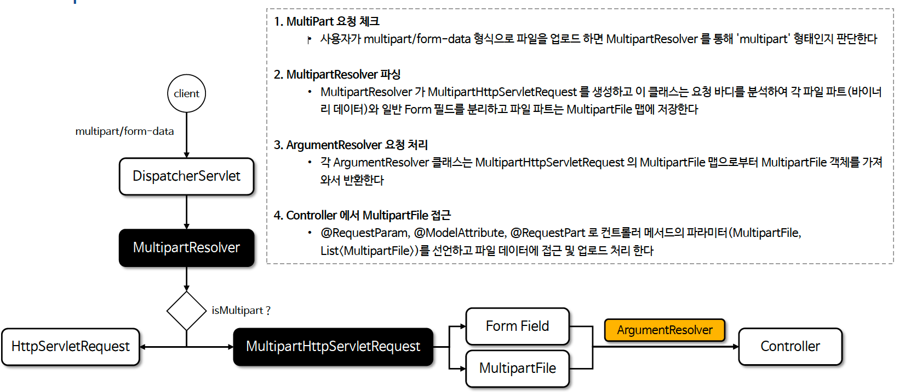

# ☘️ 파일 업로드 (1) ~ (3)

---

## 📖 내용

### MultipartFile
- 스프링에서 파일 업로드를 처리하기 위해 제공하는 인터페이스로서 HTML 폼에서 enctype="multipart/form-data"로 전송된 파일 데이터를 서버 측에서 쉽게 다룰 수 있도록 해 준다
- 단일 파일뿐 아니라 여러 파일(List<MultipartFile> 형태 등) 업로드 또한 지원한다

---

### MultipartFile
- isEmpty()
  - 업로드된 파일이 비어있는지 여부를 반환 한다
- getOriginalFilename()
  - 클라이언트 파일 시스템에서의 원본 파일명을 반환 한다. 파일이 선택되지 않았다면 빈 문자열을, 파일명이 정의되지 않았거나 사용할 수 없는 경우 null 을 반환 한다
- getBytes()
  - 파일의 내용을 바이트 배열로 반환 한다. 비어있다면 빈 배열을 반환 한다
- getInputStream()
  - 파일 내용을 읽을 수 있는 InputStream 을 반환 한다
- transferTo(Path)
  - 받은 파일을 지정된 목적지 파일로 전송한다. 목적지 파일이 이미 존재하면 먼저 삭제되며 한 번 이동된 파일은 재전송할 수 없으므로 이 메서드는 한 번만 호출해야 한다
- getResource()
  - MultipartFile 을 Resource 형태로 반환 한다
- transferTo(File)
  - 받은 파일을 지정된 목적지 파일로 전송한다. 인자로 File 객체를 받는다
- getContentType()
  - 파일의 Content-Type을 반환 한다
- getName()
  - 멀티파트 Form 에서 해당 파라미터 이름을 반환 한다
- getSize()
  - 파일의 크기를 바이트 단위로 반환하며 비어있다면 0 을 반환 한다

---

### 속성 설정
- MultipartProperties 는 Multipart(파일 업로드)에 대한 주요 설정 값들을 관리하며 Spring Boot 에서 파일 업로드와 관련된 동작을 손쉽게 제어할 수 있게 해 준다.
- application.properties(yml) 에서 spring.servlet.multipart.* 를 중심으로 설정하며 이를 통해 파일 크기 제한, 임시 저장 경로, 요청 크기 제한 등 다양한 옵션을 간단하게 지정할 수 있다


- enabled
  - spring.servlet.multipart.enabled (기본값: true)
  - 파일 업로드(멀티파트)를 지원할지 여부를 설정하며 true 로 설정하면 멀티파트 업로드 기능이 활성화되며, false 로 설정하면 비활성화 된다
- maxFileSize
  - spring.servlet.multipart.max-file-size (기본값: 1MB)
  - 업로드 가능한 단일 파일의 최대 사이즈를 제한하며 10MB, 1GB 등과 같은 식으로 원하는 크기를 문자열로 설정할 수 있다
- maxRequestSize
  - spring.servlet.multipart.max-request-size (기본값: 10MB)
  - 멀티파트 요청 전체의 최대 사이즈를 제한하며 여러 개의 파일을 동시에 업로드하는 경우, 전체 파일 사이즈 합이 이 값을 넘지 않도록 설정합니다.
- location
  - spring.servlet.multipart.location
  - 파일 업로드 중 임시로 파일을 저장할 경로를 지정하며 지정하지 않으면, 서블릿 스펙에 따라 임시 폴더(예: /tmp)가 기본값으로 사용됩니다.
- resolve-lazily (기본값: false)
  - 요청이 들어온 즉시 멀티파트 데이터를 해석하고 저장할 것인지 컨트롤러나 필터/인터셉터에서 MultipartFile 이나 파라미터에 접근할 때 비로소 파일을 해석하고 저장할 것인지 설정

```properties
spring.servlet.multipart.enabled=true
spring.servlet.multipart.location=/tmp/upload
spring.servlet.multipart.max-file-size=10MB
spring.servlet.multipart.max-request-size=30MB
spring.servlet.multipart.resolve-lazily=true
```

---

### Multipart Process

<sub>출처: 인프런</sub>

---

## 🔍 중심 로직

```java
```

📌

---

## 💬 코멘트

---
