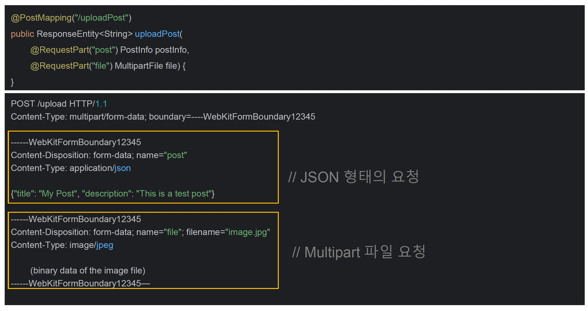

# ☘️ @RequestPart - Json & 파일업로드 처리

---

## 📖 내용

- @RequestPart 는 multipart 요청에서 특정 part(부분)를 매핑하여 컨트롤러의 파라미터로 바인딩하는 어노테이션으로서 JSON 요청 처리 + 파일 업로드를 동시에 처리 가능하다
- @RequestParam 과 다르게 파일뿐만 아니라 JSON 객체도 받을 수 있다


<sub>출처: 인프런</sub>

| 요청 방식                             | 사용 가능 애너테이션                                  |
|-----------------------------------|----------------------------------------------|
| application/json                  | @RequestBody，@RequestPart                    |
| application/x-www-form-urlencoded | @RequestParam, @ModelAttribute               |
| multipart/form-data               | @RequestParam, @ModelAttribute, @RequestPart |

---

## 🔍 중심 로직

```java
package org.springframework.web.bind.annotation;

// imports

@Target(ElementType.PARAMETER)
@Retention(RetentionPolicy.RUNTIME)
@Documented
public @interface RequestPart {

	@AliasFor("name")
	String value() default "";

	@AliasFor("value")
	String name() default "";

	boolean required() default true;

}
```

📌

---

## 💬 코멘트

---
