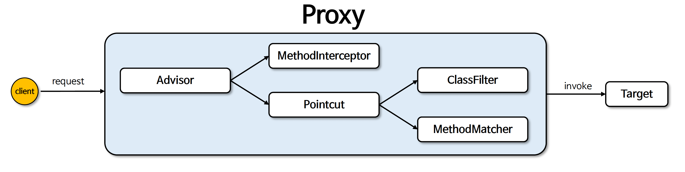
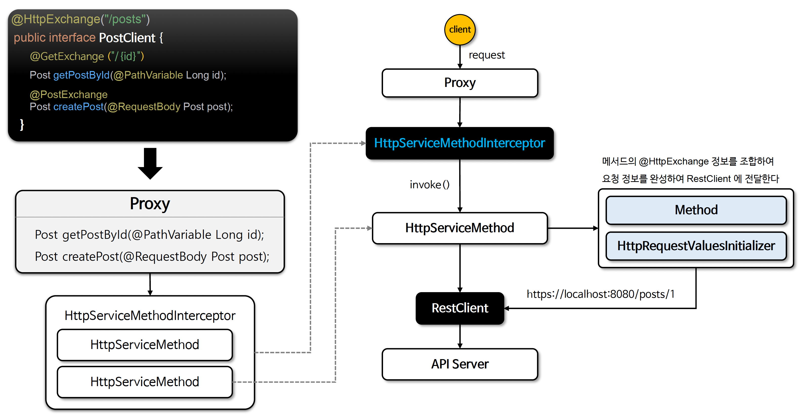

# ☘️ HttpInterface (1) ~ (2)

---

## 📖 내용

- HTTP Interface 는 클래스가 아닌 인터페이스를 사용하여 REST API 호출을 간결하고 선언적으로 정의할 수 있는 기능이다
- @HttpExchange 어노테이션을 사용하여 API의 경로, 요청 메서드, 요청 매개변수 등을 선언적으로 구성하며, 스프링의 RestClient 또는 WebClient 를 기반으로 구현된다

---

### 특징
- @HttpExchange 어노테이션 사용
  - HTTP 요청의 기본 경로, HTTP 메서드(GET, POST 등), 헤더 등을 정의하며 각 메서드에서 필요한 추가 정보(예: @PathVariable, @RequestBody)를 선언적으로 추가할 수 있다
- 인터페이스 중심의 선언적 접근
  - HTTP 요청을 Java 인터페이스로 정의하며, 구현체를 별도로 작성할 필요 없이 스프링이 이를 자동으로 생성한다
- RestClient 기반 통합
  - 스프링 부트 3.1 이상부터는 RestClient 를 사용하여 HTTP Interface 와 통합된다
- 가독성과 재사용성
  - HTTP 호출 로직을 인터페이스로 분리하여 코드가 간결하고 재사용이 쉬워지며 복잡한 HTTP 요청 처리 코드가 없어지고 테스트도 간편해 진다
- Spring Integration
  - 스프링의 의존성 주입(DI) 및 스프링의 환경설정과 어노테이션을 그대로 활용할 수 있다

---

### @HttpExchange
- HTTP 엔드포인트로 선언하기 위한 어노테이션으로서 이 어노테이션을 사용하면 자바 인터페이스의 메서드를 HTTP 엔드포인트로 지정할 수 있으며 HttpServiceProxyFactory 에 전달하면
  자동으로 HTTP 요청을 보내는 클라이언트를 만들어 준다
- @GetExchange, @PostExchange, @PutExchange, @PatchExchange, @DeleteExchange 등의 단축 어노테이션을 지원한다

---

### HTTP Interface 정의
```java
interface RepositoryService {
    @GetExchange("/repos/{owner}/{repo}")
    Repository getRepository(@PathVariable String owner, @PathVariable String repo);
    // 추가적인 HTTP 요청 메서드...
}

@HttpExchange("/repos")
interface RepositoryService {
    @GetExchange("/{owner}/{repo}")
    Repository getRepository(@PathVariable String owner, @PathVariable String repo);
    // 추가적인 HTTP 요청 메서드...
}
```

- https://docs.spring.io/spring-framework/reference/integration/rest-clients.html#rest-http-interface

---

### RestClient vs HttpInterface

| 항목           | RestClient                                                      | HTTP Interface                                                               |
|--------------|-----------------------------------------------------------------|------------------------------------------------------------------------------|
| 코드 스타일       | 명령형(Imperative)                                                 | 선언형(Declarative)                                                             |
| 구현 방식        | RestClient.get(), RestClient.post() 등을 직접 호출                    | 인터페이스에 @GetExchange, @PostExchange 어노테이션을 선언                                 |
| Spring 내부 동작 | RestClient를 사용하여 HTTP 요청을 직접 생성 및 실행                            | 내부적으로 RestClient를 사용하며 Spring이 인터페이스 구현체를 자동 생성                              |
| 가독성          | 요청마다 메서드 체이닝을 사용해야 해서 길어질 수 있음                                  | 인터페이스에 메서드 정의만 하면 되므로 깔끔함                                                    |
| 재사용성         | 요청마다 개별적으로 RestClient를 설정해야 함                                   | @HttpExchange 인터페이스를 여러 곳에서 공통으로 재사용 가능                                      |
| 적합한 사용 사례    | 유연한 HTTP 요청을 여러 곳에서 개별적으로 실행할 때 API 클라이언트 인터페이스를 선언적으로 만들고 싶을 때 | 요청별로 다른 설정(Timeout, Header 등)을 세밀하게 조정해야 할 때 여러 개의 API를 호출해야 하고 유지보수성을 고려할 때 |

---

### AOP 요소 이해

- Advisor
  - AOP Advice 와 Advice 적용 가능성을 결정하는 포인트컷를 가진 기본 인터페이스이다
- MethodInterceptor(Advice)
  - 대상 객체를 호출하기 전과 후에 추가 작업을 수행하기 위한 인터페이스로서 수행 이후 실제 대상 객체의 메서드를 호출한다
- Pointcut
  - AOP 에서 Advice 가 적용될 메소드나 클래스를 정의하는 것으로서 어드바이스가 실행되어야 하는 '적용 지점'이나 '조건'을 지정한다


<sub>출처: 인프런</sub>

---

### @HttpExchange 초기화 & 처리 구조 이해


<sub>출처: 인프런</sub>

---

## 🔍 중심 로직

```java
package org.springframework.web.service.annotation;

// imports

@Target({ElementType.TYPE, ElementType.METHOD})
@Retention(RetentionPolicy.RUNTIME)
@Documented
@Mapping
@Reflective(HttpExchangeReflectiveProcessor.class)
public @interface HttpExchange {

	@AliasFor("url")
	String value() default "";

	@AliasFor("value")
	String url() default "";

	String method() default "";

	String contentType() default "";

	String[] accept() default {};

	String[] headers() default {};

}
```

📌

---

## 💬 코멘트

---
