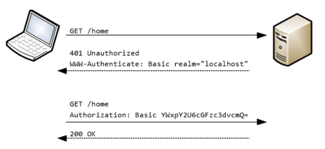

# ☘️ 기본 인증 - httpBasic()

---

## 📖 내용
- `HTTP Basic`
  - HTTP 는 액세스 제어와 인증을 위한 프레임워크를 제공하며 가장 일반적인 인증 방식은 "Basic" 인증 방식입니다.
  - RFC 7235 표준이며 인증 프로토콜은 HTTP 인증 헤더에 기술되어 있습니다.

- base-64 인코딩된 값은 디코딩이 가능하기 때문에 인증정보가 노출되기 때문에 반드시 HTTPS 와 같이 TLS 기술과 함께 사용해야 합니다.


<sub>※ 이미지 출처: https://learn.microsoft.com/en-us/aspnet/web-api/overview/security/basic-authentication</sub>

- `httpBasic()`
  - Spring Security에서는 `HttpSecurity.httpBasic()`을 통해 설정할 수 있으며 이 때 `HttpBasicConfigurer` 객체가 초기화 작업을 진행합니다.
  - HTTP Basic 인증 방식을 사용할 경우 `UsernamePasswordAuthenticationFilter` 대신 `BasicAuthenticationFilter`가 사용됩니다.
  - `HttpBasicConfigurer`는 `AbstractHttpConfigurer`를 상속받아 구현되어 있기 때문에 `AbstractHttpConfigurer` 클래스도 같이 확인해보는 것이 좋습니다.

---

## 🔍 중심 로직

```java
package org.springframework.security.config.annotation.web.configurers;

...

public final class HttpBasicConfigurer<B extends HttpSecurityBuilder<B>> extends AbstractHttpConfigurer<HttpBasicConfigurer<B>, B> {
    private static final RequestHeaderRequestMatcher X_REQUESTED_WITH = new RequestHeaderRequestMatcher("X-Requested-With", "XMLHttpRequest");
    private static final String DEFAULT_REALM = "Realm";
    private AuthenticationEntryPoint authenticationEntryPoint;
    private AuthenticationDetailsSource<HttpServletRequest, ?> authenticationDetailsSource;
    private BasicAuthenticationEntryPoint basicAuthEntryPoint = new BasicAuthenticationEntryPoint();
    private SecurityContextRepository securityContextRepository;

    public HttpBasicConfigurer() {
        this.realmName("Realm");
        LinkedHashMap<RequestMatcher, AuthenticationEntryPoint> entryPoints = new LinkedHashMap();
        entryPoints.put(X_REQUESTED_WITH, new HttpStatusEntryPoint(HttpStatus.UNAUTHORIZED));
        DelegatingAuthenticationEntryPoint defaultEntryPoint = new DelegatingAuthenticationEntryPoint(entryPoints);
        defaultEntryPoint.setDefaultEntryPoint(this.basicAuthEntryPoint);
        this.authenticationEntryPoint = defaultEntryPoint;
    }

    public HttpBasicConfigurer<B> realmName(String realmName) {
        this.basicAuthEntryPoint.setRealmName(realmName);
        this.basicAuthEntryPoint.afterPropertiesSet();
        return this;
    }

    public HttpBasicConfigurer<B> authenticationEntryPoint(AuthenticationEntryPoint authenticationEntryPoint) {
        this.authenticationEntryPoint = authenticationEntryPoint;
        return this;
    }

    public HttpBasicConfigurer<B> authenticationDetailsSource(AuthenticationDetailsSource<HttpServletRequest, ?> authenticationDetailsSource) {
        this.authenticationDetailsSource = authenticationDetailsSource;
        return this;
    }

    public HttpBasicConfigurer<B> securityContextRepository(SecurityContextRepository securityContextRepository) {
        this.securityContextRepository = securityContextRepository;
        return this;
    }

    public void init(B http) {
        this.registerDefaults(http);
    }

  ...
  
    public void configure(B http) {
        AuthenticationManager authenticationManager = (AuthenticationManager)http.getSharedObject(AuthenticationManager.class);
        BasicAuthenticationFilter basicAuthenticationFilter = new BasicAuthenticationFilter(authenticationManager, this.authenticationEntryPoint);
        if (this.authenticationDetailsSource != null) {
            basicAuthenticationFilter.setAuthenticationDetailsSource(this.authenticationDetailsSource);
        }

        if (this.securityContextRepository != null) {
            basicAuthenticationFilter.setSecurityContextRepository(this.securityContextRepository);
        }

        RememberMeServices rememberMeServices = (RememberMeServices)http.getSharedObject(RememberMeServices.class);
        if (rememberMeServices != null) {
            basicAuthenticationFilter.setRememberMeServices(rememberMeServices);
        }

        basicAuthenticationFilter.setSecurityContextHolderStrategy(this.getSecurityContextHolderStrategy());
        basicAuthenticationFilter = (BasicAuthenticationFilter)this.postProcess(basicAuthenticationFilter);
        http.addFilter(basicAuthenticationFilter);
    }
}
```

```java
import java.beans.Customizer;

@Configuration
public class SecurityConfig {

  // 1. 커스텀 설정
  @Bean
  public SecurityFilterChain securityFilterChain(HttpSecurity http) throws Exception {
    return http
            .httpBasic(httpBasic ->
                    httpBasic
                            .realmName()
                            .authenticationEntryPoint()
                            .authenticationDetailsSource()
                            .securityContextRepository()
            )
            .build();
  }

  // 2. 기본 설정
  @Bean
  public SecurityFilterChain securityFilterChain(HttpSecurity http) throws Exception {
    return http
            .httpBasic(Customizer.withDefaults())
            .build();
  }
}
```

📌  요약
- `HttpBasicConfigurer`
  - `realmName()` : 인증을 위한 realm 이름을 설정합니다.
  - `authenticationEntryPoint()` : 인증 실패 시 처리할 `AuthenticationEntryPoint`를 설정합니다.
  - `authenticationDetailsSource()` : 인증 요청 시 추가적인 정보를 설정합니다.
  - `securityContextRepository()` : 인증 정보를 저장할 `SecurityContextRepository`를 설정합니다.

---
