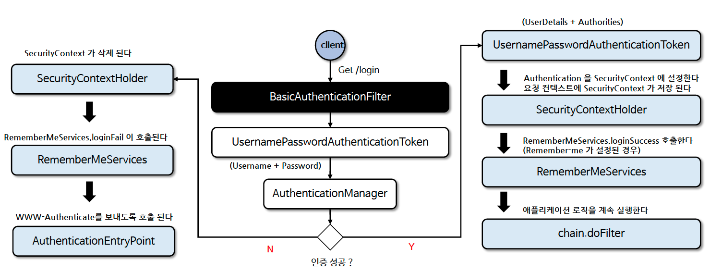

# ☘️ 기본 인증 필터 - BasicAuthenticationFilter

---

## 📖 내용

<sub>※ 이미지 출처: [정수원님의 인프런 강의](https://www.inflearn.com/course/%EC%8A%A4%ED%94%84%EB%A7%81-%EC%8B%9C%ED%81%90%EB%A6%AC%ED%8B%B0-%EC%99%84%EC%A0%84%EC%A0%95%EB%B3%B5/dashboard)</sub>

- `BasicAuthenticationFilter` 인증 처리 흐름
  - `BasicAuthenticationConverter`를 사용해서 요청 헤더에 기술된 인증 정보의 유효성을 체크하며 Base64 인코딩된 username과 password를 추출합니다.
  - 인증 이후 세션을 사용하는 경우와 사용하지 않는 경우에 따라 처리되는 흐름에 차이가 있습니다.
    - 세션을 사용하는 경우: 매 요청마다 인증 과정을 거치지 않음
    - 세션을 사용하지 않는 경우: 매 요청마다 인증 과정을 거침

---

## 🔍 중심 로직

```java
package org.springframework.security.web.authentication.www;

...

public class BasicAuthenticationFilter extends OncePerRequestFilter {
    private SecurityContextHolderStrategy securityContextHolderStrategy = SecurityContextHolder.getContextHolderStrategy();
    private AuthenticationEntryPoint authenticationEntryPoint;
    private AuthenticationManager authenticationManager;
    private RememberMeServices rememberMeServices = new NullRememberMeServices();
    private boolean ignoreFailure = false;
    private String credentialsCharset = "UTF-8";
    private AuthenticationConverter authenticationConverter = new BasicAuthenticationConverter();
    private SecurityContextRepository securityContextRepository = new RequestAttributeSecurityContextRepository();

    public BasicAuthenticationFilter(AuthenticationManager authenticationManager) {
        Assert.notNull(authenticationManager, "authenticationManager cannot be null");
        this.authenticationManager = authenticationManager;
        this.ignoreFailure = true;
    }

    public BasicAuthenticationFilter(AuthenticationManager authenticationManager, AuthenticationEntryPoint authenticationEntryPoint) {
        Assert.notNull(authenticationManager, "authenticationManager cannot be null");
        Assert.notNull(authenticationEntryPoint, "authenticationEntryPoint cannot be null");
        this.authenticationManager = authenticationManager;
        this.authenticationEntryPoint = authenticationEntryPoint;
    }

    public void setSecurityContextRepository(SecurityContextRepository securityContextRepository) {
        Assert.notNull(securityContextRepository, "securityContextRepository cannot be null");
        this.securityContextRepository = securityContextRepository;
    }

    public void setAuthenticationConverter(AuthenticationConverter authenticationConverter) {
        Assert.notNull(authenticationConverter, "authenticationConverter cannot be null");
        this.authenticationConverter = authenticationConverter;
    }

    public void afterPropertiesSet() {
        Assert.notNull(this.authenticationManager, "An AuthenticationManager is required");
        if (!this.isIgnoreFailure()) {
            Assert.notNull(this.authenticationEntryPoint, "An AuthenticationEntryPoint is required");
        }

    }

    protected void doFilterInternal(HttpServletRequest request, HttpServletResponse response, FilterChain chain) throws IOException, ServletException {
        try {
            Authentication authRequest = this.authenticationConverter.convert(request);
            if (authRequest == null) {
                this.logger.trace("Did not process authentication request since failed to find username and password in Basic Authorization header");
                chain.doFilter(request, response);
                return;
            }

            String username = authRequest.getName();
            this.logger.trace(LogMessage.format("Found username '%s' in Basic Authorization header", username));
            if (this.authenticationIsRequired(username)) {
                Authentication authResult = this.authenticationManager.authenticate(authRequest);
                SecurityContext context = this.securityContextHolderStrategy.createEmptyContext();
                context.setAuthentication(authResult);
                this.securityContextHolderStrategy.setContext(context);
                if (this.logger.isDebugEnabled()) {
                    this.logger.debug(LogMessage.format("Set SecurityContextHolder to %s", authResult));
                }

                this.rememberMeServices.loginSuccess(request, response, authResult);
                this.securityContextRepository.saveContext(context, request, response);
                this.onSuccessfulAuthentication(request, response, authResult);
            }
        } catch (AuthenticationException ex) {
            this.securityContextHolderStrategy.clearContext();
            this.logger.debug("Failed to process authentication request", ex);
            this.rememberMeServices.loginFail(request, response);
            this.onUnsuccessfulAuthentication(request, response, ex);
            if (this.ignoreFailure) {
                chain.doFilter(request, response);
            } else {
                this.authenticationEntryPoint.commence(request, response, ex);
            }

            return;
        }

        chain.doFilter(request, response);
    }

    ...

    public void setSecurityContextHolderStrategy(SecurityContextHolderStrategy securityContextHolderStrategy) {
        Assert.notNull(securityContextHolderStrategy, "securityContextHolderStrategy cannot be null");
        this.securityContextHolderStrategy = securityContextHolderStrategy;
    }

    public void setAuthenticationDetailsSource(AuthenticationDetailsSource<HttpServletRequest, ?> authenticationDetailsSource) {
        AuthenticationConverter var3 = this.authenticationConverter;
        if (var3 instanceof BasicAuthenticationConverter basicAuthenticationConverter) {
            basicAuthenticationConverter.setAuthenticationDetailsSource(authenticationDetailsSource);
        }

    }

    public void setRememberMeServices(RememberMeServices rememberMeServices) {
        Assert.notNull(rememberMeServices, "rememberMeServices cannot be null");
        this.rememberMeServices = rememberMeServices;
    }

    public void setCredentialsCharset(String credentialsCharset) {
        Assert.hasText(credentialsCharset, "credentialsCharset cannot be null or empty");
        this.credentialsCharset = credentialsCharset;
        AuthenticationConverter var3 = this.authenticationConverter;
        if (var3 instanceof BasicAuthenticationConverter basicAuthenticationConverter) {
            basicAuthenticationConverter.setCredentialsCharset(Charset.forName(credentialsCharset));
        }

    }

    ...
}
```

```java
package org.springframework.security.web.authentication.www;

...

public class BasicAuthenticationConverter implements AuthenticationConverter {
    public static final String AUTHENTICATION_SCHEME_BASIC = "Basic";
    private AuthenticationDetailsSource<HttpServletRequest, ?> authenticationDetailsSource;
    private Charset credentialsCharset;

    public BasicAuthenticationConverter() {
        this(new WebAuthenticationDetailsSource());
    }

    public BasicAuthenticationConverter(AuthenticationDetailsSource<HttpServletRequest, ?> authenticationDetailsSource) {
        this.credentialsCharset = StandardCharsets.UTF_8;
        this.authenticationDetailsSource = authenticationDetailsSource;
    }
    
    ...

    public UsernamePasswordAuthenticationToken convert(HttpServletRequest request) {
        String header = request.getHeader("Authorization");
        if (header == null) {
            return null;
        } else {
            header = header.trim();
            if (!StringUtils.startsWithIgnoreCase(header, "Basic")) {
                return null;
            } else if (header.equalsIgnoreCase("Basic")) {
                throw new BadCredentialsException("Empty basic authentication token");
            } else {
                byte[] base64Token = header.substring(6).getBytes(StandardCharsets.UTF_8);
                byte[] decoded = this.decode(base64Token);
                String token = new String(decoded, this.getCredentialsCharset(request));
                int delim = token.indexOf(":");
                if (delim == -1) {
                    throw new BadCredentialsException("Invalid basic authentication token");
                } else {
                    UsernamePasswordAuthenticationToken result = UsernamePasswordAuthenticationToken.unauthenticated(token.substring(0, delim), token.substring(delim + 1));
                    result.setDetails(this.authenticationDetailsSource.buildDetails(request));
                    return result;
                }
            }
        }
    }

    ...
}
```
