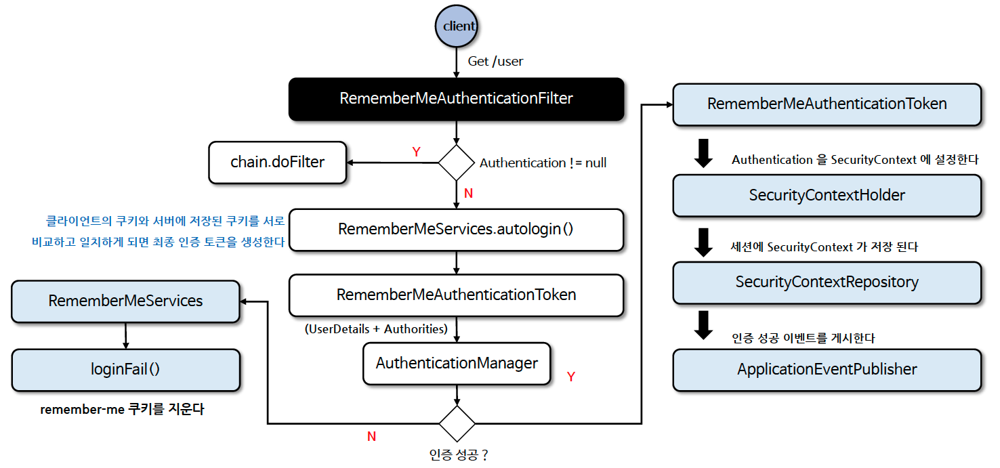

# ☘️ 기억하기 인증 필터 - RememberMeAuthenticationFilter

---

## 📖 내용
- `RememberMeAuthenticationFilter`
  - `SecurityContextHolder`에 `Authentication`이 포함되지 않은 경우 실행되는 Filter입니다.
  - 세션이 만료되었거나 애플리케이션 종료로 인해 인증 상태가 소멸된 경우 토큰 기반 인증을 사용해 유효성을 검사하고 토큰이 검증되면 자동 로그인 처리를 수행합니다.


<sub>※ 이미지 출처: [정수원님의 인프런 강의](https://www.inflearn.com/course/%EC%8A%A4%ED%94%84%EB%A7%81-%EC%8B%9C%ED%81%90%EB%A6%AC%ED%8B%B0-%EC%99%84%EC%A0%84%EC%A0%95%EB%B3%B5/dashboard)</sub>

---

## 🔍 중심 로직

```java
package org.springframework.security.web.authentication.rememberme;

...

public class RememberMeAuthenticationFilter extends GenericFilterBean implements ApplicationEventPublisherAware {
    private SecurityContextHolderStrategy securityContextHolderStrategy = SecurityContextHolder.getContextHolderStrategy();
    private ApplicationEventPublisher eventPublisher;
    private AuthenticationSuccessHandler successHandler;
    private AuthenticationManager authenticationManager;
    private RememberMeServices rememberMeServices;
    private SecurityContextRepository securityContextRepository = new HttpSessionSecurityContextRepository();
    private SessionAuthenticationStrategy sessionStrategy = new NullAuthenticatedSessionStrategy();

    public RememberMeAuthenticationFilter(AuthenticationManager authenticationManager, RememberMeServices rememberMeServices) {
        Assert.notNull(authenticationManager, "authenticationManager cannot be null");
        Assert.notNull(rememberMeServices, "rememberMeServices cannot be null");
        this.authenticationManager = authenticationManager;
        this.rememberMeServices = rememberMeServices;
    }

    public void afterPropertiesSet() {
        Assert.notNull(this.authenticationManager, "authenticationManager must be specified");
        Assert.notNull(this.rememberMeServices, "rememberMeServices must be specified");
    }

    public void doFilter(ServletRequest request, ServletResponse response, FilterChain chain) throws IOException, ServletException {
        this.doFilter((HttpServletRequest)request, (HttpServletResponse)response, chain);
    }

    private void doFilter(HttpServletRequest request, HttpServletResponse response, FilterChain chain) throws IOException, ServletException {
        if (this.securityContextHolderStrategy.getContext().getAuthentication() != null) {
            this.logger.debug(LogMessage.of(() -> "SecurityContextHolder not populated with remember-me token, as it already contained: '" + String.valueOf(this.securityContextHolderStrategy.getContext().getAuthentication()) + "'"));
            chain.doFilter(request, response);
        } else {
            Authentication rememberMeAuth = this.rememberMeServices.autoLogin(request, response);
            if (rememberMeAuth != null) {
                try {
                    rememberMeAuth = this.authenticationManager.authenticate(rememberMeAuth);
                    this.sessionStrategy.onAuthentication(rememberMeAuth, request, response);
                    SecurityContext context = this.securityContextHolderStrategy.createEmptyContext();
                    context.setAuthentication(rememberMeAuth);
                    this.securityContextHolderStrategy.setContext(context);
                    this.onSuccessfulAuthentication(request, response, rememberMeAuth);
                    this.logger.debug(LogMessage.of(() -> "SecurityContextHolder populated with remember-me token: '" + String.valueOf(this.securityContextHolderStrategy.getContext().getAuthentication()) + "'"));
                    this.securityContextRepository.saveContext(context, request, response);
                    if (this.eventPublisher != null) {
                        this.eventPublisher.publishEvent(new InteractiveAuthenticationSuccessEvent(this.securityContextHolderStrategy.getContext().getAuthentication(), this.getClass()));
                    }

                    if (this.successHandler != null) {
                        this.successHandler.onAuthenticationSuccess(request, response, rememberMeAuth);
                        return;
                    }
                } catch (AuthenticationException ex) {
                    this.logger.debug(LogMessage.format("SecurityContextHolder not populated with remember-me token, as AuthenticationManager rejected Authentication returned by RememberMeServices: '%s'; invalidating remember-me token", rememberMeAuth), ex);
                    this.rememberMeServices.loginFail(request, response);
                    this.onUnsuccessfulAuthentication(request, response, ex);
                }
            }

            chain.doFilter(request, response);
        }
    }

    protected void onSuccessfulAuthentication(HttpServletRequest request, HttpServletResponse response, Authentication authResult) {
    }

    protected void onUnsuccessfulAuthentication(HttpServletRequest request, HttpServletResponse response, AuthenticationException failed) {
    }

    public RememberMeServices getRememberMeServices() {
        return this.rememberMeServices;
    }

    public void setApplicationEventPublisher(ApplicationEventPublisher eventPublisher) {
        this.eventPublisher = eventPublisher;
    }

    public void setAuthenticationSuccessHandler(AuthenticationSuccessHandler successHandler) {
        Assert.notNull(successHandler, "successHandler cannot be null");
        this.successHandler = successHandler;
    }

    public void setSecurityContextRepository(SecurityContextRepository securityContextRepository) {
        Assert.notNull(securityContextRepository, "securityContextRepository cannot be null");
        this.securityContextRepository = securityContextRepository;
    }

    public void setSecurityContextHolderStrategy(SecurityContextHolderStrategy securityContextHolderStrategy) {
        Assert.notNull(securityContextHolderStrategy, "securityContextHolderStrategy cannot be null");
        this.securityContextHolderStrategy = securityContextHolderStrategy;
    }

    public void setSessionAuthenticationStrategy(SessionAuthenticationStrategy sessionStrategy) {
        Assert.notNull(sessionStrategy, "sessionStrategy cannot be null");
        this.sessionStrategy = sessionStrategy;
    }
}
```

📌  요약
- `SecurityContextHolder`에 `Authentication`이 포함되지 않은 경우
  - `rememberMeServices.autoLogin(request, response)`를 호출하여 자동 로그인 처리를 수행합니다.
  - `AuthenticationManager`의 `authenticate()` 메서드를 호출하여 인증을 처리합니다.
  - 인증 성공 시 `SecurityContextHolder`에 `Authentication`을 저장합니다.
  - 인증 실패 시 `rememberMeServices.loginFail(request, response)`를 호출하여 로그인 실패 처리를 수행합니다.

---
