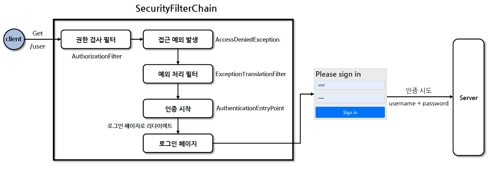

# ☘️ 폼 인증 - formLogin()

---

## 📖 내용


<sub>※ 이미지 출처: [정수원님의 인프런 강의](https://www.inflearn.com/course/%EC%8A%A4%ED%94%84%EB%A7%81-%EC%8B%9C%ED%81%90%EB%A6%AC%ED%8B%B0-%EC%99%84%EC%A0%84%EC%A0%95%EB%B3%B5/dashboard)</sub>

- 폼 인증
  - HTTP 기반의 폼 로그인 인증 메커니즘을 활성화하는 API로서 사용자 인증을 위한 사용자 정의 로그인 페이지를 쉽게 구현할 수 있습니다.
  - 기본적으로 Spring Security가 제공하는 로그인 페이지가 있으며 개발자가 직접 만든 로그인 페이지를 사용할 수도 있습니다.
  - `formLogin()` 메서드를 사용하여 활성화할 수 있으며 `FormLoginConfigurer` 객체를 사용하여 폼 로그인 관련 설정이 적용됩니다.
  - `FormLoginConfigurer`는 `AbstractAuthenticationFilterConfigurer`를 상속받아 구현되어 있으므로 두 객체를 모두 살펴보면 좋습니다.
---

## 🔍 중심 로직

```java
package org.springframework.security.config.annotation.web.configurers;

...

public final class FormLoginConfigurer<H extends HttpSecurityBuilder<H>> extends AbstractAuthenticationFilterConfigurer<H, FormLoginConfigurer<H>, UsernamePasswordAuthenticationFilter> {
    public FormLoginConfigurer() {
        super(new UsernamePasswordAuthenticationFilter(), (String)null);
        this.usernameParameter("username");
        this.passwordParameter("password");
    }

    public FormLoginConfigurer<H> loginPage(String loginPage) {
        return (FormLoginConfigurer)super.loginPage(loginPage);
    }

    public FormLoginConfigurer<H> usernameParameter(String usernameParameter) {
        ((UsernamePasswordAuthenticationFilter)this.getAuthenticationFilter()).setUsernameParameter(usernameParameter);
        return this;
    }

    public FormLoginConfigurer<H> passwordParameter(String passwordParameter) {
        ((UsernamePasswordAuthenticationFilter)this.getAuthenticationFilter()).setPasswordParameter(passwordParameter);
        return this;
    }

    public FormLoginConfigurer<H> failureForwardUrl(String forwardUrl) {
        this.failureHandler(new ForwardAuthenticationFailureHandler(forwardUrl));
        return this;
    }

    public FormLoginConfigurer<H> successForwardUrl(String forwardUrl) {
        this.successHandler(new ForwardAuthenticationSuccessHandler(forwardUrl));
        return this;
    }

    public void init(H http) throws Exception {
        super.init(http);
        this.initDefaultLoginFilter(http);
    }

    protected RequestMatcher createLoginProcessingUrlMatcher(String loginProcessingUrl) {
        return new AntPathRequestMatcher(loginProcessingUrl, "POST");
    }

  ...

    private void initDefaultLoginFilter(H http) {
        DefaultLoginPageGeneratingFilter loginPageGeneratingFilter = (DefaultLoginPageGeneratingFilter)http.getSharedObject(DefaultLoginPageGeneratingFilter.class);
        if (loginPageGeneratingFilter != null && !this.isCustomLoginPage()) {
            loginPageGeneratingFilter.setFormLoginEnabled(true);
            loginPageGeneratingFilter.setUsernameParameter(this.getUsernameParameter());
            loginPageGeneratingFilter.setPasswordParameter(this.getPasswordParameter());
            loginPageGeneratingFilter.setLoginPageUrl(this.getLoginPage());
            loginPageGeneratingFilter.setFailureUrl(this.getFailureUrl());
            loginPageGeneratingFilter.setAuthenticationUrl(this.getLoginProcessingUrl());
        }

    }
}
```

```java
package org.springframework.security.config.annotation.web.configurers;

...

public abstract class AbstractAuthenticationFilterConfigurer<B extends HttpSecurityBuilder<B>, T extends AbstractAuthenticationFilterConfigurer<B, T, F>, F extends AbstractAuthenticationProcessingFilter> extends AbstractHttpConfigurer<T, B> {
    private F authFilter;
    private AuthenticationDetailsSource<HttpServletRequest, ?> authenticationDetailsSource;
    private SavedRequestAwareAuthenticationSuccessHandler defaultSuccessHandler;
    private AuthenticationSuccessHandler successHandler;
    private LoginUrlAuthenticationEntryPoint authenticationEntryPoint;
    private boolean customLoginPage;
    private String loginPage;
    private String loginProcessingUrl;
    private AuthenticationFailureHandler failureHandler;
    private boolean permitAll;
    private String failureUrl;

    protected AbstractAuthenticationFilterConfigurer() {
        this.defaultSuccessHandler = new SavedRequestAwareAuthenticationSuccessHandler();
        this.successHandler = this.defaultSuccessHandler;
        this.setLoginPage("/login");
    }

    protected AbstractAuthenticationFilterConfigurer(F authenticationFilter, String defaultLoginProcessingUrl) {
        this();
        this.authFilter = authenticationFilter;
        if (defaultLoginProcessingUrl != null) {
            this.loginProcessingUrl(defaultLoginProcessingUrl);
        }

    }

    public final T defaultSuccessUrl(String defaultSuccessUrl) {
        return (T)this.defaultSuccessUrl(defaultSuccessUrl, false);
    }

    public final T defaultSuccessUrl(String defaultSuccessUrl, boolean alwaysUse) {
        SavedRequestAwareAuthenticationSuccessHandler handler = new SavedRequestAwareAuthenticationSuccessHandler();
        handler.setDefaultTargetUrl(defaultSuccessUrl);
        handler.setAlwaysUseDefaultTargetUrl(alwaysUse);
        this.defaultSuccessHandler = handler;
        return (T)this.successHandler(handler);
    }

    public T loginProcessingUrl(String loginProcessingUrl) {
        this.loginProcessingUrl = loginProcessingUrl;
        this.authFilter.setRequiresAuthenticationRequestMatcher(this.createLoginProcessingUrlMatcher(loginProcessingUrl));
        return (T)this.getSelf();
    }

    public T securityContextRepository(SecurityContextRepository securityContextRepository) {
        this.authFilter.setSecurityContextRepository(securityContextRepository);
        return (T)this.getSelf();
    }

    protected abstract RequestMatcher createLoginProcessingUrlMatcher(String loginProcessingUrl);

    public final T authenticationDetailsSource(AuthenticationDetailsSource<HttpServletRequest, ?> authenticationDetailsSource) {
        this.authenticationDetailsSource = authenticationDetailsSource;
        return (T)this.getSelf();
    }

    public final T successHandler(AuthenticationSuccessHandler successHandler) {
        this.successHandler = successHandler;
        return (T)this.getSelf();
    }

    public final T permitAll() {
        return (T)this.permitAll(true);
    }

    public final T permitAll(boolean permitAll) {
        this.permitAll = permitAll;
        return (T)this.getSelf();
    }

    public final T failureUrl(String authenticationFailureUrl) {
        T result = this.failureHandler(new SimpleUrlAuthenticationFailureHandler(authenticationFailureUrl));
        this.failureUrl = authenticationFailureUrl;
        return result;
    }

    public final T failureHandler(AuthenticationFailureHandler authenticationFailureHandler) {
        this.failureUrl = null;
        this.failureHandler = authenticationFailureHandler;
        return (T)this.getSelf();
    }

    public void init(B http) throws Exception {
        this.updateAuthenticationDefaults();
        this.updateAccessDefaults(http);
        this.registerDefaultAuthenticationEntryPoint(http);
    }

  ...

    public void configure(B http) throws Exception {
        PortMapper portMapper = (PortMapper)http.getSharedObject(PortMapper.class);
        if (portMapper != null) {
            this.authenticationEntryPoint.setPortMapper(portMapper);
        }

        RequestCache requestCache = (RequestCache)http.getSharedObject(RequestCache.class);
        if (requestCache != null) {
            this.defaultSuccessHandler.setRequestCache(requestCache);
        }

        this.authFilter.setAuthenticationManager((AuthenticationManager)http.getSharedObject(AuthenticationManager.class));
        this.authFilter.setAuthenticationSuccessHandler(this.successHandler);
        this.authFilter.setAuthenticationFailureHandler(this.failureHandler);
        if (this.authenticationDetailsSource != null) {
            this.authFilter.setAuthenticationDetailsSource(this.authenticationDetailsSource);
        }

        SessionAuthenticationStrategy sessionAuthenticationStrategy = (SessionAuthenticationStrategy)http.getSharedObject(SessionAuthenticationStrategy.class);
        if (sessionAuthenticationStrategy != null) {
            this.authFilter.setSessionAuthenticationStrategy(sessionAuthenticationStrategy);
        }

        RememberMeServices rememberMeServices = (RememberMeServices)http.getSharedObject(RememberMeServices.class);
        if (rememberMeServices != null) {
            this.authFilter.setRememberMeServices(rememberMeServices);
        }

        SecurityContextConfigurer securityContextConfigurer = (SecurityContextConfigurer)http.getConfigurer(SecurityContextConfigurer.class);
        if (securityContextConfigurer != null && securityContextConfigurer.isRequireExplicitSave()) {
            SecurityContextRepository securityContextRepository = securityContextConfigurer.getSecurityContextRepository();
            this.authFilter.setSecurityContextRepository(securityContextRepository);
        }

        this.authFilter.setSecurityContextHolderStrategy(this.getSecurityContextHolderStrategy());
        F filter = (F)(this.postProcess(this.authFilter));
        http.addFilter(filter);
    }

    protected T loginPage(String loginPage) {
        this.setLoginPage(loginPage);
        this.updateAuthenticationDefaults();
        this.customLoginPage = true;
        return (T)this.getSelf();
    }
    
  ...

    private void setLoginPage(String loginPage) {
        this.loginPage = loginPage;
        this.authenticationEntryPoint = new LoginUrlAuthenticationEntryPoint(loginPage);
    }
    
  ...
}
```

```java
import java.beans.Customizer;

@Configuration
public class SecurityConfig {

  // 1. 커스텀 설정
  @Bean
  public SecurityFilterChain securityFilterChain(HttpSecurity http) throws Exception {
    return http
            .formLogin(formLogin ->
                    formLogin
                            .loginPage()
                            .usernameParameter()
                            .passwordParameter()
                            .failureForwardUrl()
                            .successForwardUrl()
                            .defaultSuccessUrl()
                            .loginProcessingUrl()
                            .securityContextRepository()
                            .authenticationDetailsSource()
                            .successHandler()
                            .failureUrl()
                            .failureHandler()
                            .permitAll()
            )
            .build();
  }

  // 2. 기본값 설정
  @Bean
  public SecurityFilterChain securityFilterChain(HttpSecurity http) throws Exception {
    return http
            .formLogin(Customizer.withDefaults())
            .build();
  }
}
```

📌  요약

- `FormLoginConfigurer`
  - `loginPage()`: 로그인 페이지 URL을 설정합니다.
  - `usernameParameter()`: 사용자 이름을 입력받는 파라미터의 이름을 설정합니다.
  - `passwordParameter()`: 비밀번호를 입력받는 파라미터의 이름을 설정합니다.
  - `failureForwardUrl()`: 인증 실패 시 포워딩할 URL을 설정합니다.
  - `successForwardUrl()`: 인증 성공 시 포워딩할 URL을 설정합니다.
- `AbstractAuthenticationFilterConfigurer`
  - `defaultSuccessUrl()`: 인증 성공 시 리다이렉트할 URL을 설정합니다. `alwaysUse`가 true일 경우 항상 해당 URL로 리다이렉트합니다.(default: false)
  - `loginProcessingUrl()`: 로그인 처리 URL을 설정합니다.
  - `securityContextRepository()`: SecurityContextRepository를 설정합니다.
  - `authenticationDetailsSource()`: 인증 세부 정보 소스를 설정합니다.
  - `successHandler()`: 인증 성공 핸들러를 설정합니다. (default: `SimpleUrlAuthenticationSuccessHandler`)
  - `permitAll()`: `failureUrl()`, `loginPage()`, `loginProcessingUrl()`에 대해 모든 사용자의 접근을 허용
  - `failureUrl()`: 인증 실패 시 리다이렉트할 URL을 설정합니다.
  - `failureHandler()`: 인증 실패 핸들러를 설정합니다. (default: `SimpleUrlAuthenticationFailureHandler`)

---

## 💬 코멘트
- 폼 로그인은 Spring Security에서 가장 기본적이고 가장 많이 사용되는 인증 방식이라고 생각하기 때문에 Form 로그인 동작 방식을 정확하게 이해하는 것이 중요합니다.
- 폼 로그인 초기화 객체는 `FormLoginConfigurer`이지만 해당 객체가 `AbstractAuthenticationFilterConfigurer`를 상속받고 있기 때문에 두 객체 모두 살펴보는 것이 좋습니다.
- handler에서도 기본으로 제공하는 SuccessHandler, FailureHandler도 살펴보면 좋습니다.

---
