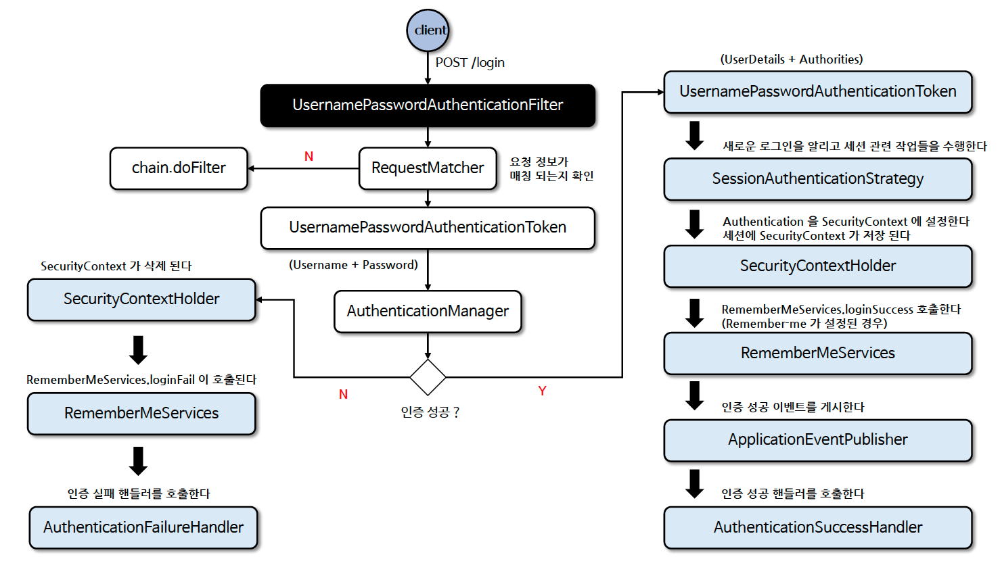

# ☘️ 폼 인증 필터 - UsernamePasswordAuthenticationFilter

---

## 📖 내용
- `UsernamePasswordAuthenticationFilter`
  - `AbstractAuthenticationProcessingFilter`를 상속받아 구현
  - 인증 프로세스가 초기화 될 때 로그인 페이지/로그아웃 페이지 생성을 위해 `DefaultLoginPageGeneratingFilter`/`DefaultLogoutPageGeneratingFilter`를 사용
  - 인증 처리는 `attemptAuthentication()` 메서드를 호출하여 처리

- `UsernamePasswordAuthenticationFilter` 인증 처리 흐름

- <sub>※ 이미지 출처: [정수원님의 인프런 강의](https://www.inflearn.com/course/%EC%8A%A4%ED%94%84%EB%A7%81-%EC%8B%9C%ED%81%90%EB%A6%AC%ED%8B%B0-%EC%99%84%EC%A0%84%EC%A0%95%EB%B3%B5/dashboard)</sub>
---

## 🔍 중심 로직

```java
package org.springframework.security.web.authentication;

...

public class UsernamePasswordAuthenticationFilter extends AbstractAuthenticationProcessingFilter {
    public static final String SPRING_SECURITY_FORM_USERNAME_KEY = "username";
    public static final String SPRING_SECURITY_FORM_PASSWORD_KEY = "password";
    private static final AntPathRequestMatcher DEFAULT_ANT_PATH_REQUEST_MATCHER = new AntPathRequestMatcher("/login", "POST");
    private String usernameParameter = "username";
    private String passwordParameter = "password";
    private boolean postOnly = true;

    public UsernamePasswordAuthenticationFilter() {
        super(DEFAULT_ANT_PATH_REQUEST_MATCHER);
    }

    public UsernamePasswordAuthenticationFilter(AuthenticationManager authenticationManager) {
        super(DEFAULT_ANT_PATH_REQUEST_MATCHER, authenticationManager);
    }

    public Authentication attemptAuthentication(HttpServletRequest request, HttpServletResponse response) throws AuthenticationException {
        if (this.postOnly && !request.getMethod().equals("POST")) {
            throw new AuthenticationServiceException("Authentication method not supported: " + request.getMethod());
        } else {
            String username = this.obtainUsername(request);
            username = username != null ? username.trim() : "";
            String password = this.obtainPassword(request);
            password = password != null ? password : "";
            UsernamePasswordAuthenticationToken authRequest = UsernamePasswordAuthenticationToken.unauthenticated(username, password);
            this.setDetails(request, authRequest);
            return this.getAuthenticationManager().authenticate(authRequest);
        }
    }

    ...

    public void setUsernameParameter(String usernameParameter) {
        Assert.hasText(usernameParameter, "Username parameter must not be empty or null");
        this.usernameParameter = usernameParameter;
    }

    public void setPasswordParameter(String passwordParameter) {
        Assert.hasText(passwordParameter, "Password parameter must not be empty or null");
        this.passwordParameter = passwordParameter;
    }

    public void setPostOnly(boolean postOnly) {
        this.postOnly = postOnly;
    }

    ...
}
```

```java
// 코드가 길어 패키지명만 작성, 직접 해당 클래스를 소스코드에서 확인
package org.springframework.security.web.authentication.AbstractAuthenticationProcessingFilter;
package org.springframework.security.web.authentication.ui.DefaultLoginPageGeneratingFilter;
package org.springframework.security.web.authentication.ui.DefaultLogoutPageGeneratingFilter;
```

📌  요약
- `UsernamePasswordAuthenticationFilter`의 `attemptAuthentication()` 메서드에서 
  - `HttpServletRequest`에서 `username`과 `password`를 가져와서
  - `UsernamePasswordAuthenticationToken` 객체를 생성하여
  - `AuthenticationManager`의 `authenticate()` 메서드를 호출하여 인증을 처리한다.

---

## 💬 코멘트
- 스프링에서 폼 로그인 방식에 제공하는 `UsernamePasswordAuthenticationFilter`는 `AbstractAuthenticationProcessingFilter`를 상속받아 구현되어 있다.
- 따라서 직접 폼 로그인 방식에 대한 필터를 만들고 싶다면 `AbstractAuthenticationProcessingFilter`를 상속받아 구현하면 된다.
- 또는 `UsernamePasswordAuthenticationFilter`를 상속받아 구현해도 되지만 
  - `UsernamePasswordAuthenticationFilter`는 스프링 시큐리티에서 제공하는 기본 필터이기 때문에
  - 다른 필터와의 충돌을 피하기 위해 직접 구현하는 것을 추천한다.

---
