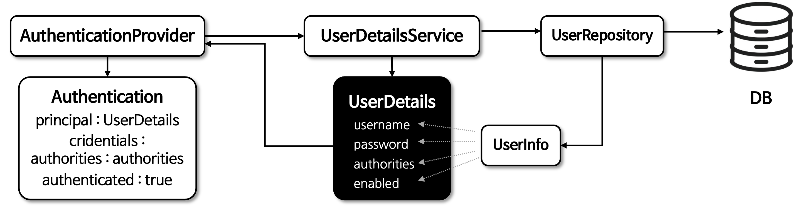

# ☘️ 사용자 상세 - UserDetails

---

## 📖 내용
- `UserDetails`
  - 사용자의 기본 정보를 저장하는 인터페이스로서 Spring Security에서 사용하는 사용자 타입입니다.
  - 저장된 사용자 정보는 추후 인증 절차에서 사용되기 위해 `Authentication` 객체에 포함되며 구현체로서 `User` 클래스가 제공됩니다.


<sub>※ 이미지 출처: [정수원님의 인프런 강의](https://www.inflearn.com/course/%EC%8A%A4%ED%94%84%EB%A7%81-%EC%8B%9C%ED%81%90%EB%A6%AC%ED%8B%B0-%EC%99%84%EC%A0%84%EC%A0%95%EB%B3%B5/dashboard)</sub>

---

## 🔍 중심 로직

```java
package org.springframework.security.core.userdetails;

...

public interface UserDetails extends Serializable {
    Collection<? extends GrantedAuthority> getAuthorities();

    String getPassword();

    String getUsername();

    default boolean isAccountNonExpired() {
        return true;
    }

    default boolean isAccountNonLocked() {
        return true;
    }

    default boolean isCredentialsNonExpired() {
        return true;
    }

    default boolean isEnabled() {
        return true;
    }
}
```

```java
package org.springframework.security.core.userdetails;

...

public class User implements UserDetails, CredentialsContainer {
    private static final long serialVersionUID = 620L;
    private static final Log logger = LogFactory.getLog(User.class);
    private String password;
    private final String username;
    private final Set<GrantedAuthority> authorities;
    private final boolean accountNonExpired;
    private final boolean accountNonLocked;
    private final boolean credentialsNonExpired;
    private final boolean enabled;

    public User(String username, String password, Collection<? extends GrantedAuthority> authorities) {
        this(username, password, true, true, true, true, authorities);
    }

    public User(String username, String password, boolean enabled, boolean accountNonExpired, boolean credentialsNonExpired, boolean accountNonLocked, Collection<? extends GrantedAuthority> authorities) {
        Assert.isTrue(username != null && !"".equals(username) && password != null, "Cannot pass null or empty values to constructor");
        this.username = username;
        this.password = password;
        this.enabled = enabled;
        this.accountNonExpired = accountNonExpired;
        this.credentialsNonExpired = credentialsNonExpired;
        this.accountNonLocked = accountNonLocked;
        this.authorities = Collections.unmodifiableSet(sortAuthorities(authorities));
    }

    public Collection<GrantedAuthority> getAuthorities() {
        return this.authorities;
    }

    public String getPassword() {
        return this.password;
    }

    public String getUsername() {
        return this.username;
    }

    public boolean isEnabled() {
        return this.enabled;
    }

    public boolean isAccountNonExpired() {
        return this.accountNonExpired;
    }

    public boolean isAccountNonLocked() {
        return this.accountNonLocked;
    }

    public boolean isCredentialsNonExpired() {
        return this.credentialsNonExpired;
    }

    public void eraseCredentials() {
        this.password = null;
    }

    private static SortedSet<GrantedAuthority> sortAuthorities(Collection<? extends GrantedAuthority> authorities) {
        Assert.notNull(authorities, "Cannot pass a null GrantedAuthority collection");
        SortedSet<GrantedAuthority> sortedAuthorities = new TreeSet(new AuthorityComparator());

        for(GrantedAuthority grantedAuthority : authorities) {
            Assert.notNull(grantedAuthority, "GrantedAuthority list cannot contain any null elements");
            sortedAuthorities.add(grantedAuthority);
        }

        return sortedAuthorities;
    }

    public boolean equals(Object obj) {
        if (obj instanceof User user) {
            return this.username.equals(user.getUsername());
        } else {
            return false;
        }
    }

    public int hashCode() {
        return this.username.hashCode();
    }

    public String toString() {
        StringBuilder sb = new StringBuilder();
        sb.append(this.getClass().getName()).append(" [");
        sb.append("Username=").append(this.username).append(", ");
        sb.append("Password=[PROTECTED], ");
        sb.append("Enabled=").append(this.enabled).append(", ");
        sb.append("AccountNonExpired=").append(this.accountNonExpired).append(", ");
        sb.append("CredentialsNonExpired=").append(this.credentialsNonExpired).append(", ");
        sb.append("AccountNonLocked=").append(this.accountNonLocked).append(", ");
        sb.append("Granted Authorities=").append(this.authorities).append("]");
        return sb.toString();
    }

    public static UserBuilder withUsername(String username) {
        return builder().username(username);
    }

    public static UserBuilder builder() {
        return new UserBuilder();
    }

    /** @deprecated */
    @Deprecated
    public static UserBuilder withDefaultPasswordEncoder() {
        logger.warn("User.withDefaultPasswordEncoder() is considered unsafe for production and is only intended for sample applications.");
        PasswordEncoder encoder = PasswordEncoderFactories.createDelegatingPasswordEncoder();
        UserBuilder var10000 = builder();
        Objects.requireNonNull(encoder);
        return var10000.passwordEncoder(encoder::encode);
    }

    public static UserBuilder withUserDetails(UserDetails userDetails) {
        return withUsername(userDetails.getUsername()).password(userDetails.getPassword()).accountExpired(!userDetails.isAccountNonExpired()).accountLocked(!userDetails.isAccountNonLocked()).authorities(userDetails.getAuthorities()).credentialsExpired(!userDetails.isCredentialsNonExpired()).disabled(!userDetails.isEnabled());
    }

    private static class AuthorityComparator implements Comparator<GrantedAuthority>, Serializable {
        private static final long serialVersionUID = 620L;

        private AuthorityComparator() {
        }

        public int compare(GrantedAuthority g1, GrantedAuthority g2) {
            if (g2.getAuthority() == null) {
                return -1;
            } else {
                return g1.getAuthority() == null ? 1 : g1.getAuthority().compareTo(g2.getAuthority());
            }
        }
    }

    public static final class UserBuilder {
        private String username;
        private String password;
        private List<GrantedAuthority> authorities = new ArrayList();
        private boolean accountExpired;
        private boolean accountLocked;
        private boolean credentialsExpired;
        private boolean disabled;
        private Function<String, String> passwordEncoder = (password) -> password;

        private UserBuilder() {
        }

        public UserBuilder username(String username) {
            Assert.notNull(username, "username cannot be null");
            this.username = username;
            return this;
        }

        public UserBuilder password(String password) {
            Assert.notNull(password, "password cannot be null");
            this.password = password;
            return this;
        }

        public UserBuilder passwordEncoder(Function<String, String> encoder) {
            Assert.notNull(encoder, "encoder cannot be null");
            this.passwordEncoder = encoder;
            return this;
        }

        public UserBuilder roles(String... roles) {
            List<GrantedAuthority> authorities = new ArrayList(roles.length);

            for(String role : roles) {
                Assert.isTrue(!role.startsWith("ROLE_"), () -> role + " cannot start with ROLE_ (it is automatically added)");
                authorities.add(new SimpleGrantedAuthority("ROLE_" + role));
            }

            return this.authorities((Collection)authorities);
        }

        public UserBuilder authorities(GrantedAuthority... authorities) {
            Assert.notNull(authorities, "authorities cannot be null");
            return this.authorities((Collection)Arrays.asList(authorities));
        }

        public UserBuilder authorities(Collection<? extends GrantedAuthority> authorities) {
            Assert.notNull(authorities, "authorities cannot be null");
            this.authorities = new ArrayList(authorities);
            return this;
        }

        public UserBuilder authorities(String... authorities) {
            Assert.notNull(authorities, "authorities cannot be null");
            return this.authorities((Collection)AuthorityUtils.createAuthorityList(authorities));
        }

        public UserBuilder accountExpired(boolean accountExpired) {
            this.accountExpired = accountExpired;
            return this;
        }

        public UserBuilder accountLocked(boolean accountLocked) {
            this.accountLocked = accountLocked;
            return this;
        }

        public UserBuilder credentialsExpired(boolean credentialsExpired) {
            this.credentialsExpired = credentialsExpired;
            return this;
        }

        public UserBuilder disabled(boolean disabled) {
            this.disabled = disabled;
            return this;
        }

        public UserDetails build() {
            String encodedPassword = (String)this.passwordEncoder.apply(this.password);
            return new User(this.username, encodedPassword, !this.disabled, !this.accountExpired, !this.credentialsExpired, !this.accountLocked, this.authorities);
        }
    }
}
```

📌  요약
- Spring Security에서는 `UserDetails` 인터페이스를 구현한 `User` 클래스를 제공하여 사용자의 정보를 저장합니다.
- `UserDetails` 또는 `User` 클래스를 상속/구현하여 직접 사용자의 정보를 저장하는 객체를 생성할 수 있습니다.

---