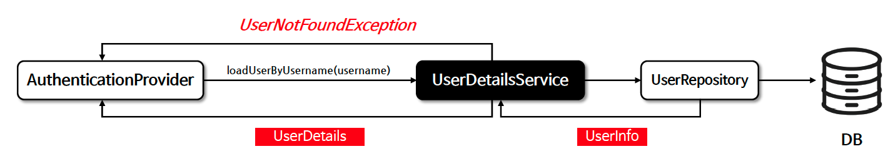

# ☘️ 사용자 상세 서비스 - UserDetailsService

---

## 📖 내용
- `UserDetailsService`
  - 사용자와 관련된 상세 데이터를 로드하는 것이며 사용자의 신원, 권한, 자격 증명 등과 같은 정보를 포함할 수 있습니다.
  - 주로 `AuthenticationProvider` 클래스가 사용하며 사용자가 시스템에 존재하는지 여부와 사용자 데이터를 검색하고 인증 과정을 수행합니다.

- `UserDetailsService.loadUserByUsername(String username)` 메서드를 호출하여 사용자의 이름을 통해 사용자 데이터를 검색하고 해당 데이터를 UserDetails 객체로 반환합니다.


<sub>※ 이미지 출처: [정수원님의 인프런 강의](https://www.inflearn.com/course/%EC%8A%A4%ED%94%84%EB%A7%81-%EC%8B%9C%ED%81%90%EB%A6%AC%ED%8B%B0-%EC%99%84%EC%A0%84%EC%A0%95%EB%B3%B5/dashboard)</sub>

---

## 🔍 중심 로직

```java
package org.springframework.security.core.userdetails;

public interface UserDetailsService {
    UserDetails loadUserByUsername(String username) throws UsernameNotFoundException;
}
```

---