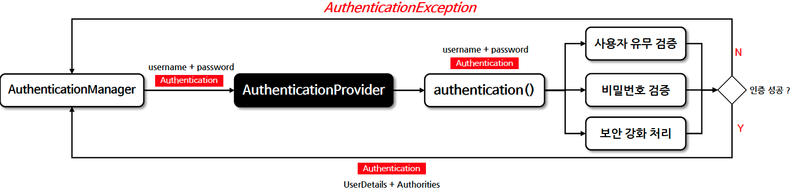

# ☘️ 인증 제공자 - AuthenticationProvider - 1 ~ 2

---

## 📖 내용
- `AuthenticationProvider`
  - 사용자의 자격 증명을 확인하고 인증 과정을 관리하는 클래스로서 사용자가 시스템에 엑세스하기 위해 제공한 정보(ex: 아이디, 비밀번호)가 유효한지 검증하는 과정을 포함합니다.
  - 다양한 유형의 인증 메커니즘을 지원할 수 있는데, 이름/비밀번호를 기반으로 한 인증, 토큰 기반 인증 등을 처리할 수 있습니다.
  - 인증 성공 시 Authentication 객체를 AuthenticationManager 객체로 반환하며 이 때 사용자의 정보와 인증된 자격 증명을 포함합니다.
  - 인증 실패 시 AuthenticationException과 같은 예외를 발생시킵니다.

- `AuthenticationProvider` 흐름도
  - 1.`AuthenticationManager` 객체에게 인증 처리 위임 받음
  - 2.인증 처리 후 성공/실패에 대한 처리 진행
  - 2-1.인증 성공 시 Authentication 객체를 AuthenticationManager 객체로 반환
  - 2-2.인증 실패 시 AuthenticationException 예외 발생


<sub>※ 이미지 출처: [정수원님의 인프런 강의](https://www.inflearn.com/course/%EC%8A%A4%ED%94%84%EB%A7%81-%EC%8B%9C%ED%81%90%EB%A6%AC%ED%8B%B0-%EC%99%84%EC%A0%84%EC%A0%95%EB%B3%B5/dashboard)</sub>

---

## 🔍 중심 로직

```java
package org.springframework.security.authentication;

...

public interface AuthenticationProvider {
    Authentication authenticate(Authentication authentication) throws AuthenticationException;

    boolean supports(Class<?> authentication);
}
```

```java
package org.springframework.security.authentication.dao;

...

public class DaoAuthenticationProvider extends AbstractUserDetailsAuthenticationProvider {
    private static final String USER_NOT_FOUND_PASSWORD = "userNotFoundPassword";
    private PasswordEncoder passwordEncoder;
    private volatile String userNotFoundEncodedPassword;
    private UserDetailsService userDetailsService;
    private UserDetailsPasswordService userDetailsPasswordService;
    private CompromisedPasswordChecker compromisedPasswordChecker;

    public DaoAuthenticationProvider() {
        this(PasswordEncoderFactories.createDelegatingPasswordEncoder());
    }

    public DaoAuthenticationProvider(PasswordEncoder passwordEncoder) {
        this.setPasswordEncoder(passwordEncoder);
    }

    protected void additionalAuthenticationChecks(UserDetails userDetails, UsernamePasswordAuthenticationToken authentication) throws AuthenticationException {
        if (authentication.getCredentials() == null) {
            this.logger.debug("Failed to authenticate since no credentials provided");
            throw new BadCredentialsException(this.messages.getMessage("AbstractUserDetailsAuthenticationProvider.badCredentials", "Bad credentials"));
        } else {
            String presentedPassword = authentication.getCredentials().toString();
            if (!this.passwordEncoder.matches(presentedPassword, userDetails.getPassword())) {
                this.logger.debug("Failed to authenticate since password does not match stored value");
                throw new BadCredentialsException(this.messages.getMessage("AbstractUserDetailsAuthenticationProvider.badCredentials", "Bad credentials"));
            }
        }
    }

    protected void doAfterPropertiesSet() {
        Assert.notNull(this.userDetailsService, "A UserDetailsService must be set");
    }

    protected final UserDetails retrieveUser(String username, UsernamePasswordAuthenticationToken authentication) throws AuthenticationException {
        this.prepareTimingAttackProtection();

        try {
            UserDetails loadedUser = this.getUserDetailsService().loadUserByUsername(username);
            if (loadedUser == null) {
                throw new InternalAuthenticationServiceException("UserDetailsService returned null, which is an interface contract violation");
            } else {
                return loadedUser;
            }
        } catch (UsernameNotFoundException ex) {
            this.mitigateAgainstTimingAttack(authentication);
            throw ex;
        } catch (InternalAuthenticationServiceException ex) {
            throw ex;
        } catch (Exception ex) {
            throw new InternalAuthenticationServiceException(ex.getMessage(), ex);
        }
    }

    protected Authentication createSuccessAuthentication(Object principal, Authentication authentication, UserDetails user) {
        String presentedPassword = authentication.getCredentials().toString();
        boolean isPasswordCompromised = this.compromisedPasswordChecker != null && this.compromisedPasswordChecker.check(presentedPassword).isCompromised();
        if (isPasswordCompromised) {
            throw new CompromisedPasswordException("The provided password is compromised, please change your password");
        } else {
            boolean upgradeEncoding = this.userDetailsPasswordService != null && this.passwordEncoder.upgradeEncoding(user.getPassword());
            if (upgradeEncoding) {
                String newPassword = this.passwordEncoder.encode(presentedPassword);
                user = this.userDetailsPasswordService.updatePassword(user, newPassword);
            }

            return super.createSuccessAuthentication(principal, authentication, user);
        }
    }

    // UsernamePasswordAuthenticationToken을 사용할 경우 DaoAuthenticationProvider를 사용
  public boolean supports(Class<?> authentication) {
    return UsernamePasswordAuthenticationToken.class.isAssignableFrom(authentication);
  }

  ... other methods
}
```

```java
package org.springframework.security.authentication;

...

public class AnonymousAuthenticationProvider implements AuthenticationProvider, MessageSourceAware {
    protected MessageSourceAccessor messages = SpringSecurityMessageSource.getAccessor();
    private String key;

    public AnonymousAuthenticationProvider(String key) {
        Assert.hasLength(key, "A Key is required");
        this.key = key;
    }

    public Authentication authenticate(Authentication authentication) throws AuthenticationException {
        if (!this.supports(authentication.getClass())) {
            return null;
        } else if (this.key.hashCode() != ((AnonymousAuthenticationToken)authentication).getKeyHash()) {
            throw new BadCredentialsException(this.messages.getMessage("AnonymousAuthenticationProvider.incorrectKey", "The presented AnonymousAuthenticationToken does not contain the expected key"));
        } else {
            return authentication;
        }
    }

    public String getKey() {
        return this.key;
    }

    public void setMessageSource(MessageSource messageSource) {
        Assert.notNull(messageSource, "messageSource cannot be null");
        this.messages = new MessageSourceAccessor(messageSource);
    }

    // AnonymousAuthenticationToken을 사용할 경우 AnonymousAuthenticationProvider를 사용
    public boolean supports(Class<?> authentication) {
        return AnonymousAuthenticationToken.class.isAssignableFrom(authentication);
    }
}
```

📌  요약
- Spring Security에는 기본 Provider들을 기능에 맞게끔 제공해주는데 가장 많이 사용하는 `DaoAuthenticationProvider`와 `AnonymousAuthenticationProvider`가 있습니다.
  - `DaoAuthenticationProvider`: `UsernamePasswordAuthenticationToken`을 사용할 경우 사용합니다.
  - `AnonymousAuthenticationProvider`: `AnonymousAuthenticationToken`을 사용할 경우 사용합니다.

---