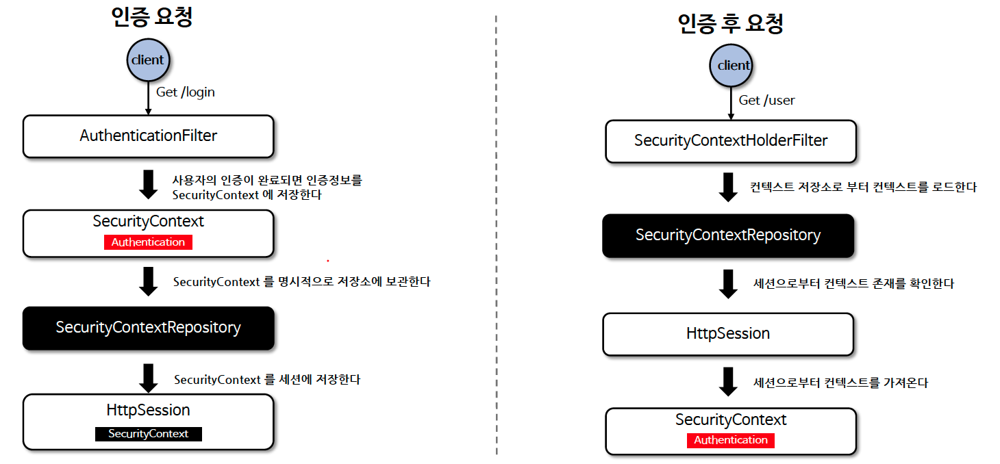

# ☘️ SecurityContextRepository / SecurityContextHolderFilter - 1 ~ 3

---

## 📖 내용
- `SpringContextRepository`
  - 스프링 시큐리티에서 사용자가 인증을 한 이후 요청에 대해 계속 사용자의 인증을 유지하기 위해 사용되는 클래스입니다.
  - 인증 상태의 영속 메커니즘은 사용자가 인증을 하게 되면 해당 사용자의 인증 정보와 권한이 `SecurityContext`에 저장되고 `HttpSession` 을 통해 요청 간 영속이 이루어 지는 방식입니다.
  - 기본 구현체로 `DelegatingSecurityContextRepository`가 제공됩니다.


<sub>※ 이미지 출처: [정수원님의 인프런 강의](https://www.inflearn.com/course/%EC%8A%A4%ED%94%84%EB%A7%81-%EC%8B%9C%ED%81%90%EB%A6%AC%ED%8B%B0-%EC%99%84%EC%A0%84%EC%A0%95%EB%B3%B5/dashboard)</sub>

- `SecurityContextHolderFilter`
  - `SecurityContextRepository`를 사용하여 `SecurityContext`를 가져오고 이를 `SecurityContextHolder`에 설정하는 filter 클래스입니다.
  - `SecurityContextRepository.saveContext()`를 실행시키지 않기 때문에 사용자가 명시적으로 호출해야 `SecurityContext`를 저장할 수 있는데 이는 `SecurityContextPersistenceFilter(현재 deprecated)`와 다른점입니다.
  - 인증이 지속되어야 하는지를 각 인증 메커니즘이 독립적으로 선택할 수 있게 하여 더 나은 유연성을 제공하고 `HttpSession`에 필요할 때만 저장함으로써 성능을 향상시킵니다.


<sub>※ 이미지 출처: [정수원님의 인프런 강의](https://www.inflearn.com/course/%EC%8A%A4%ED%94%84%EB%A7%81-%EC%8B%9C%ED%81%90%EB%A6%AC%ED%8B%B0-%EC%99%84%EC%A0%84%EC%A0%95%EB%B3%B5/dashboard)</sub>

---

## 🔍 중심 로직

```java
package org.springframework.security.web.context;

...

public interface SecurityContextRepository {
    /** @deprecated */
    @Deprecated
    SecurityContext loadContext(HttpRequestResponseHolder requestResponseHolder);

    default DeferredSecurityContext loadDeferredContext(HttpServletRequest request) {
        Supplier<SecurityContext> supplier = () -> this.loadContext(new HttpRequestResponseHolder(request, (HttpServletResponse)null));
        return new SupplierDeferredSecurityContext(SingletonSupplier.of(supplier), SecurityContextHolder.getContextHolderStrategy());
    }

    void saveContext(SecurityContext context, HttpServletRequest request, HttpServletResponse response);

    boolean containsContext(HttpServletRequest request);
}

// 구현체 목록
org.springframework.security.web.context.HttpSessionSecurityContextRepository;
org.springframework.security.web.context.RequestAttributeSecurityContextRepository;
org.springframework.security.web.context.NullSecurityContextRepository;
org.springframework.security.web.context.DelegatingSecurityContextRepository;
org.springframework.security.test.web.servlet.request.SecurityMockMvcRequestPostProcessors.TestSecurityContextHolderPostProcessor; // 테스트용
```

```java
package org.springframework.security.web.context;

...

public class SecurityContextHolderFilter extends GenericFilterBean {
    private static final String FILTER_APPLIED = SecurityContextHolderFilter.class.getName() + ".APPLIED";
    private final SecurityContextRepository securityContextRepository;
    private SecurityContextHolderStrategy securityContextHolderStrategy = SecurityContextHolder.getContextHolderStrategy();

    public SecurityContextHolderFilter(SecurityContextRepository securityContextRepository) {
        Assert.notNull(securityContextRepository, "securityContextRepository cannot be null");
        this.securityContextRepository = securityContextRepository;
    }

    public void doFilter(ServletRequest request, ServletResponse response, FilterChain chain) throws IOException, ServletException {
        this.doFilter((HttpServletRequest)request, (HttpServletResponse)response, chain);
    }

    private void doFilter(HttpServletRequest request, HttpServletResponse response, FilterChain chain) throws ServletException, IOException {
        if (request.getAttribute(FILTER_APPLIED) != null) {
            chain.doFilter(request, response);
        } else {
            request.setAttribute(FILTER_APPLIED, Boolean.TRUE);
            Supplier<SecurityContext> deferredContext = this.securityContextRepository.loadDeferredContext(request);

            try {
                this.securityContextHolderStrategy.setDeferredContext(deferredContext);
                chain.doFilter(request, response);
            } finally {
                this.securityContextHolderStrategy.clearContext();
                request.removeAttribute(FILTER_APPLIED);
            }

        }
    }

  ...
}
```

📌  요약
- `HttpSessionSecurityContextRepository`: `HttpSession` 에 보안 컨텍스트를 저장합니다. 컨텍스트 영속성을 유지할 수 있습니다.
- `RequestAttributeSecurityContextRepository`: `ServletRequest` 에 보안 컨텍스트를 저장합니다. 컨텍스트 영속성을 유지할 수 없습니다.
- `NullSecurityContextRepository`: 세션을 사용하지 않는 인증(JWT, OAuth2) 일 경우 사용하며 컨텍스트 관련 아무런 처리를 하지 않습니다.
- `DelegatingSecurityContextRepository`: `RequestAttributeSecurityContextRepository`와 `HttpSessionSecurityContextRepository` 를 동시에 사용할 수 있도록 위임된 클래스로서 초기화 시 기본으로 설정됩니다.

---

## 📂 참고할만한 자료
