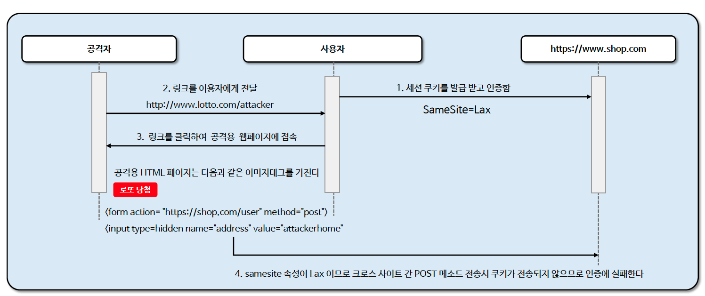

# ☘️ SameSite

---

## 📖 내용
- SameSite 는 최신 방식의 CSRF 공격 방어 방법 중 하나로서 서버가 쿠키를 설정할 때 SameSite 속성을 지정하여 크로스 사이트 간 쿠키 전송에 대한 제어를 핸들링 할 수 있습니다.
- Spring Security는 세션 쿠키의 생성을 직접 제어하지 않기 때문에 SameSite 속성에 대한 지원을 제공하지 않지만 Spring Session 은 SameSite 속성을 지원한다

- `SameSite` 속성
  - `Strict`: 동일 사이트에서 오는 모든 요청에 쿠키가 포함되고 크로스 사이트간 HTTP 요청에 쿠키가 포함되지 않습니다.
  - `Lax(기본 설정)`: 
    - 동일 사이트에서 오거나 Top Level Navigation 에서 오는 요청 및 메소드가 읽기 전용인 경우 쿠키가 전송되고 그렇지 않으면 HTTP 요청에 쿠키가 포함되지 않습니다.
    - 사용자가 링크(&lt;a&gt;)를 클릭하거나 window.location.replace , 302 리다이렉트 등의 이동이 포함된다. 그러나 &lt;iframe&gt;이나 &lt;img&gt;를 문서에 삽입, AJAX 통신 등은
      쿠키가 전송되지 않습니다.
  - `None`: 동일 사이트 및 크로스 사이트 요청의 경우에도 쿠키가 전송됩니다. 이 모드에서는 HTTPS 의한 Secure 쿠키로 설정되야 합니다.


<sub>※ 이미지 출처: [정수원님의 인프런 강의](https://www.inflearn.com/course/%EC%8A%A4%ED%94%84%EB%A7%81-%EC%8B%9C%ED%81%90%EB%A6%AC%ED%8B%B0-%EC%99%84%EC%A0%84%EC%A0%95%EB%B3%B5/dashboard)</sub>

---

## 🔍 중심 로직

```groovy
implementation group: 'org.springframework.session', name: 'spring-session-core', version: '3.2.1'
```

```java
package org.springframework.session.web.http;

...

public interface CookieSerializer {
    void writeCookieValue(CookieValue cookieValue);

    List<String> readCookieValues(HttpServletRequest request);

    public static class CookieValue {
        private final HttpServletRequest request;
        private final HttpServletResponse response;
        private final String cookieValue;
        private int cookieMaxAge = -1;

        public CookieValue(HttpServletRequest request, HttpServletResponse response, String cookieValue) {
            this.request = request;
            this.response = response;
            this.cookieValue = cookieValue;
            if ("".equals(this.cookieValue)) {
                this.cookieMaxAge = 0;
            }

        }

        public HttpServletRequest getRequest() {
            return this.request;
        }

        public HttpServletResponse getResponse() {
            return this.response;
        }

        public String getCookieValue() {
            return this.cookieValue;
        }

        public int getCookieMaxAge() {
            return this.cookieMaxAge;
        }

        public void setCookieMaxAge(int cookieMaxAge) {
            this.cookieMaxAge = cookieMaxAge;
        }
    }
}
```

```java
package org.springframework.session.web.http;

...

public class DefaultCookieSerializer implements CookieSerializer {
    private static final Log logger = LogFactory.getLog(DefaultCookieSerializer.class);
    private static final BitSet domainValid = new BitSet(128);
    private Clock clock = Clock.systemUTC();
    private String cookieName = "SESSION";
    private Boolean useSecureCookie;
    private boolean useHttpOnlyCookie = true;
    private String cookiePath;
    private Integer cookieMaxAge;
    private String domainName;
    private Pattern domainNamePattern;
    private String jvmRoute;
    private boolean useBase64Encoding = true;
    private String rememberMeRequestAttribute;
    private String sameSite = "Lax";

    public DefaultCookieSerializer() {
    }

    public List<String> readCookieValues(HttpServletRequest request) {
        Cookie[] cookies = request.getCookies();
        List<String> matchingCookieValues = new ArrayList();
        if (cookies != null) {
            for(Cookie cookie : cookies) {
                if (this.cookieName.equals(cookie.getName())) {
                    String sessionId = this.useBase64Encoding ? this.base64Decode(cookie.getValue()) : cookie.getValue();
                    if (sessionId != null) {
                        if (this.jvmRoute != null && sessionId.endsWith(this.jvmRoute)) {
                            sessionId = sessionId.substring(0, sessionId.length() - this.jvmRoute.length());
                        }

                        matchingCookieValues.add(sessionId);
                    }
                }
            }
        }

        return matchingCookieValues;
    }

    public void writeCookieValue(CookieSerializer.CookieValue cookieValue) {
        HttpServletRequest request = cookieValue.getRequest();
        HttpServletResponse response = cookieValue.getResponse();
        StringBuilder sb = new StringBuilder();
        sb.append(this.cookieName).append('=');
        String value = this.getValue(cookieValue);
        if (value != null && value.length() > 0) {
            this.validateValue(value);
            sb.append(value);
        }

        int maxAge = this.getMaxAge(cookieValue);
        if (maxAge > -1) {
            sb.append("; Max-Age=").append(cookieValue.getCookieMaxAge());
            ZonedDateTime expires = maxAge != 0 ? ZonedDateTime.now(this.clock).plusSeconds((long)maxAge) : Instant.EPOCH.atZone(ZoneOffset.UTC);
            sb.append("; Expires=").append(expires.format(DateTimeFormatter.RFC_1123_DATE_TIME));
        }

        String domain = this.getDomainName(request);
        if (domain != null && domain.length() > 0) {
            this.validateDomain(domain);
            sb.append("; Domain=").append(domain);
        }

        String path = this.getCookiePath(request);
        if (path != null && path.length() > 0) {
            this.validatePath(path);
            sb.append("; Path=").append(path);
        }

        if (this.isSecureCookie(request)) {
            sb.append("; Secure");
        }

        if (this.useHttpOnlyCookie) {
            sb.append("; HttpOnly");
        }

        if (this.sameSite != null) {
            sb.append("; SameSite=").append(this.sameSite);
        }

        response.addHeader("Set-Cookie", sb.toString());
    }

    ... other methods
}
```

```java
@Configuration
@EnableSpringHttpSession
public class HttpSessionConfig {
    @Bean
    public CookieSerializer cookieSerializer() {
        DefaultCookieSerializer serializer = new DefaultCookieSerializer();
        serializer.setUseSecureCookie(true);
        serializer.setUseHttpOnlyCookie(true);
        serializer.setSameSite("Lax");
        return serializer;
    }

    @Bean
    public SessionRepository<MapSession> sessionRepository() {
        return new MapSessionRepository(new ConcurrentHashMap<>());
    }
}
```

📌

---

## 📂 참고할만한 자료

