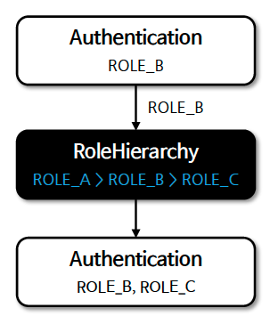

# ☘️ 계층적 권한 - RoleHierarchy

---

## 📖 내용
- 기본적으로 Spring Security에서 권한과 역할은 계층적이거나 상하 관계로 구분되지 않습니다.
- `RoleHierarchy`는 역할 간의 계층 구조를 정의하고 관리하는 데 사용되며 보다 간편하게 역할 간의 계층 구조를 설정하고 이를 기반으로 사용자에 대한 액세스 규칙을 정의할 수 있습니다.

```xml
<property6name="hierarchy">
    <value>
        ROLE_A > ROLE_B
        ROLE_B > ROLE_C
        ROLE_C > ROLE_D
    </value>
</property>
```

- 계층적 역할을 사용하면 액세스 규칙이 간결해지며 더 효율적인 형태로 권한 규칙을 표현할 수 있습니다.

---

## 🔍 중심 로직

```java
package org.springframework.security.access.hierarchicalroles;

...

public interface RoleHierarchy {
    Collection<? extends GrantedAuthority> getReachableGrantedAuthorities(Collection<? extends GrantedAuthority> authorities);
}
```

```java
package org.springframework.security.access.hierarchicalroles;

...

public class RoleHierarchyImpl implements RoleHierarchy {
    private static final Log logger = LogFactory.getLog(RoleHierarchyImpl.class);
    private Map<String, Set<GrantedAuthority>> rolesReachableInOneOrMoreStepsMap = null;
    
    ... deprecated methods

    private RoleHierarchyImpl(Map<String, Set<GrantedAuthority>> hierarchy) {
        this.rolesReachableInOneOrMoreStepsMap = buildRolesReachableInOneOrMoreStepsMap(hierarchy);
    }

    public static RoleHierarchyImpl fromHierarchy(String hierarchy) {
        return new RoleHierarchyImpl(buildRolesReachableInOneStepMap(hierarchy));
    }

    public static Builder withDefaultRolePrefix() {
        return withRolePrefix("ROLE_");
    }

    public static Builder withRolePrefix(String rolePrefix) {
        Assert.notNull(rolePrefix, "rolePrefix must not be null");
        return new Builder(rolePrefix);
    }
    
    ... deprecated methods

    public Collection<GrantedAuthority> getReachableGrantedAuthorities(Collection<? extends GrantedAuthority> authorities) {
        if (authorities != null && !authorities.isEmpty()) {
            Set<GrantedAuthority> reachableRoles = new HashSet();
            Set<String> processedNames = new HashSet();

            for(GrantedAuthority authority : authorities) {
                if (authority.getAuthority() == null) {
                    reachableRoles.add(authority);
                } else if (processedNames.add(authority.getAuthority())) {
                    reachableRoles.add(authority);
                    Set<GrantedAuthority> lowerRoles = (Set)this.rolesReachableInOneOrMoreStepsMap.get(authority.getAuthority());
                    if (lowerRoles != null) {
                        for(GrantedAuthority role : lowerRoles) {
                            if (processedNames.add(role.getAuthority())) {
                                reachableRoles.add(role);
                            }
                        }
                    }
                }
            }

            logger.debug(LogMessage.format("getReachableGrantedAuthorities() - From the roles %s one can reach %s in zero or more steps.", authorities, reachableRoles));
            return new ArrayList(reachableRoles);
        } else {
            return AuthorityUtils.NO_AUTHORITIES;
        }
    }

    private static Map<String, Set<GrantedAuthority>> buildRolesReachableInOneStepMap(String hierarchy) {
        Map<String, Set<GrantedAuthority>> rolesReachableInOneStepMap = new HashMap();

        for(String line : hierarchy.split("\n")) {
            String[] roles = line.trim().split("\\s+>\\s+");

            for(int i = 1; i < roles.length; ++i) {
                String higherRole = roles[i - 1];
                GrantedAuthority lowerRole = new SimpleGrantedAuthority(roles[i]);
                Set<GrantedAuthority> rolesReachableInOneStepSet;
                if (!rolesReachableInOneStepMap.containsKey(higherRole)) {
                    rolesReachableInOneStepSet = new HashSet();
                    rolesReachableInOneStepMap.put(higherRole, rolesReachableInOneStepSet);
                } else {
                    rolesReachableInOneStepSet = (Set)rolesReachableInOneStepMap.get(higherRole);
                }

                rolesReachableInOneStepSet.add(lowerRole);
                logger.debug(LogMessage.format("buildRolesReachableInOneStepMap() - From role %s one can reach role %s in one step.", higherRole, lowerRole));
            }
        }

        return rolesReachableInOneStepMap;
    }

    private static Map<String, Set<GrantedAuthority>> buildRolesReachableInOneOrMoreStepsMap(Map<String, Set<GrantedAuthority>> hierarchy) {
        Map<String, Set<GrantedAuthority>> rolesReachableInOneOrMoreStepsMap = new HashMap();

        for(String roleName : hierarchy.keySet()) {
            Set<GrantedAuthority> rolesToVisitSet = new HashSet((Collection)hierarchy.get(roleName));
            Set<GrantedAuthority> visitedRolesSet = new HashSet();

            while(!rolesToVisitSet.isEmpty()) {
                GrantedAuthority lowerRole = (GrantedAuthority)rolesToVisitSet.iterator().next();
                rolesToVisitSet.remove(lowerRole);
                if (visitedRolesSet.add(lowerRole) && hierarchy.containsKey(lowerRole.getAuthority())) {
                    if (roleName.equals(lowerRole.getAuthority())) {
                        throw new CycleInRoleHierarchyException();
                    }

                    rolesToVisitSet.addAll((Collection)hierarchy.get(lowerRole.getAuthority()));
                }
            }

            rolesReachableInOneOrMoreStepsMap.put(roleName, visitedRolesSet);
            logger.debug(LogMessage.format("buildRolesReachableInOneOrMoreStepsMap() - From role %s one can reach %s in one or more steps.", roleName, visitedRolesSet));
        }

        return rolesReachableInOneOrMoreStepsMap;
    }

    public static final class Builder {
        ...
    }
}
```

### 사용 예시
```java
// Spring Security 6.3.3 이전
@Bean
static RoleHierarchy roleHierarchy() {
    RoleHierarchyImpl hierarchy = new RoleHierarchyImpl();
    hierarchy.setHierarchy("ROLE_ADMIN > ROLE_MANAGER\n" +
            "ROLE_MANAGER > ROLE_USER\n" +
            "ROLE_USER > ROLE_GUEST");
    return hierarchy;
}

// Spring Security 6.3.3 이후
@Bean
public RoleHierarchy roleHierarchy() {
  return fromHierarchy("ROLE_ADMIN > ROLE_MANAGER\n" +
          "ROLE_MANAGER > ROLE_USER\n" +
          "ROLE_USER > ROLE_GUEST");
}
```

📌
- `setHierarchy()`: 역할 계층을 설정하고 각 역할에 대해 해당 역할의 하위 계층에 속하는 모든 역할 집합을 미리 정해 놓습니다.
  - ex: ROLE_A > ROLE_B > ROLE_C
- `getReachableGrantedAuthorities()`: 모든 도달 가능한 권한의 배열을 반환합니다. 도달 가능한 권한은 직접 할당된 권한에 더해 역할 계층에서 이들로부터 도달 가능한 모든 권한을 의미합니다.
  - ex: 직접 할당된 권한: ROLE_B
  - ex: 도달 가능한 권한: ROLE_B, ROLE_C

- Spring Security 6.3.3 버전 부터는 `RoleHierarchyImpl`의 `setHierarchy()` 메서드가 deprecated 되어 `fromHierarchy()` 메서드를 사용하여 역할 계층을 설정합니다.



<sub>※ 이미지 출처: [정수원님의 인프런 강의](https://www.inflearn.com/course/%EC%8A%A4%ED%94%84%EB%A7%81-%EC%8B%9C%ED%81%90%EB%A6%AC%ED%8B%B0-%EC%99%84%EC%A0%84%EC%A0%95%EB%B3%B5/dashboard)</sub>

---

## 📂 참고할만한 자료

