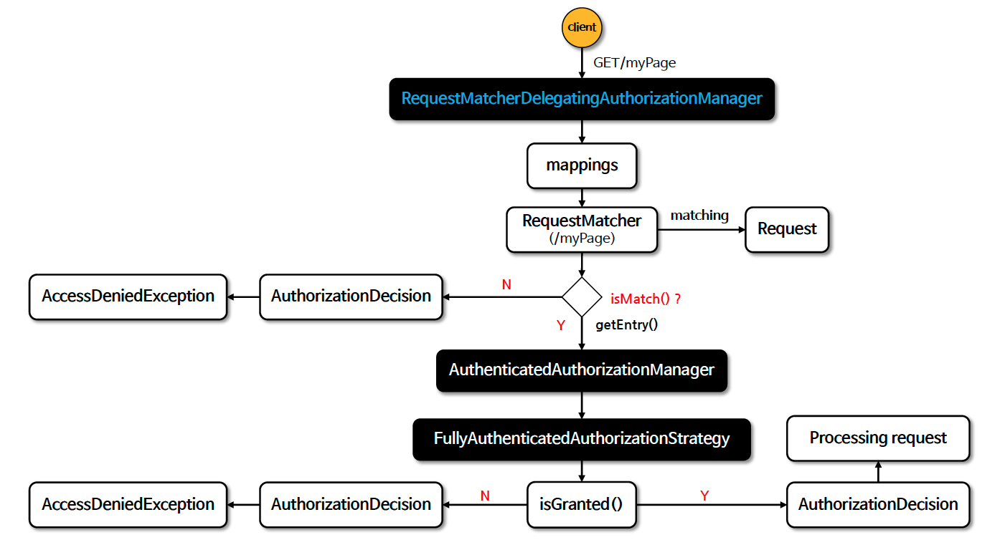
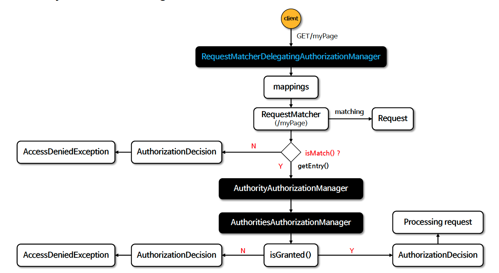

# ☘️ 요청 기반 인가 관리자 - AuthorityAuthorizationManager 외 클래스 구조 이해 - 1 ~ 2

---

## 📖 내용
- Spring Security는 요청 기반의 인증된 사용자 및 특정 권한을 가진 사용자의 자원 접근 허용 여부를 결정하는 인가 관리자 클래스들을 제공합니다.
- 대표적으로 `AuthorityAuthorizationManager`, `AuthenticatedAuthorizationManager`, `WebExpressionAuthorizationManager`, 그리고 대리자인 `RequestMatcherDelegatingAuthorizationManager` 등이 있습니다.

- 인가 처리 흐름
  - `AuthorizationFilter`에서 요청 정보와 인증 정보를 인가 관리자 (`RequestMatcherDelegatingAuthorizationManager`)에 전달합니다.
  - `RequestMatcherDelegatingAuthorizationManager`는 요청 패턴을 기준으로 적절한 인가 관리자 (`AuthorityAuthorizationManager`, `AuthenticatedAuthorizationManager`, `WebExpressionAuthorizationManager`)를 선택합니다.
  - 선택된 인가 관리자는 요청 정보와 인증 정보를 바탕으로 인가 결정을 내립니다.

- `AuthenticatedAuthorizationManager`는 다시 인가 처리를 하기 위한 방법을 `authorizationStrategy` 를 통해 위임합니다.
  - 인가 처리 방법은 `AuthenticatedAuthorizationStrategy` 를 상속받은 `FullyAuthenticatedAuthorizationStrategy`, `AnonymousAuthorizationStrategy`, `RememberMeAuthorizationStrategy`, `AuthenticatedAuthorizationStrategy` 가 있습니다.

### `AuthenticatedAuthorizationManager` 흐름도

<sub>※ 이미지 출처: [정수원님의 인프런 강의](https://www.inflearn.com/course/%EC%8A%A4%ED%94%84%EB%A7%81-%EC%8B%9C%ED%81%90%EB%A6%AC%ED%8B%B0-%EC%99%84%EC%A0%84%EC%A0%95%EB%B3%B5/dashboard)</sub>

- `AuthorityAuthorizationManager`는 특정 권한을 가진 사용자에게만 접근을 허용합니다.
- `AuthorityAuthorizationManager`는 다시 내부적으로 `AuthoritiesAuthorizationManager` 객체를 사용하여 인증된 사용자의 권한을 확인합니다.

### `AuthorityAuthorizationManager` 흐름도

<sub>※ 이미지 출처: [정수원님의 인프런 강의](https://www.inflearn.com/course/%EC%8A%A4%ED%94%84%EB%A7%81-%EC%8B%9C%ED%81%90%EB%A6%AC%ED%8B%B0-%EC%99%84%EC%A0%84%EC%A0%95%EB%B3%B5/dashboard)</sub>

---

## 🔍 중심 로직

```java
package org.springframework.security.authorization;

...

public final class AuthenticatedAuthorizationManager<T> implements AuthorizationManager<T> {
    private final AbstractAuthorizationStrategy authorizationStrategy;

    public AuthenticatedAuthorizationManager() {
        this(new AuthenticatedAuthorizationStrategy());
    }

    private AuthenticatedAuthorizationManager(AbstractAuthorizationStrategy authorizationStrategy) {
        this.authorizationStrategy = authorizationStrategy;
    }

    public void setTrustResolver(AuthenticationTrustResolver trustResolver) {
        this.authorizationStrategy.setTrustResolver(trustResolver);
    }

    public static <T> AuthenticatedAuthorizationManager<T> authenticated() {
        return new AuthenticatedAuthorizationManager<T>();
    }

    public static <T> AuthenticatedAuthorizationManager<T> fullyAuthenticated() {
        return new AuthenticatedAuthorizationManager<T>(new FullyAuthenticatedAuthorizationStrategy());
    }

    public static <T> AuthenticatedAuthorizationManager<T> rememberMe() {
        return new AuthenticatedAuthorizationManager<T>(new RememberMeAuthorizationStrategy());
    }

    public static <T> AuthenticatedAuthorizationManager<T> anonymous() {
        return new AuthenticatedAuthorizationManager<T>(new AnonymousAuthorizationStrategy());
    }

    public AuthorizationDecision check(Supplier<Authentication> authentication, T object) {
        boolean granted = this.authorizationStrategy.isGranted((Authentication)authentication.get());
        return new AuthorizationDecision(granted);
    }

    /** 인가 처리 전략 추상 클래스 */
    private abstract static class AbstractAuthorizationStrategy {
        AuthenticationTrustResolver trustResolver = new AuthenticationTrustResolverImpl();

        private AbstractAuthorizationStrategy() {
        }

        private void setTrustResolver(AuthenticationTrustResolver trustResolver) {
            Assert.notNull(trustResolver, "trustResolver cannot be null");
            this.trustResolver = trustResolver;
        }

        abstract boolean isGranted(Authentication authentication);
    }

    /** 인가 처리 전략 추상 클래스 - 구현체 */
    private static class AuthenticatedAuthorizationStrategy extends AbstractAuthorizationStrategy {
        private AuthenticatedAuthorizationStrategy() {
        }

        boolean isGranted(Authentication authentication) {
            return this.trustResolver.isAuthenticated(authentication);
        }
    }

    /** 인가 처리 전략 추상 클래스 - 구현체 */
    private static final class FullyAuthenticatedAuthorizationStrategy extends AuthenticatedAuthorizationStrategy {
        private FullyAuthenticatedAuthorizationStrategy() {
        }

        boolean isGranted(Authentication authentication) {
            return this.trustResolver.isFullyAuthenticated(authentication);
        }
    }

    /** 인가 처리 전략 추상 클래스 - 구현체 */
    private static final class AnonymousAuthorizationStrategy extends AbstractAuthorizationStrategy {
        private AnonymousAuthorizationStrategy() {
        }

        boolean isGranted(Authentication authentication) {
            return this.trustResolver.isAnonymous(authentication);
        }
    }

    /** 인가 처리 전략 추상 클래스 - 구현체 */
    private static final class RememberMeAuthorizationStrategy extends AbstractAuthorizationStrategy {
        private RememberMeAuthorizationStrategy() {
        }

        boolean isGranted(Authentication authentication) {
            return this.trustResolver.isRememberMe(authentication);
        }
    }
}
```

```java
package org.springframework.security.authorization;

...

public final class AuthorityAuthorizationManager<T> implements AuthorizationManager<T> {
    private static final String ROLE_PREFIX = "ROLE_";
    private final AuthoritiesAuthorizationManager delegate = new AuthoritiesAuthorizationManager();
    private final Set<String> authorities;

    private AuthorityAuthorizationManager(String... authorities) {
        this.authorities = Set.of(authorities);
    }

    public void setRoleHierarchy(RoleHierarchy roleHierarchy) {
        this.delegate.setRoleHierarchy(roleHierarchy);
    }

    public static <T> AuthorityAuthorizationManager<T> hasRole(String role) {
        Assert.notNull(role, "role cannot be null");
        Assert.isTrue(!role.startsWith("ROLE_"), () -> role + " should not start with ROLE_ since ROLE_ is automatically prepended when using hasRole. Consider using hasAuthority instead.");
        return hasAuthority("ROLE_" + role);
    }

    public static <T> AuthorityAuthorizationManager<T> hasAuthority(String authority) {
        Assert.notNull(authority, "authority cannot be null");
        return new AuthorityAuthorizationManager<T>(new String[]{authority});
    }

    public static <T> AuthorityAuthorizationManager<T> hasAnyRole(String... roles) {
        return hasAnyRole("ROLE_", roles);
    }

    public static <T> AuthorityAuthorizationManager<T> hasAnyRole(String rolePrefix, String[] roles) {
        Assert.notNull(rolePrefix, "rolePrefix cannot be null");
        Assert.notEmpty(roles, "roles cannot be empty");
        Assert.noNullElements(roles, "roles cannot contain null values");
        return hasAnyAuthority(toNamedRolesArray(rolePrefix, roles));
    }

    public static <T> AuthorityAuthorizationManager<T> hasAnyAuthority(String... authorities) {
        Assert.notEmpty(authorities, "authorities cannot be empty");
        Assert.noNullElements(authorities, "authorities cannot contain null values");
        return new AuthorityAuthorizationManager<T>(authorities);
    }

    private static String[] toNamedRolesArray(String rolePrefix, String[] roles) {
        String[] result = new String[roles.length];

        for(int i = 0; i < roles.length; ++i) {
            String role = roles[i];
            Assert.isTrue(rolePrefix.isEmpty() || !role.startsWith(rolePrefix), () -> role + " should not start with " + rolePrefix + " since " + rolePrefix + " is automatically prepended when using hasAnyRole. Consider using hasAnyAuthority instead.");
            result[i] = rolePrefix + role;
        }

        return result;
    }

    /** @deprecated */
    @Deprecated
    public AuthorizationDecision check(Supplier<Authentication> authentication, T object) {
        return this.delegate.check(authentication, this.authorities);
    }

    public String toString() {
        return "AuthorityAuthorizationManager[authorities=" + String.valueOf(this.authorities) + "]";
    }
}
```

```java
package org.springframework.security.authorization;

...

public final class AuthoritiesAuthorizationManager implements AuthorizationManager<Collection<String>> {
    private RoleHierarchy roleHierarchy = new NullRoleHierarchy();

    public AuthoritiesAuthorizationManager() {
    }

    public void setRoleHierarchy(RoleHierarchy roleHierarchy) {
        Assert.notNull(roleHierarchy, "roleHierarchy cannot be null");
        this.roleHierarchy = roleHierarchy;
    }

    public AuthorityAuthorizationDecision check(Supplier<Authentication> authentication, Collection<String> authorities) {
        boolean granted = this.isGranted((Authentication)authentication.get(), authorities);
        return new AuthorityAuthorizationDecision(granted, AuthorityUtils.createAuthorityList(authorities));
    }

    private boolean isGranted(Authentication authentication, Collection<String> authorities) {
        return authentication != null && this.isAuthorized(authentication, authorities);
    }

    private boolean isAuthorized(Authentication authentication, Collection<String> authorities) {
        for(GrantedAuthority grantedAuthority : this.getGrantedAuthorities(authentication)) {
            if (authorities.contains(grantedAuthority.getAuthority())) {
                return true;
            }
        }

        return false;
    }

    private Collection<? extends GrantedAuthority> getGrantedAuthorities(Authentication authentication) {
        return this.roleHierarchy.getReachableGrantedAuthorities(authentication.getAuthorities());
    }
}
```

```java
@Configuration
@EnableWebSecurity
public class SecurityConfig {

    @Bean
    public SecurityFilterChain securityFilterChain(HttpSecurity http) throws Exception {
        return http
                .authorizeHttpRequests(auth -> auth
                        // AuthenticatedAuthorizationManager 매핑
                        .requestMatchers("/user").authenticated() // AuthenticatedAuthorizationStrategy 매핑
                        .requestMatchers("/myPage").fullyAuthenticated() // FullyAuthenticatedAuthorizationStrategy 매핑
                        .requestMatchers("/guest").anonymous() // AnonymousAuthorizationStrategy 매핑
                        .requestMatchers("/history").rememberMe() // RememberMeAuthorizationStrategy 매핑
                        
                        // AuthorityAuthorizationManager 매핑
                        .requestMatchers("/user", "/myPage").hasAuthority("USER")
                        .requestMatchers("/admin").hasRole("ADMIN")
                        .requestMatchers("/payment").hasAnyRole("ADMIN","MANAGER")
                        .requestMatchers("/api").hasAnyAuthority("USER","GUEST")
                )
                .build();
    }
}
```

📌
- Spring Security 5.8 이전에는 Voter 패턴을 사용하여 인가 결정을 내렸으나, Spring Security 5.8 부터는 `AuthorizationManager` 패턴을 사용하여 인가 결정을 내립니다.

---

## 📂 참고할만한 자료
- Voter 패턴 Deprecated
  - [link](https://stackoverflow.com/questions/74763256/accessdecisionvoter-deprecated-with-spring-security-6-x)
  - [link](https://docs.spring.io/spring-security/reference/5.8/migration/servlet/authorization.html#_replace_any_custom_method_security_accessdecisionmanagers)
  - [link](https://spring.io/security/cve-2024-22257)

