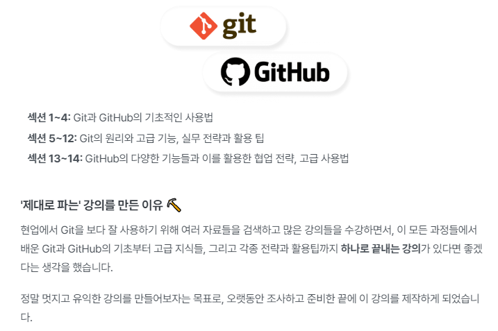

### inflearn-yalco-git-practice

```
얄코(얄팍한 코딩사전)님의 인프런 제대로 파는 Git & GitHub - by 얄코 강의로 학습한 Repository입니다.
```

[인프런 바로가기](https://www.inflearn.com/course/%EC%A0%9C%EB%8C%80%EB%A1%9C-%ED%8C%8C%EB%8A%94-%EA%B9%83/dashboard)




### 챕터
- 섹션 0. 인트로
- 섹션 1. Git 시작하기
- 섹션 2. 시간 여행하기
- 섹션 3. 차원 넘나들기
- 섹션 4. GitHub 사용하기
- 섹션 5. Git 보다 깊이 알기
- 섹션 6. Git 보다 잘 사용하기
- 섹션 7. 프로답게 커밋 관리하기
- 섹션 8. 취소와 되돌리기 보다 깊이 알기
- 섹션 9. 태그
- 섹션 10. Branch 보다 깊이 알기
- 섹션 11. 분석하고 디버깅하기
- 섹션 12. Git의 추가 기능들
- 섹션 13. GitHub 잘 활용하기
- 섹션 14. GitHub 제대로 활용하기
- 섹션 15. 강의를 마무리하며