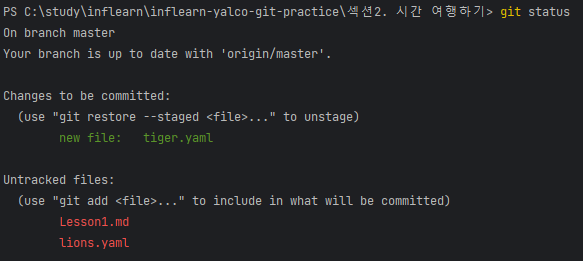
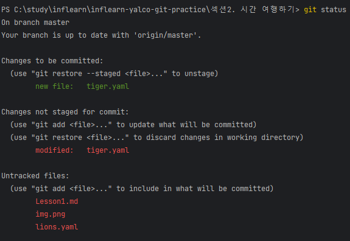

# Lesson1. 변화를 타임캡슐에 담아 묻기

### git cli command

#### stage
`git add .` → 모든 파일 staged 상태로 변경
`git add [filename]` → 특정 파일 staged 상태로 변경

#### commit
`git commit -m "message..."` → staged 상태인 파일들 commit

#### stage + commit
`git commit -am "message..."` → stage + commit 동시에


### unmodified
파일이 staged, committed 상태이고 변경되지 않았다면 이 파일의 상태는 unmodified 상태입니다.


### modified
파일이 staged, committed 상태이고 만약 파일이 수정되었다면 이 파일의 상태는 modified 상태가 됩니다.



```
tiger.yaml 파일을 생성한 후 "git add" 명령어를 통해 staged 상태로 변경합니다.
그리고 tiger.yaml 파일을 수정한 후 "git status" 명령어를 실행해보면 아래와 같이 
tiger.yaml이 modfiied 상태임을 확인할 수 있습니다.
```



