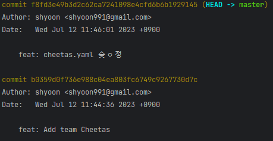
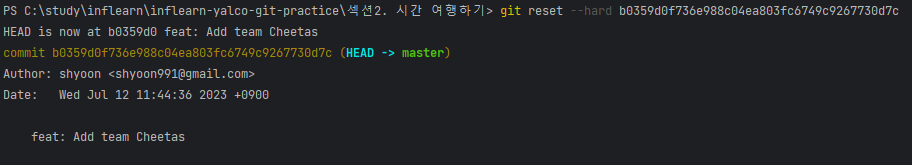
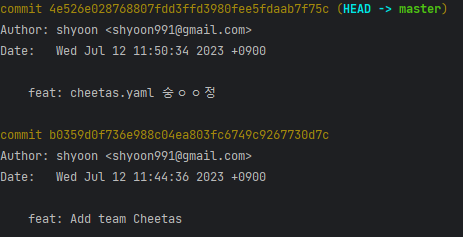
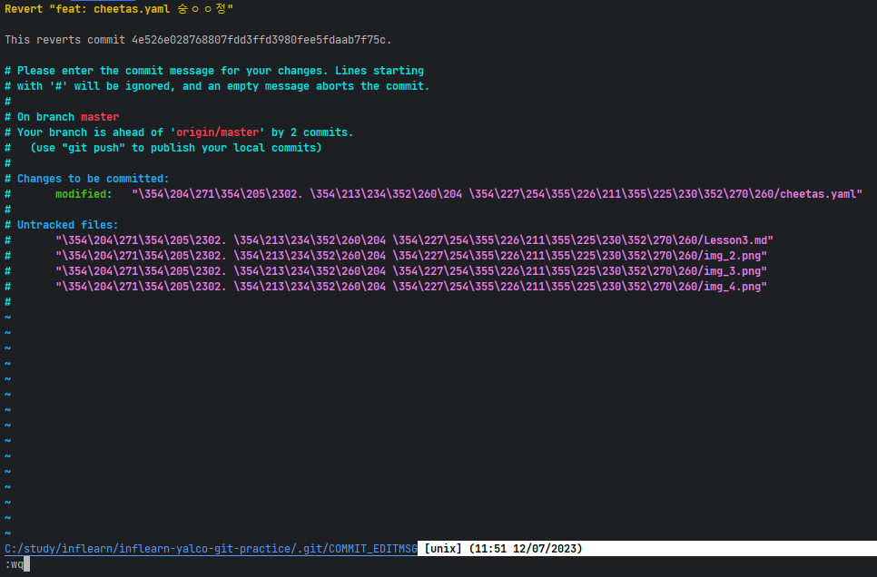
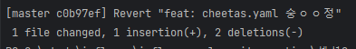
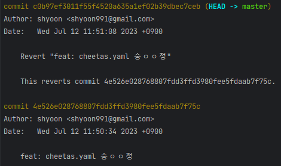

# Lesson3. 과거로 돌아가기 실습

### reset
reset은 특정 커밋으로 되돌아 간 후 그 이후 커밋들은 모두 히스토리에서 제거합니다.

### revert
revert는 특정 커밋의 내용의 정반대되는(취소) 커밋을 새로 생성합니다.

```
cheetas.yaml 파일을 생성 후 commit 합니다.
그리고 cheetas.yaml 파일을 수정하고 커밋을 했는데, 잘 못 수정했다고 가정해봅니다.
이 때 reset, revert 명령어를 각각 실행하여 어떤 결과가 나오는지 확인해봅니다.
```




### reset
`git reset --hard [커밋 해시]`를 실행하여 특정 커밋으로 되돌아갑니다.
지금 경우에는 잘못 커밋한 `f8fd3e49b3d2c62ca7241098e4cfd6b6b1929145`의 직전 커밋인 
`b0359d0f736e988c04ea803fc6749c9267730d7c`에 해당하는 커밋으로 되돌아간 후 이 후 커밋은 제거합니다.




### revert
`git revert [커밋 해시]`를 실행하여 특정 커밋을 revert합니다.



`git revert [커밋 해시]`를 실행하면 아래와 같이 커밋 메시지를 입력할 수 있습니다.



저장하게 되면 아래와 같은 log가 출력됩니다.



`git log` 명령어를 실행하면 revert 명령어로 인해 생성된 커밋이 출력됩니다.

