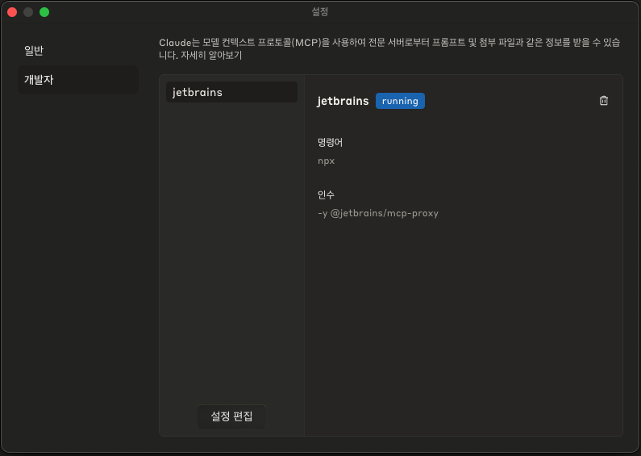

## 섹션 1. 반가워, MCP와 친해지기 👋

### Claude App jetbrains plugin 설치 & IntelliJ 연동

```json
// claude-desktop.json
{
  "mcpServers": {
    "jetbrains": {
      "command": "npx",
      "args": [
        "-y",
        "@jetbrains/mcp-proxy"
      ]
    }
  }
}
```



> Claude App에 아래 문구 입력하여 IntelliJ 연동
>
> check out my project in the ide and give me all the supported apis of the project