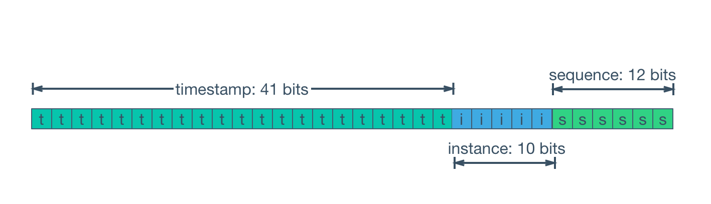

### Snowflake

- X(Twitter)에서 개발
- 분산 시스템에서 고유한 64비트 ID를 생성하는 알고리즘
  - [1비트][41비트: 타임스탬프][10비트: 노드 ID][12비트: 시퀀스 번호]
    - 1비트: 부호 비트로 양수를 생성하기 위한 0으로 고정
  - 분산 환경에서도 중복 없이 순차적 ID를 생성하기 위한 규착
    - 타임스탬프: 순차성
    - 노드ID + 시퀀스 번호: 고유성
  - 유니크, 시간 기반 순차성, 분산 환경에서의 높은 성능

※ [이미지 출처](https://velog.io/@minsik2434/SnowFlake-ID%EB%A1%9C-%EA%B3%A0%EC%9C%A0-%EC%95%84%EC%9D%B4%EB%94%94-%EC%83%9D%EC%84%B1)

## 📂 추가로 학습할만한 자료
- [Snowflake ID WIKI 링크](https://en.wikipedia.org/wiki/Snowflake_ID)
- [How Snowflake IDs work](https://www.youtube.com/watch?v=aLYKd7h7vgY)