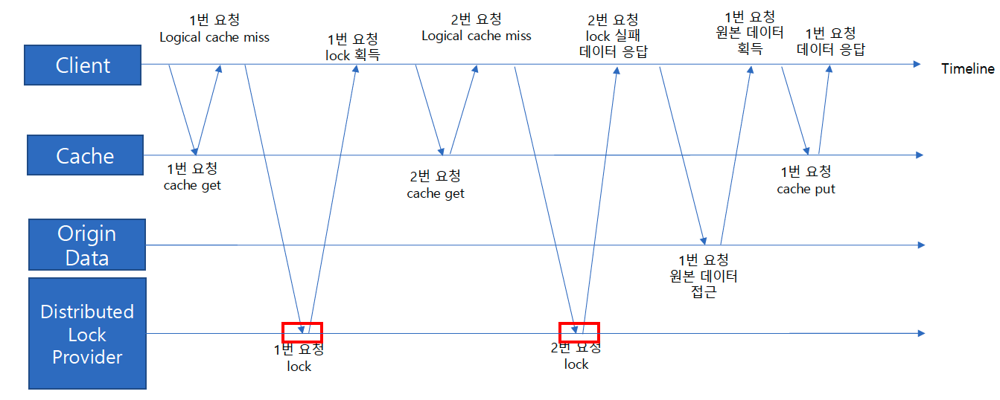

### 캐시 최적화 전략

### `@Cacheable` 동작
- 캐시에서 데이터를 조회
  - 캐시 데이터 유무에 따라,
    - 데이터가 있으면, 캐시의 데이터를 응답
    - 데이터가 없으면, 원본 데이터를 가져오고, 캐시에 저장한 뒤 응답

- 동시에 많은 트래픽이 올 경우 캐시가 만료될 때마다 원본 데이터 서버에 여러 번 요청되고 있다.

- 하지만 캐시 갱신은 한 번의 요청으로 충분하다.

### Distributed Lock
- 분산 락을 사용하여 1개의 요청만 처리할 수 있도록 한다.
- 이 때 나머지 요청들에 대한 처리로 대기하지 않고 즉시 응답을 보내준다.
  - 이를 위해 실제 데이터 만료 시간을 갱신 시간보다 더 길게 잡을 수 있다.
  - 갱신을 위한 만료 시간(Logical TTL)과 실제 만료 시간(Physical TTL)을 다르게 가져가는 전략
  - Logical TTL < Physical TTL
  - Logical TTL때문에 갱신을 수행하더라도, Physical TTL로 인해 데이터는 남아있으므로 즉시 응답할 수 있다.

### Distributed Lock Provider
- Redis의 setIfAbsent 연산으로 빠르게 처리할 수 있다.
- 물론, 이러한 캐시 최적화 전략은 모든 경우에서 사용할 수는 없다.
  - Logical TTL과 Physical TTL이 다르므로, 갱신이 처리 되기 전까지 과거 데이터가 일시적으로 노출될 수 있기 때문이다.
- 하지만 조회수와 같이 캐시 만료 시간이 아주 짧으면서 실시간 데이터 일관성이 반드시 중요하지 않은 작업, 또는 원본 데이터를 처리하는 게 아주 무거운 작업이면,
  - 무의미할 수 있는 중복된 요청 트래픽을 줄임으로써많은 이점을 가져올 수 있다.
  - 원본 데이터 서버에 부하를 줄이면서도, 캐시를 적극 활용하며 조회 성능을 최적화하는데 유리해질 수 있는 것
  - 이렇게 여러 개의 동일하거나 유사한 요청을 하나의 요청으로 병합하여 처리하는 기법을 Request Collapsing이라고 한다.