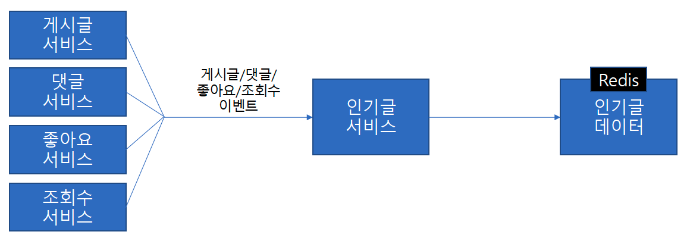
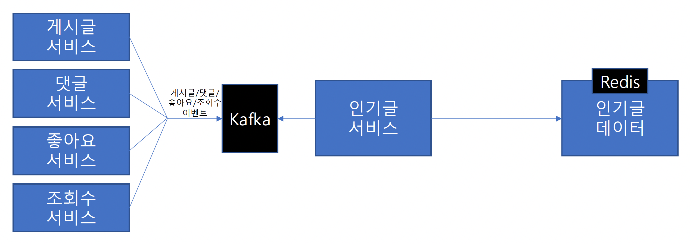

#### 인기글 Consumer 설계
- 매일 게시글 생성 트래픽은 수백~수천만 건 이상
- 하루 동안 생성된 모든 게시글에 대해서,
    - 점수를 계산하고, 상위 10건을 찾아야 하는 작업
    - 이러한 작업은 1시간 만에 처리되어야 한다.

#### 배치 처리
- 배치 처리를 고려해볼 수 있다.
    - 오전 12시에 전날 작성된 게시글을 모두 순회
    - 각 게시글에 대해서 좋아요 수, 조회수, 댓글 수를 조회
    - 게시글의 점수를 계산
    - 모든 게시글에 대해서 상위 10건을 선정
- 하지만 배치 작업에서도 몇 가지 제한될 수 있는 부분이 있다.
    - 대규모 데이터이기 때문에 1시간 만에 처리하기에 시간이 촉박할 수 있다.
    - 병렬 시스템을 구축할 수도 있지만 리소스도 고려해야 한다.
- 시간적인 제약, 개발 복잡성, 노출 시간 정책 등에 따라서 배치 처리에는 한계가 생길 수 있다.

#### 스트림 처리(Stream Processing)
- Kafka를 사용하여 스트림 처리를 고려해볼 수 있다.
- 이벤트
    - 게시글 생성/수정/삭제 이벤트
    - 댓글 생성/삭제 이벤트
    - 좋아요 생성/삭제 이벤트
    - 조회수 집계 이벤트
- 위와 같은 목적별 이벤트를 생성하고 실시간으로 받아서 처리하면 배치 시스템을 구축하지 않고도 인기글 상위 10건에 대한 정보를 미리 생성할 수 있다.
- 그럼 인기글은 다음과 같은 흐름으로 계산된다.
    - 인기글 선정에 필요한 이벤트를 스트림으로 받는다.
    - 실시간으로 각 게시글의 점수를 계산한다.
    - 실시간으로 상위 10건의 인기글 목록을 만든다.
    - Client는 인기글 목록을 조회한다.

#### 이벤트를 수신할 방법 API vs Message Broker
- API
    - 게시글/좋아요/조회수/댓글 서비스의 데이터 변경이 생기면 인기글 서비스로 API를 이용한 이벤트 전송
    - 비교적 간단한 구현
    - 타 서비스에 직접적 의존, 시스템 간 결합도 증가
    - 서버 부하 전파
        - 인기글
            - 데이터를 실시간으로 PUSH 받는다.
        - 게시글/좋아요/조회수/댓글
            - 데이터를 실시간을 PUSH 한다.
        - 장애 전파, 유실등의 위험 높음
- Message Broker
    - 게시글/좋아요/조회수/댓글 서비스의 데이터 변경이 생기면 메시지 브로커로 이벤트를 전송하고, 인기글 서비스에서 이벤트를 수신하여 처리
    - 비교적 복잡한 구현
        - 대규모 데이터를 안전하게 처리하기 위한 시스템 필요할 수도 있음
    - 타 서비스에 메시지 브로커 이용한 간접적 의존성, 시스템 간 결합도 감소
    - 서버 부하 전파
        - 인기글
            - 인기글 서비스는 메시지 브로커에서 적절하게 이벤트를 가져와서 비동기 처리 가능
        - 게시글/좋아요/조회수/댓글
            - 메시지 브로커로 이벤트 전송만 하면 된다.
        - 장애 전파, 유실등의 위험 낮음

#### Message Broker(Kafka) 적용

