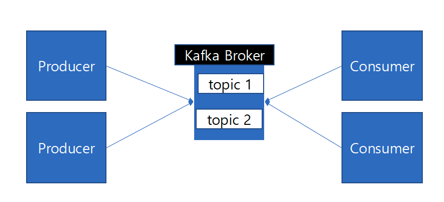
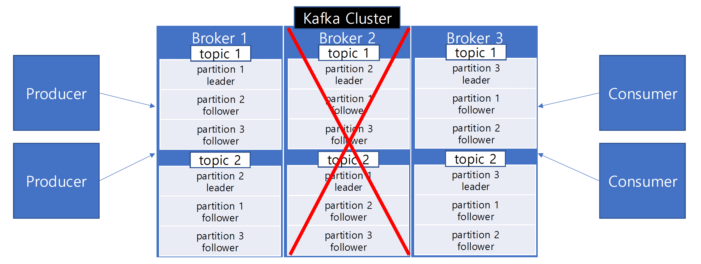

### Kafka
- 분산 이벤트 스트리밍 플랫폼
- 대규모 데이터를 실시간으로 처리하기 위해 사용
- 고성능, 확장성, 내구성, 가용성
- 여러 서비스 간에 대규모 이벤트를 생산하고 소비하며 통신하기 위해 사용

### Kafka 구성 요소
- Topic
    - 데이터가 구분되는 논리적인 단위
    - ex: article-topic: 게시글 이벤트
    - ex: comment-topic: 댓글 이벤트
- Partition
    - Topic이 분산되는 단위
    - 각 Topic은 여러 개의 Partition으로 분산 저장 및 병렬 처리된다.
    - 각 Partition 내에서 데이터가 순차적으로 기록되므로, Partition 간에는 순서가 보장되지 않는다.
    - Partition은 여러 Broker에 분산되어 Cluster의 확장성을 높인다.
- Broker
    - Kafka에서 데이터를 중개 및 처리해주는 애플리케이션 실행 단위
    - Producer와 Consumer 간의 중개자 역할을 한다.
- Kafka Cluster
    - 여러 개의 Broker가 모여서 하나의 분산형 시스템을 구성한 것
    - 대규모 데이터에 대해 고성능, 안전성, 확장성, 고가용성 등 지원
        - 데이터의 복제, 분산 처리, 장애 복구 등
- Offset
    - 각 데이터에 대해 고유한 위치
        - 데이터는 각 Topic의 Partition 단위로 순차적으로 기록되고, 기록된 데이터는 offset을 가진다.
    - Consumer Group은 각 그룹이 처리한 offset을 관리한다.
        - 데이터를 어디까지 읽었는지
- Consumer Group
    - Consumer Group은 각 Topic의 Partition 단위로 offset을 관리한다.
        - 인기글 서비스를 위한 Consumer Group
        - 조회 최적화를 서비스를 위한 Consumer Group
    - Consumer Group 내의 Consumer들은 데이터를 중복해서 읽지 않을 수 있다.
    - Consumer Group 별로 데이터를 병렬로 처리할 수 있다.

### Partition
- 각 Topic은 Partition 단위로 물리적으로 분산될 수 있다.
- 각 Topic은 3개의 Partition으로 분산하여 데이터를 처리한다.
- Producer는 Topic의 Partition 단위로 데이터를 생산하고
- Consumer는 Topic의 Partition 단위로 데이터를 소비한다.

- `replication factor=3` 옵션으로 각 Partition은 3개의 Broker에 복제된다.
- 이 중 하나의 Partition이 leader로 선정되며 leader에 데이터를 쓰면 follower에 복제된다.

- leader Partition에 장애가 발생하면, 나머지 follower Partition 중 하나가 leader로 승격된다.
- 관련 옵션
  - `acks`
  - `min.insync.replicas`

### 참고 링크
- [kafka docs](https://kafka.apache.org/)
- [\[데브원영\] 아파치 카프카 for beginners](https://www.inflearn.com/course/%EC%95%84%ED%8C%8C%EC%B9%98-%EC%B9%B4%ED%94%84%EC%B9%B4-%EC%9E%85%EB%AC%B8/dashboard)
- [카프카 완벽 가이드 - 코어편](https://www.inflearn.com/course/%EC%B9%B4%ED%94%84%EC%B9%B4-%EC%99%84%EB%B2%BD%EA%B0%80%EC%9D%B4%EB%93%9C-%EC%BD%94%EC%96%B4/dashboard)
- [실전 카프카 개발부터 운영까지](https://product.kyobobook.co.kr/detail/S000001932756)
- [Apache Kafka의 새로운 협의 프로토콜인 KRaft에 대해(1)](https://devocean.sk.com/blog/techBoardDetail.do?ID=165711&boardType=techBlog)
- [Apache Kafka의 새로운 협의 프로토콜인 KRaft에 대해(2)](https://devocean.sk.com/blog/techBoardDetail.do?ID=165737&boardType=techBlog&searchData=&searchDataMain=&page=&subIndex=&searchText=Kafka&techType=&searchDataSub=&comment=)
- [Raft 알고리즘을 이용해 고가용 프로그램을 만들어보자!!](https://devocean.sk.com/blog/techBoardDetail.do?ID=167472&boardType=techBlog)
- [Kafka KRaft 모드 (with Docker) - 동물원을 탈출한 Kafka](https://medium.com/mo-zza/kafka-kraft-%EB%AA%A8%EB%93%9C-with-docker-%EB%8F%99%EB%AC%BC%EC%9B%90%EC%9D%84-%ED%83%88%EC%B6%9C%ED%95%9C-kafka-8b5e7c7632fa)
- [뗏목 타고 합의 알고리즘 이해하기: The Raft Consensus Algorithm](https://www.youtube.com/watch?v=aywjlaKxQp4)