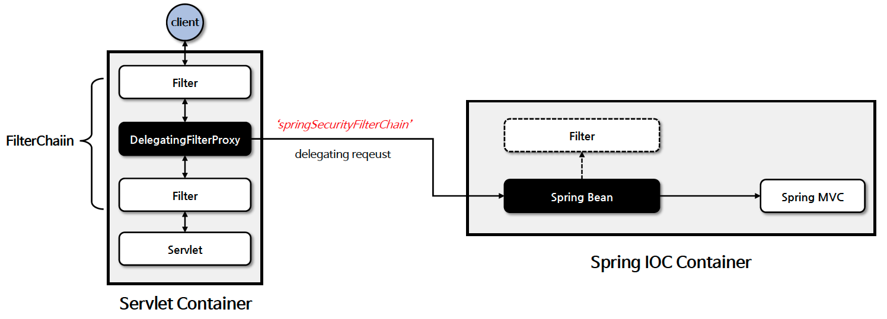
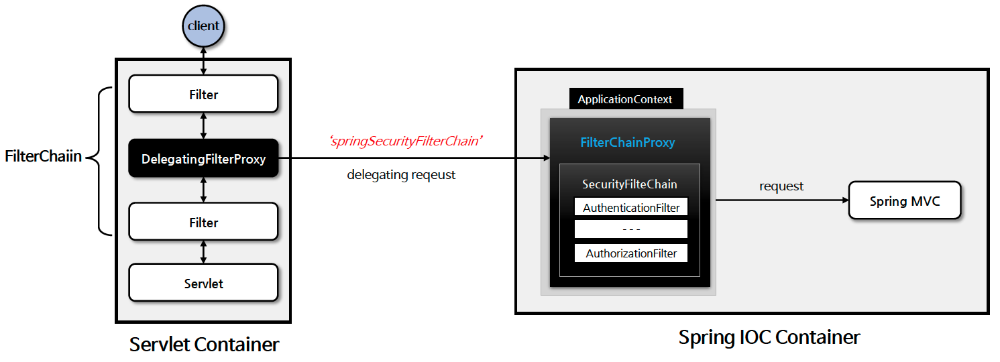

# ☘️ DelegatingFilterProxy / FilterChainProxy

---

## 📖 내용

<sub>※ 이미지 출처: [정수원님의 인프런 강의](https://www.inflearn.com/course/%EC%8A%A4%ED%94%84%EB%A7%81-%EC%8B%9C%ED%81%90%EB%A6%AC%ED%8B%B0-%EC%99%84%EC%A0%84%EC%A0%95%EB%B3%B5/dashboard)</sub>

- `DelegatingFilterProxy`
  - `DelegatingFilterProxy` 는 스프링에서 사용되는 특별한 서블릿 필터로, 서블릿 컨테이너와 스프링 애플리케이션 컨텍스트 간의 *연결고리 역할을 하는 필터*입니다
  - `DelegatingFilterProxy` 는 서블릿 필터의 기능을 수행하는 동시에 스프링의 의존성 주입 및 빈 관리 기능과 연동되도록 설계된 필터라 할 수 있습니다.
  - `DelegatingFilterProxy` 는 `springSecurityFilterChain` 이름으로 생성된 빈을 `ApplicationContext` 에서 찾아 요청을 위임합니다.
  - *실제 보안 처리를 수행하지 않는다*


<sub>※ 이미지 출처: [정수원님의 인프런 강의](https://www.inflearn.com/course/%EC%8A%A4%ED%94%84%EB%A7%81-%EC%8B%9C%ED%81%90%EB%A6%AC%ED%8B%B0-%EC%99%84%EC%A0%84%EC%A0%95%EB%B3%B5/dashboard)</sub>

- `FilterChainProxy`
  - `springSecurityFilterChain` 의 이름으로 생성되는 필터 빈으로서 `DelegatingFilterProxy` 으로 부터 요청을 위임 받고 보안 처리 역할을 합니다.
  - 내부적으로 하나 이상의 `SecurityFilterChain` 객체들을 가지고 있으며 요청 URL 정보를 기준으로 적절한 `SecurityFilterChain` 을 선택하여 필터들을 호출한다
  - `HttpSecurity` 를 통해 API 추가 시 관련 필터들이 추가된다
  - 사용자의 요청을 필터 순서대로 호출함으로 보안 기능을 동작시키고 필요 시 직접 필터를 생성해서 기존의 필터 전.후로 추가 가능하다

---

## 🔍 중심 로직

```java
package org.springframework.web.filter;

...

public class DelegatingFilterProxy extends GenericFilterBean {
    @Nullable
    private String contextAttribute;
    @Nullable
    private WebApplicationContext webApplicationContext;
    @Nullable
    private String targetBeanName;
    private boolean targetFilterLifecycle;
    @Nullable
    private volatile Filter delegate;
    private final Object delegateMonitor;

    public DelegatingFilterProxy() {
        this.targetFilterLifecycle = false;
        this.delegateMonitor = new Object();
    }

    public DelegatingFilterProxy(Filter delegate) {
        this.targetFilterLifecycle = false;
        this.delegateMonitor = new Object();
        Assert.notNull(delegate, "Delegate Filter must not be null");
        this.delegate = delegate;
    }

    public DelegatingFilterProxy(String targetBeanName) {
        this(targetBeanName, (WebApplicationContext)null);
    }

    public DelegatingFilterProxy(String targetBeanName, @Nullable WebApplicationContext wac) {
        this.targetFilterLifecycle = false;
        this.delegateMonitor = new Object();
        Assert.hasText(targetBeanName, "Target Filter bean name must not be null or empty");
        this.setTargetBeanName(targetBeanName);
        this.webApplicationContext = wac;
        if (wac != null) {
            this.setEnvironment(wac.getEnvironment());
        }

    }

  ...

    protected void initFilterBean() throws ServletException {
        synchronized(this.delegateMonitor) {
            if (this.delegate == null) {
                if (this.targetBeanName == null) {
                    this.targetBeanName = this.getFilterName();
                }

                WebApplicationContext wac = this.findWebApplicationContext();
                if (wac != null) {
                    this.delegate = this.initDelegate(wac);
                }
            }

        }
    }

    public void doFilter(ServletRequest request, ServletResponse response, FilterChain filterChain) throws ServletException, IOException {
        Filter delegateToUse = this.delegate;
        if (delegateToUse == null) {
            synchronized(this.delegateMonitor) {
                delegateToUse = this.delegate;
                if (delegateToUse == null) {
                    WebApplicationContext wac = this.findWebApplicationContext();
                    if (wac == null) {
                        throw new IllegalStateException("No WebApplicationContext found: no ContextLoaderListener or DispatcherServlet registered?");
                    }

                    delegateToUse = this.initDelegate(wac);
                }

                this.delegate = delegateToUse;
            }
        }

        this.invokeDelegate(delegateToUse, request, response, filterChain);
    }

  ...

    @Nullable
    protected WebApplicationContext findWebApplicationContext() {
        if (this.webApplicationContext != null) {
            if (this.webApplicationContext instanceof ConfigurableApplicationContext) {
                ConfigurableApplicationContext cac = (ConfigurableApplicationContext)this.webApplicationContext;
                if (!cac.isActive()) {
                    cac.refresh();
                }
            }

            return this.webApplicationContext;
        } else {
            String attrName = this.getContextAttribute();
            return attrName != null ? WebApplicationContextUtils.getWebApplicationContext(this.getServletContext(), attrName) : WebApplicationContextUtils.findWebApplicationContext(this.getServletContext());
        }
    }
    
  ...
}
```

```java
package org.springframework.boot.autoconfigure.security.servlet;

...

@AutoConfiguration(
    after = {SecurityAutoConfiguration.class}
)
@ConditionalOnWebApplication(
    type = Type.SERVLET
)
@EnableConfigurationProperties({SecurityProperties.class})
@ConditionalOnClass({AbstractSecurityWebApplicationInitializer.class, SessionCreationPolicy.class})
public class SecurityFilterAutoConfiguration {
    private static final String DEFAULT_FILTER_NAME = "springSecurityFilterChain"; // DelegatingFilterProxy 빈 기본 이름

    public SecurityFilterAutoConfiguration() {
    }

    @Bean
    @ConditionalOnBean(
        name = {"springSecurityFilterChain"}
    )
    public DelegatingFilterProxyRegistrationBean securityFilterChainRegistration(SecurityProperties securityProperties) {
        DelegatingFilterProxyRegistrationBean registration = new DelegatingFilterProxyRegistrationBean("springSecurityFilterChain", new ServletRegistrationBean[0]);
        registration.setOrder(securityProperties.getFilter().getOrder());
        registration.setDispatcherTypes(this.getDispatcherTypes(securityProperties));
        return registration;
    }

    private EnumSet<DispatcherType> getDispatcherTypes(SecurityProperties securityProperties){
        return securityProperties.getFilter().getDispatcherTypes() == null ? null : (EnumSet)securityProperties.getFilter().getDispatcherTypes().stream().map((type) -> DispatcherType.valueOf(type.name())).collect(Collectors.toCollection(() -> EnumSet.noneOf(DispatcherType.class)));
    }
}
```

```java
package org.springframework.boot.web.servlet;

...

public class DelegatingFilterProxyRegistrationBean extends AbstractFilterRegistrationBean<DelegatingFilterProxy> implements ApplicationContextAware {
    
  ...

  protected FilterRegistration.Dynamic addRegistration(String description, ServletContext servletContext) {
    Filter filter = this.getFilter();
    return servletContext.addFilter(this.getOrDeduceName(filter), filter); // DelegatingFilterProxy 객체를 서블릿 컨테이너에 저장
  }
}
```

📌  요약
- Spring Security는 `FilterChainProxy`를 사용하여 필터 체인을 관리합니다.
- 이 때 `FilterChainProxy`는 스프링의 빈으로 관리됩니다.
- 일반적으로는 서블릿 필터에서는 스프링의 빈에 접근할 수 없으므로 서블릿에서는 `FilterChainProxy`를 사용할수 없습니다.
- 이 문제를 해결해주는 것이 바로 `DelegatingFilterProxy`입니다.
- 그리고 `DelegatingFilterProxyRegistrationBean`을 통해 `DelegatingFilterProxy`를 서블릿 컨테이너에 등록합니다.

---

## 💬 코멘트
- Spring Security에서 가장 중요하다고 볼 수 있는 `DelegatingFilterProxy`와 `FilterChainProxy`에 대해 알아보았습니다.
- `DelegatingFilterProxy`의 동작 방식에 대해 이해하지 못한다면 Spring Security가 어떻게 Filter 단에서 Spring의 빈, 기능들을 사용하는지 이해하기 힘들 것입니다.

---
