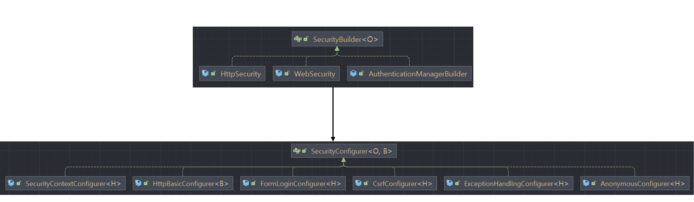
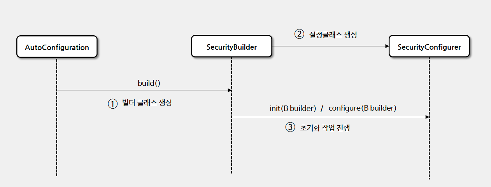
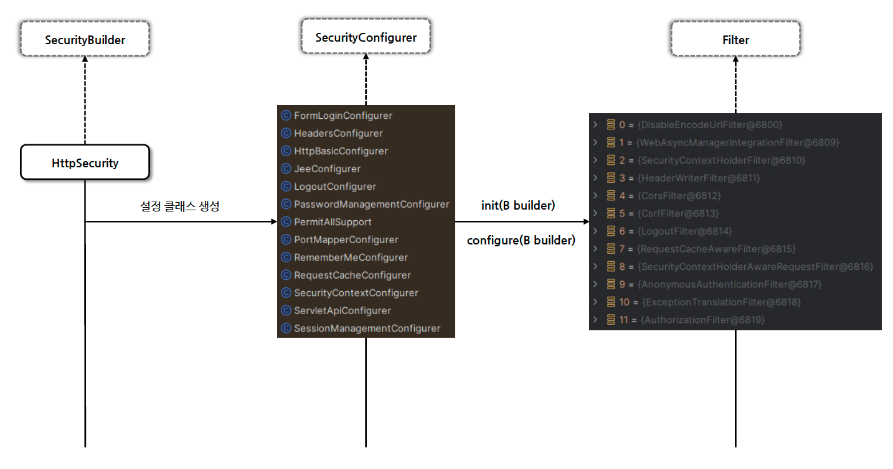

# ☘️ SecurityBuilder / SecurityConfigurer

---

## 📖 내용


- `SecurityBuilder`
  - Spring Security의 구성 요소를 생성하는 데 사용되는 빌더 패턴을 구현한 인터페이스입니다.
  - 웹 보안을 구성하는 빈 객체와 설정 클래스들을 생성하는 역할을 하며 대표적인 구현체로는 `WebSecurity`, `HttpSecurity`가 있습니다.
  - `SecurityBuilder`는 `SecurityConfigurer`를 참조하고 있으며 인증 및 인가 초기화 작업은 `SecurityConfigurer`에 의해 진행됩니다.
- `SecurityConfigurer`
  - `SecurityConfigurer`는 Http 요청과 관련된 보안처리를 담당하는 필터들을 생성하고 여러 초기화 설정에 관여합니다.

---

## 초기화 작업 진행 방식



---

## 🔍 중심 로직

```java
package org.springframework.security.config.annotation;

public interface SecurityBuilder<O> {
    O build() throws Exception;
}
```

```java
public interface SecurityConfigurer<O, B extends SecurityBuilder<O>> {
    void init(B builder) throws Exception;

    void configure(B builder) throws Exception;
}
```

```java
package org.springframework.security.config.annotation.web.configuration;

...

@Configuration(
    proxyBeanMethods = false
)
class HttpSecurityConfiguration {
    private static final String BEAN_NAME_PREFIX = "org.springframework.security.config.annotation.web.configuration.HttpSecurityConfiguration.";
    private static final String HTTPSECURITY_BEAN_NAME = "org.springframework.security.config.annotation.web.configuration.HttpSecurityConfiguration.httpSecurity";
    private ObjectPostProcessor<Object> objectPostProcessor;
    private AuthenticationManager authenticationManager;
    private AuthenticationConfiguration authenticationConfiguration;
    private ApplicationContext context;

  ...
  
    @Bean({"org.springframework.security.config.annotation.web.configuration.HttpSecurityConfiguration.httpSecurity"})
    @Scope("prototype")
    HttpSecurity httpSecurity() throws Exception {
        WebSecurityConfigurerAdapter.LazyPasswordEncoder passwordEncoder = new WebSecurityConfigurerAdapter.LazyPasswordEncoder(this.context);
        AuthenticationManagerBuilder authenticationBuilder = new WebSecurityConfigurerAdapter.DefaultPasswordEncoderAuthenticationManagerBuilder(this.objectPostProcessor, passwordEncoder);
        authenticationBuilder.parentAuthenticationManager(this.authenticationManager());
        authenticationBuilder.authenticationEventPublisher(this.getAuthenticationEventPublisher());
        HttpSecurity http = new HttpSecurity(this.objectPostProcessor, authenticationBuilder, this.createSharedObjects());
        http.csrf(Customizer.withDefaults()).addFilter(new WebAsyncManagerIntegrationFilter()).exceptionHandling(Customizer.withDefaults()).headers(Customizer.withDefaults()).sessionManagement(Customizer.withDefaults()).securityContext(Customizer.withDefaults()).requestCache(Customizer.withDefaults()).anonymous(Customizer.withDefaults()).servletApi(Customizer.withDefaults()).apply(new DefaultLoginPageConfigurer());
        http.logout(Customizer.withDefaults());
        this.applyDefaultConfigurers(http);
        return http;
    }
    
  ...
}
```

```java
package org.springframework.security.config.annotation.web.configuration;

...

@Configuration(
    proxyBeanMethods = false
)
public class WebSecurityConfiguration implements ImportAware, BeanClassLoaderAware {
    private WebSecurity webSecurity;
    private Boolean debugEnabled;
    private List<SecurityConfigurer<Filter, WebSecurity>> webSecurityConfigurers;
    private List<SecurityFilterChain> securityFilterChains = Collections.emptyList();
    private List<WebSecurityCustomizer> webSecurityCustomizers = Collections.emptyList();
    private ClassLoader beanClassLoader;
    
  ...

    @Bean(
        name = {"springSecurityFilterChain"}
    )
    public Filter springSecurityFilterChain() throws Exception {
        boolean hasConfigurers = this.webSecurityConfigurers != null && !this.webSecurityConfigurers.isEmpty();
        boolean hasFilterChain = !this.securityFilterChains.isEmpty();
        Assert.state(!hasConfigurers || !hasFilterChain, "Found WebSecurityConfigurerAdapter as well as SecurityFilterChain. Please select just one.");
        if (!hasConfigurers && !hasFilterChain) {
            WebSecurityConfigurerAdapter adapter = (WebSecurityConfigurerAdapter)this.objectObjectPostProcessor.postProcess(new WebSecurityConfigurerAdapter() {
            });
            this.webSecurity.apply(adapter);
        }

        for(SecurityFilterChain securityFilterChain : this.securityFilterChains) {
            this.webSecurity.addSecurityFilterChainBuilder(() -> securityFilterChain);

            for(Filter filter : securityFilterChain.getFilters()) {
                if (filter instanceof FilterSecurityInterceptor) {
                    this.webSecurity.securityInterceptor((FilterSecurityInterceptor)filter);
                    break;
                }
            }
        }

        for(WebSecurityCustomizer customizer : this.webSecurityCustomizers) {
            customizer.customize(this.webSecurity);
        }

        return (Filter)this.webSecurity.build();
    }

  ...
}
```

📌  요약
- 각각 `HttpSecurity` -> `HttpSecurityConfiguration`, `WebSecurity` -> `WebSecurityConfiguration` 객체를 통해 초기화된다.
- 초기화 시 각 기능에 맞게 구현된 `Configurer` 객체를 통해 초기화 작업이 진행됩니다.
  - ex) `CsrfConfigurer`, `ExceptionHandlingConfigurer`, `HeadersConfigurer`, `SessionManagementConfigurer`...

---

## 💬 코멘트
- Spring Security에서 `SecurityFilterChain`을 초기화 할 때 각 기능들에 맞게 구성된 `Configurer` 객체들도 기본 설정을 가진 객체를 생성하여 초기화 작업을 진행합니다.
- 커스텀 설정을 적용 시 우리가 작성하게 되는 설정들이 바로 이 `Configurer` 객체들이며, Security에서는 람다식으로 작성하게끔 권장되고 있습니다.
- Spring Security에서 제공하는 설정들, 그리고 Configurer 객체들을 사용하지 않고 직접 Configurer 객체를 만들어서 설정에 적용할 수 도 있는데, 그러기 위해서는 이러한 Spring Security 초기화 동작 방식에 대해 이해하고 있어야 합니다.

---
