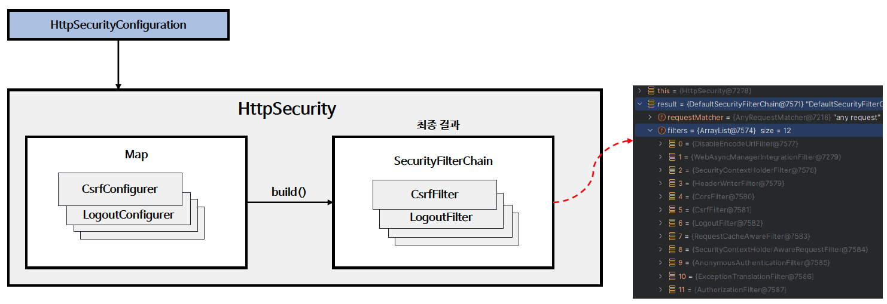
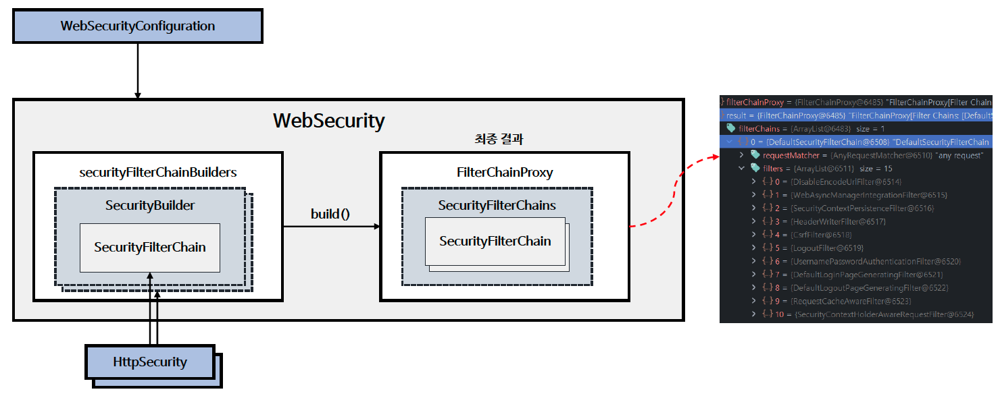

# ☘️ WebSecurity / HttpSecurity

---

## 📖 내용

<sub>※ 이미지 출처: [정수원님의 인프런 강의](https://www.inflearn.com/course/%EC%8A%A4%ED%94%84%EB%A7%81-%EC%8B%9C%ED%81%90%EB%A6%AC%ED%8B%B0-%EC%99%84%EC%A0%84%EC%A0%95%EB%B3%B5/dashboard)</sub>

- `HttpSecurity`
  - `HttpSecurity`는 `HttpSecurityConfiguration`에서 생성되며 초기화가 진행됩니다.
  - `HttpSecurity`는 보안에 필요한 각 설정 클래스와 필터들을 생성하고 최종적으로 `SecurityFilterChain` Bean을 생성합니다.


<sub>※ 이미지 출처: [정수원님의 인프런 강의](https://www.inflearn.com/course/%EC%8A%A4%ED%94%84%EB%A7%81-%EC%8B%9C%ED%81%90%EB%A6%AC%ED%8B%B0-%EC%99%84%EC%A0%84%EC%A0%95%EB%B3%B5/dashboard)</sub>

- `WebSecurity`
  - `WebSecurity`는 `WebSecurityConfiguration`에서 생성되며 초기화가 진행됩니다.
  - `WebSecurity` 는 `HttpSecurity` 에서 생성한 `SecurityFilterChain` Bean을 `SecurityBuilder`에 저장합니다.
  - `WebSecurity` 가 build() 를 실행하면 `SecurityBuilder` 에서 `SecurityFilterChain` 을 꺼내어 `FilterChainProxy` 생성자에게 전달한다

---

## 🔍 중심 로직

```java
package org.springframework.security.config.annotation.web.builders;

...

public final class HttpSecurity extends AbstractConfiguredSecurityBuilder<DefaultSecurityFilterChain, HttpSecurity> implements SecurityBuilder<DefaultSecurityFilterChain>, HttpSecurityBuilder<HttpSecurity> {
    private final RequestMatcherConfigurer requestMatcherConfigurer;
    private List<OrderedFilter> filters = new ArrayList();
    private RequestMatcher requestMatcher;
    private FilterOrderRegistration filterOrders;
    private AuthenticationManager authenticationManager;

    public HttpSecurity(ObjectPostProcessor<Object> objectPostProcessor, AuthenticationManagerBuilder authenticationBuilder, Map<Class<?>, Object> sharedObjects) {
        super(objectPostProcessor);
        this.requestMatcher = AnyRequestMatcher.INSTANCE;
        this.filterOrders = new FilterOrderRegistration();
        Assert.notNull(authenticationBuilder, "authenticationBuilder cannot be null");
        this.setSharedObject(AuthenticationManagerBuilder.class, authenticationBuilder);

        for(Map.Entry<Class<?>, Object> entry : sharedObjects.entrySet()) {
            this.setSharedObject((Class)entry.getKey(), entry.getValue());
        }

        ApplicationContext context = (ApplicationContext)sharedObjects.get(ApplicationContext.class);
        this.requestMatcherConfigurer = new RequestMatcherConfigurer(context);
    }

  ...
  
    protected DefaultSecurityFilterChain performBuild() {
        ExpressionUrlAuthorizationConfigurer<?> expressionConfigurer = (ExpressionUrlAuthorizationConfigurer)this.getConfigurer(ExpressionUrlAuthorizationConfigurer.class);
        AuthorizeHttpRequestsConfigurer<?> httpConfigurer = (AuthorizeHttpRequestsConfigurer)this.getConfigurer(AuthorizeHttpRequestsConfigurer.class);
        boolean oneConfigurerPresent = expressionConfigurer == null ^ httpConfigurer == null;
        Assert.state(expressionConfigurer == null && httpConfigurer == null || oneConfigurerPresent, "authorizeHttpRequests cannot be used in conjunction with authorizeRequests. Please select just one.");
        this.filters.sort(OrderComparator.INSTANCE);
        List<Filter> sortedFilters = new ArrayList(this.filters.size());

        for(Filter filter : this.filters) {
            sortedFilters.add(((OrderedFilter)filter).filter);
        }

        return new DefaultSecurityFilterChain(this.requestMatcher, sortedFilters); // SecurityFilterChain인 DefaultSecurityFilterChain을 생성
    }

  ...
}
```

```java
package org.springframework.security.config.annotation.web.builders;

...

public final class WebSecurity extends AbstractConfiguredSecurityBuilder<Filter, WebSecurity> implements SecurityBuilder<Filter>, ApplicationContextAware, ServletContextAware {
    private final Log logger = LogFactory.getLog(this.getClass());
    private final List<RequestMatcher> ignoredRequests = new ArrayList();
    private final List<SecurityBuilder<? extends SecurityFilterChain>> securityFilterChainBuilders = new ArrayList();
    private IgnoredRequestConfigurer ignoredRequestRegistry;
    private FilterSecurityInterceptor filterSecurityInterceptor;
    private HttpFirewall httpFirewall;
    private RequestRejectedHandler requestRejectedHandler;
    private boolean debugEnabled;
    private WebInvocationPrivilegeEvaluator privilegeEvaluator;
    private DefaultWebSecurityExpressionHandler defaultWebSecurityExpressionHandler = new DefaultWebSecurityExpressionHandler();
    private SecurityExpressionHandler<FilterInvocation> expressionHandler;
    private Runnable postBuildAction;
    private ServletContext servletContext;

    public WebSecurity(ObjectPostProcessor<Object> objectPostProcessor) {
        super(objectPostProcessor);
        this.expressionHandler = this.defaultWebSecurityExpressionHandler;
        this.postBuildAction = () -> {
        };
    }
  
  ...

    protected Filter performBuild() throws Exception {
        Assert.state(!this.securityFilterChainBuilders.isEmpty(), () -> "At least one SecurityBuilder<? extends SecurityFilterChain> needs to be specified. Typically this is done by exposing a SecurityFilterChain bean. More advanced users can invoke " + WebSecurity.class.getSimpleName() + ".addSecurityFilterChainBuilder directly");
        int chainSize = this.ignoredRequests.size() + this.securityFilterChainBuilders.size();
        List<SecurityFilterChain> securityFilterChains = new ArrayList(chainSize);
        List<RequestMatcherEntry<List<WebInvocationPrivilegeEvaluator>>> requestMatcherPrivilegeEvaluatorsEntries = new ArrayList();

        for(RequestMatcher ignoredRequest : this.ignoredRequests) {
            this.logger.warn("You are asking Spring Security to ignore " + ignoredRequest + ". This is not recommended -- please use permitAll via HttpSecurity#authorizeHttpRequests instead.");
            SecurityFilterChain securityFilterChain = new DefaultSecurityFilterChain(ignoredRequest, new Filter[0]);
            securityFilterChains.add(securityFilterChain);
            requestMatcherPrivilegeEvaluatorsEntries.add(this.getRequestMatcherPrivilegeEvaluatorsEntry(securityFilterChain));
        }

        for(SecurityBuilder<? extends SecurityFilterChain> securityFilterChainBuilder : this.securityFilterChainBuilders) {
            SecurityFilterChain securityFilterChain = (SecurityFilterChain)securityFilterChainBuilder.build();
            securityFilterChains.add(securityFilterChain);
            requestMatcherPrivilegeEvaluatorsEntries.add(this.getRequestMatcherPrivilegeEvaluatorsEntry(securityFilterChain));
        }

        if (this.privilegeEvaluator == null) {
            this.privilegeEvaluator = new RequestMatcherDelegatingWebInvocationPrivilegeEvaluator(requestMatcherPrivilegeEvaluatorsEntries);
        }

        FilterChainProxy filterChainProxy = new FilterChainProxy(securityFilterChains);
        if (this.httpFirewall != null) {
            filterChainProxy.setFirewall(this.httpFirewall);
        }

        if (this.requestRejectedHandler != null) {
            filterChainProxy.setRequestRejectedHandler(this.requestRejectedHandler);
        }

        filterChainProxy.afterPropertiesSet();
        Filter result = filterChainProxy;
        if (this.debugEnabled) {
            this.logger.warn("\n\n********************************************************************\n**********        Security debugging is enabled.       *************\n**********    This may include sensitive information.  *************\n**********      Do not use in a production system!     *************\n********************************************************************\n\n");
            result = new DebugFilter(filterChainProxy);
        }

        this.postBuildAction.run();
        return result;
    }

  ...
}
```

```java
package org.springframework.security.web;

...

public interface SecurityFilterChain {
    boolean matches(HttpServletRequest request);

    List<Filter> getFilters();
}
```

```java
package org.springframework.security.web;

import java.util.ArrayList;
import java.util.Arrays;
import java.util.List;
import javax.servlet.Filter;
import javax.servlet.http.HttpServletRequest;
import org.apache.commons.logging.Log;
import org.apache.commons.logging.LogFactory;
import org.springframework.core.log.LogMessage;
import org.springframework.security.web.util.matcher.RequestMatcher;

public final class DefaultSecurityFilterChain implements SecurityFilterChain {
    private static final Log logger = LogFactory.getLog(DefaultSecurityFilterChain.class);
    private final RequestMatcher requestMatcher;
    private final List<Filter> filters;

    public DefaultSecurityFilterChain(RequestMatcher requestMatcher, Filter... filters) {
        this(requestMatcher, Arrays.asList(filters));
    }

    public DefaultSecurityFilterChain(RequestMatcher requestMatcher, List<Filter> filters) {
        if (filters.isEmpty()) {
            logger.info(LogMessage.format("Will not secure %s", requestMatcher));
        } else {
            logger.info(LogMessage.format("Will secure %s with %s", requestMatcher, filters));
        }

        this.requestMatcher = requestMatcher;
        this.filters = new ArrayList(filters);
    }

    public RequestMatcher getRequestMatcher() {
        return this.requestMatcher;
    }

    public List<Filter> getFilters() {
        return this.filters;
    }

    public boolean matches(HttpServletRequest request) {
        return this.requestMatcher.matches(request);
    }

    public String toString() {
        return this.getClass().getSimpleName() + " [RequestMatcher=" + this.requestMatcher + ", Filters=" + this.filters + "]";
    }
}
```

```java
package org.springframework.security.web;

...

public class FilterChainProxy extends GenericFilterBean {
    private static final Log logger = LogFactory.getLog(FilterChainProxy.class);
    private static final String FILTER_APPLIED = FilterChainProxy.class.getName().concat(".APPLIED");
    private List<SecurityFilterChain> filterChains;
    private FilterChainValidator filterChainValidator;
    private HttpFirewall firewall;
    private RequestRejectedHandler requestRejectedHandler;
    private ThrowableAnalyzer throwableAnalyzer;

    public FilterChainProxy() {
        this.filterChainValidator = new NullFilterChainValidator();
        this.firewall = new StrictHttpFirewall();
        this.requestRejectedHandler = new DefaultRequestRejectedHandler();
        this.throwableAnalyzer = new ThrowableAnalyzer();
    }

    public FilterChainProxy(SecurityFilterChain chain) {
        this(Arrays.asList(chain));
    }

    public FilterChainProxy(List<SecurityFilterChain> filterChains) {
        this.filterChainValidator = new NullFilterChainValidator();
        this.firewall = new StrictHttpFirewall();
        this.requestRejectedHandler = new DefaultRequestRejectedHandler();
        this.throwableAnalyzer = new ThrowableAnalyzer();
        this.filterChains = filterChains;
    }

    public void afterPropertiesSet() {
        this.filterChainValidator.validate(this);
    }

    public void doFilter(ServletRequest request, ServletResponse response, FilterChain chain) throws IOException, ServletException {
        boolean clearContext = request.getAttribute(FILTER_APPLIED) == null;
        if (!clearContext) {
            this.doFilterInternal(request, response, chain);
        } else {
            try {
                request.setAttribute(FILTER_APPLIED, Boolean.TRUE);
                this.doFilterInternal(request, response, chain);
            } catch (Exception ex) {
                Throwable[] causeChain = this.throwableAnalyzer.determineCauseChain(ex);
                Throwable requestRejectedException = this.throwableAnalyzer.getFirstThrowableOfType(RequestRejectedException.class, causeChain);
                if (!(requestRejectedException instanceof RequestRejectedException)) {
                    throw ex;
                }

                this.requestRejectedHandler.handle((HttpServletRequest)request, (HttpServletResponse)response, (RequestRejectedException)requestRejectedException);
            } finally {
                SecurityContextHolder.clearContext();
                request.removeAttribute(FILTER_APPLIED);
            }

        }
    }

    private void doFilterInternal(ServletRequest request, ServletResponse response, FilterChain chain) throws IOException, ServletException {
        FirewalledRequest firewallRequest = this.firewall.getFirewalledRequest((HttpServletRequest)request);
        HttpServletResponse firewallResponse = this.firewall.getFirewalledResponse((HttpServletResponse)response);
        List<Filter> filters = this.getFilters((HttpServletRequest)firewallRequest);
        if (filters != null && filters.size() != 0) {
            if (logger.isDebugEnabled()) {
                logger.debug(LogMessage.of(() -> "Securing " + requestLine(firewallRequest)));
            }

            VirtualFilterChain virtualFilterChain = new VirtualFilterChain(firewallRequest, chain, filters);
            virtualFilterChain.doFilter(firewallRequest, firewallResponse);
        } else {
            if (logger.isTraceEnabled()) {
                logger.trace(LogMessage.of(() -> "No security for " + requestLine(firewallRequest)));
            }

            firewallRequest.reset();
            chain.doFilter(firewallRequest, firewallResponse);
        }
    }

  ...
}
```

📌  정리
- `SecurityFilterChain`은 `matches()`, `getFilters()` 메서드를 가지고 있습니다.
  - `matches()` 메서드는 Request가 `SecurityFilterChain`에 의해 처리되어야 하는지 여부를 결정합니다.
    - true: Request가 FilterChain에 의해 처리되어야 함
    - false: Request가 FilterChain에 의해 처리되지 않아야 하며 다른 `SecurityFilterChain`이나 로직에 의해 처리되어야 함
  - `getFilters()` 메서드는 `SecurityFilterChain`에 포함된 Filter 목록을 반환합니다.
  - 각 필터는 요청 처리 과정에서 담당 작업 (ex: 인증, 권한 부여, 로깅 등)을 수행합니다.
- `DefaultSecurityFilterChain`
  - `RequestMatcher`를 주입받고 `RequestMatcher`의 `matches()`를 통해 Request가 `SecurityFilterChain`에 의해 처리되어야 하는지 여부를 결정합니다.
  - 만약 주입 받은 `RequestMatcher`가 가 없다면 Spring Security는 `AnyRequestMatcher`를 기본값으로 제공하며 `AnyRequestMatcher`의 경우 모든 Request에 대해 `SecurityFilterChain`에 의해 처리되도록 합니다. 
- `HttpSecurity` -> `SecurityFilterChain` -> `WebSecurity` -> `FilterChainProxy`
  - `HttpSecurity`는 `SecurityFilterChain`을 생성하고, `WebSecurity`는 `SecurityFilterChain`을 `FilterChainProxy`에 전달합니다.
  - `FilterChainProxy`는 여러 개의 `SecurityFilterChain`을 관리하며, 각 Request에 대해 적절한 `SecurityFilterChain`을 선택하여 필터를 적용합니다.
  - `FilterChainProxy`는 `doFilter()` 메서드를 통해 Request를 처리하며, 각 필터를 순차적으로 호출합니다.

---

## 💬 코멘트
- 일반적으로는 `SecurityFilterChain`을 하나만 생성해서 사용하는데, 여러 개의 `SecurityFilterChain`을 생성하는 경우 `matches()` 를 잘 설정하여 
각각의 `SecurityFilterChain`의 설정이 충돌나지 않도록 해야 합니다. (ex: 사용자 권한 처리, 관리자 권한 처리 분리)

---
