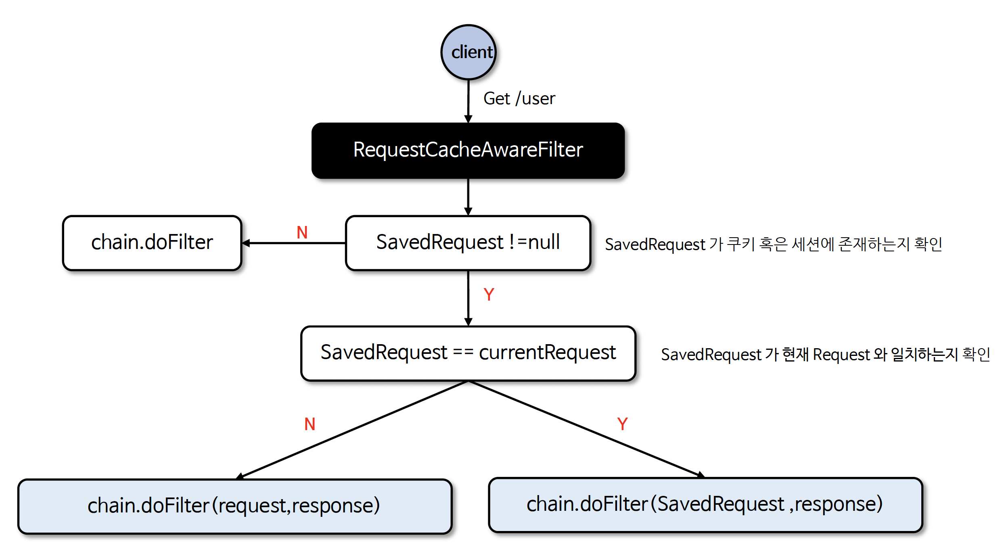

# ☘️ 요청 캐시 RequestCache / SavedRequest

---

## 📖 내용
- `RequestCache`
  - 인증 절차 문제로 리다이렉트 된 후에 이전의 요청 정보를 담고 있는 `SavedRequest` 객체를 쿠키 혹은 세션에 저장하고 필요할 경우 다시 가져와 실행하는 캐시 메커니즘입니다.
  - `HttpSessionRequestCache`가 기본 구현체로 제공됩니다.
- `SavedRequest`
  - 로그인과 같은 인증 절차 후 사용자를 인증 이전의 원래 페이지로 안내하며 이전 요청과 관련된 여러 정보를 저장합니다.
  - `DefaultSavedRequest`가 기본 구현체로 제공됩니다.

- `requestCache()` 메서드를 사용하여 활성화할 수 있으며 `RequestCacheConfigurer` 객체가 초기화 작업을 진행합니다.
- 사용자 인증 흐름
  - 1.인증받지 않은 상태로 접근
  - 2.`HttpSessionRequestCache.saveRequest()` 메소드를 호출하여 요청 정보를 세션에 저장
    - 2.1 이 때 `DefaultSavedRequest` 객체가 생성되어 요청 정보를 저장합니다.
  - 3.로그인 페이지로 리다이렉트합니다.
  - 4.로그인 후 `AuthenticationSuccessHandler`는 `HttpSession`에서 `DefaultSavedRequest` 객체를 가져온 후 저장된 redirect url 정보를 가져옵니다.
    (`SavedRequestAwareAuthenticationSuccessHandler`가 `AuthenticationSuccessHandler`로 등록되어 동작합니다.)
  - 5-1.사용자를 redirect url로 리다이렉트 합니다.
  - 5-2.만약 이전 요청 정보가 없다면 (`DefaultSavedRequest == null`) Spring Security에 저장된 redirect url로 리다이렉트 합니다.

- 위와 같은 처리를 담당하는 것이 `RequestCacheAwareFilter`입니다.
  - `RequestCacheAwareFilter`는 이전에 저장했던 웹 요청을 다시 불러오는 역할을 합니다.
  - `SavedRequest`가 현재 Request와 일치하면 `SavedRequest`를 전달하고, `SavedRequest`가 없으면 원래 Request를 전달합니다.


<sub>※ 이미지 출처: [정수원님의 인프런 강의](https://www.inflearn.com/course/%EC%8A%A4%ED%94%84%EB%A7%81-%EC%8B%9C%ED%81%90%EB%A6%AC%ED%8B%B0-%EC%99%84%EC%A0%84%EC%A0%95%EB%B3%B5/dashboard)</sub>

---

## 🔍 중심 로직

```java
package org.springframework.security.web.savedrequest;

...

public interface RequestCache {
    void saveRequest(HttpServletRequest request, HttpServletResponse response);

    SavedRequest getRequest(HttpServletRequest request, HttpServletResponse response);

    HttpServletRequest getMatchingRequest(HttpServletRequest request, HttpServletResponse response);

    void removeRequest(HttpServletRequest request, HttpServletResponse response);
}
```

```java
package org.springframework.security.web.savedrequest;

...

public class HttpSessionRequestCache implements RequestCache {
    static final String SAVED_REQUEST = "SPRING_SECURITY_SAVED_REQUEST";
    protected final Log logger = LogFactory.getLog(this.getClass());
    private PortResolver portResolver = new PortResolverImpl();
    private boolean createSessionAllowed = true;
    private RequestMatcher requestMatcher;
    private String sessionAttrName;
    private String matchingRequestParameterName;

    public HttpSessionRequestCache() {
        this.requestMatcher = AnyRequestMatcher.INSTANCE;
        this.sessionAttrName = "SPRING_SECURITY_SAVED_REQUEST";
        this.matchingRequestParameterName = "continue";
    }

    public void saveRequest(HttpServletRequest request, HttpServletResponse response) {
        if (!this.requestMatcher.matches(request)) {
            if (this.logger.isTraceEnabled()) {
                this.logger.trace(LogMessage.format("Did not save request since it did not match [%s]", this.requestMatcher));
            }

        } else {
            if (!this.createSessionAllowed && request.getSession(false) == null) {
                this.logger.trace("Did not save request since there's no session and createSessionAllowed is false");
            } else {
                DefaultSavedRequest savedRequest = new DefaultSavedRequest(request, this.portResolver, this.matchingRequestParameterName);
                request.getSession().setAttribute(this.sessionAttrName, savedRequest);
                if (this.logger.isDebugEnabled()) {
                    this.logger.debug(LogMessage.format("Saved request %s to session", savedRequest.getRedirectUrl()));
                }
            }

        }
    }

    public SavedRequest getRequest(HttpServletRequest currentRequest, HttpServletResponse response) {
        HttpSession session = currentRequest.getSession(false);
        return session != null ? (SavedRequest)session.getAttribute(this.sessionAttrName) : null;
    }

    public void removeRequest(HttpServletRequest currentRequest, HttpServletResponse response) {
        HttpSession session = currentRequest.getSession(false);
        if (session != null) {
            this.logger.trace("Removing DefaultSavedRequest from session if present");
            session.removeAttribute(this.sessionAttrName);
        }

    }

    public HttpServletRequest getMatchingRequest(HttpServletRequest request, HttpServletResponse response) {
        if (this.matchingRequestParameterName == null || StringUtils.hasText(request.getQueryString()) && UriComponentsBuilder.fromUriString(UrlUtils.buildRequestUrl(request)).build().getQueryParams().containsKey(this.matchingRequestParameterName)) {
            SavedRequest saved = this.getRequest(request, response);
            if (saved == null) {
                this.logger.trace("No saved request");
                return null;
            } else if (!this.matchesSavedRequest(request, saved)) {
                if (this.logger.isTraceEnabled()) {
                    this.logger.trace(LogMessage.format("Did not match request %s to the saved one %s", UrlUtils.buildRequestUrl(request), saved));
                }

                return null;
            } else {
                this.removeRequest(request, response);
                if (this.logger.isDebugEnabled()) {
                    this.logger.debug(LogMessage.format("Loaded matching saved request %s", saved.getRedirectUrl()));
                }

                return new SavedRequestAwareWrapper(saved, request);
            }
        } else {
            this.logger.trace("matchingRequestParameterName is required for getMatchingRequest to lookup a value, but not provided");
            return null;
        }
    }

    private boolean matchesSavedRequest(HttpServletRequest request, SavedRequest savedRequest) {
        if (savedRequest instanceof DefaultSavedRequest defaultSavedRequest) {
            return defaultSavedRequest.doesRequestMatch(request, this.portResolver);
        } else {
            String currentUrl = UrlUtils.buildFullRequestUrl(request);
            return savedRequest.getRedirectUrl().equals(currentUrl);
        }
    }

    public void setRequestMatcher(RequestMatcher requestMatcher) {
        this.requestMatcher = requestMatcher;
    }

    public void setCreateSessionAllowed(boolean createSessionAllowed) {
        this.createSessionAllowed = createSessionAllowed;
    }

    public void setPortResolver(PortResolver portResolver) {
        this.portResolver = portResolver;
    }

    public void setSessionAttrName(String sessionAttrName) {
        this.sessionAttrName = sessionAttrName;
    }

    public void setMatchingRequestParameterName(String matchingRequestParameterName) {
        this.matchingRequestParameterName = matchingRequestParameterName;
    }
}
```

```java
package org.springframework.security.web.savedrequest;

...

public interface SavedRequest extends Serializable {
    String getRedirectUrl();

    List<Cookie> getCookies();

    String getMethod();

    List<String> getHeaderValues(String name);

    Collection<String> getHeaderNames();

    List<Locale> getLocales();

    String[] getParameterValues(String name);

    Map<String, String[]> getParameterMap();
}
```

```java
package org.springframework.security.web.savedrequest;

...

public class DefaultSavedRequest implements SavedRequest {
    private static final long serialVersionUID = 620L;
    protected static final Log logger = LogFactory.getLog(DefaultSavedRequest.class);
    private static final String HEADER_IF_NONE_MATCH = "If-None-Match";
    private static final String HEADER_IF_MODIFIED_SINCE = "If-Modified-Since";
    private final ArrayList<SavedCookie> cookies;
    private final ArrayList<Locale> locales;
    private final Map<String, List<String>> headers;
    private final Map<String, String[]> parameters;
    private final String contextPath;
    private final String method;
    private final String pathInfo;
    private final String queryString;
    private final String requestURI;
    private final String requestURL;
    private final String scheme;
    private final String serverName;
    private final String servletPath;
    private final int serverPort;
    private final String matchingRequestParameterName;

    public DefaultSavedRequest(HttpServletRequest request, PortResolver portResolver) {
        this(request, portResolver, (String)null);
    }

    public DefaultSavedRequest(HttpServletRequest request, PortResolver portResolver, String matchingRequestParameterName) {
        this.cookies = new ArrayList();
        this.locales = new ArrayList();
        this.headers = new TreeMap(String.CASE_INSENSITIVE_ORDER);
        this.parameters = new TreeMap();
        Assert.notNull(request, "Request required");
        Assert.notNull(portResolver, "PortResolver required");
        this.addCookies(request.getCookies());
        Enumeration<String> names = request.getHeaderNames();

        while(names.hasMoreElements()) {
            String name = (String)names.nextElement();
            if (!"If-Modified-Since".equalsIgnoreCase(name) && !"If-None-Match".equalsIgnoreCase(name)) {
                Enumeration<String> values = request.getHeaders(name);

                while(values.hasMoreElements()) {
                    this.addHeader(name, (String)values.nextElement());
                }
            }
        }

        this.addLocales(request.getLocales());
        this.addParameters(request.getParameterMap());
        this.method = request.getMethod();
        this.pathInfo = request.getPathInfo();
        this.queryString = request.getQueryString();
        this.requestURI = request.getRequestURI();
        this.serverPort = portResolver.getServerPort(request);
        this.requestURL = request.getRequestURL().toString();
        this.scheme = request.getScheme();
        this.serverName = request.getServerName();
        this.contextPath = request.getContextPath();
        this.servletPath = request.getServletPath();
        this.matchingRequestParameterName = matchingRequestParameterName;
    }

    private DefaultSavedRequest(Builder builder) {
        this.cookies = new ArrayList();
        this.locales = new ArrayList();
        this.headers = new TreeMap(String.CASE_INSENSITIVE_ORDER);
        this.parameters = new TreeMap();
        this.contextPath = builder.contextPath;
        this.method = builder.method;
        this.pathInfo = builder.pathInfo;
        this.queryString = builder.queryString;
        this.requestURI = builder.requestURI;
        this.requestURL = builder.requestURL;
        this.scheme = builder.scheme;
        this.serverName = builder.serverName;
        this.servletPath = builder.servletPath;
        this.serverPort = builder.serverPort;
        this.matchingRequestParameterName = builder.matchingRequestParameterName;
    }

    private void addCookies(Cookie[] cookies) {
        if (cookies != null) {
            for(Cookie cookie : cookies) {
                this.addCookie(cookie);
            }
        }

    }

    private void addCookie(Cookie cookie) {
        this.cookies.add(new SavedCookie(cookie));
    }

    private void addHeader(String name, String value) {
        List<String> values = (List)this.headers.computeIfAbsent(name, (key) -> new ArrayList());
        values.add(value);
    }

    private void addLocales(Enumeration<Locale> locales) {
        while(locales.hasMoreElements()) {
            Locale locale = (Locale)locales.nextElement();
            this.addLocale(locale);
        }

    }

    private void addLocale(Locale locale) {
        this.locales.add(locale);
    }

    private void addParameters(Map<String, String[]> parameters) {
        if (!ObjectUtils.isEmpty(parameters)) {
            for(String paramName : parameters.keySet()) {
                Object paramValues = parameters.get(paramName);
                if (paramValues instanceof String[]) {
                    this.addParameter(paramName, (String[])paramValues);
                } else {
                    logger.warn("ServletRequest.getParameterMap() returned non-String array");
                }
            }
        }

    }

    private void addParameter(String name, String[] values) {
        this.parameters.put(name, values);
    }

    public boolean doesRequestMatch(HttpServletRequest request, PortResolver portResolver) {
        if (!this.propertyEquals(this.pathInfo, request.getPathInfo())) {
            return false;
        } else if (!this.propertyEquals(createQueryString(this.queryString, this.matchingRequestParameterName), request.getQueryString())) {
            return false;
        } else if (!this.propertyEquals(this.requestURI, request.getRequestURI())) {
            return false;
        } else if (!"GET".equals(request.getMethod()) && "GET".equals(this.method)) {
            return false;
        } else if (!this.propertyEquals(this.serverPort, portResolver.getServerPort(request))) {
            return false;
        } else if (!this.propertyEquals(this.requestURL, request.getRequestURL().toString())) {
            return false;
        } else if (!this.propertyEquals(this.scheme, request.getScheme())) {
            return false;
        } else if (!this.propertyEquals(this.serverName, request.getServerName())) {
            return false;
        } else {
            return !this.propertyEquals(this.contextPath, request.getContextPath()) ? false : this.propertyEquals(this.servletPath, request.getServletPath());
        }
    }

  ... getters

    private boolean propertyEquals(Object arg1, Object arg2) {
        if (arg1 == null && arg2 == null) {
            return true;
        } else {
            return arg1 != null && arg2 != null ? arg1.equals(arg2) : false;
        }
    }

    public String toString() {
        return "DefaultSavedRequest [" + this.getRedirectUrl() + "]";
    }

    private static String createQueryString(String queryString, String matchingRequestParameterName) {
        if (matchingRequestParameterName == null) {
            return queryString;
        } else {
            return queryString != null && queryString.length() != 0 ? UriComponentsBuilder.newInstance().query(queryString).replaceQueryParam(matchingRequestParameterName, new Object[0]).queryParam(matchingRequestParameterName, new Object[0]).build().getQuery() : matchingRequestParameterName;
        }
    }

    @JsonIgnoreProperties(
        ignoreUnknown = true
    )
    @JsonPOJOBuilder(
        withPrefix = "set"
    )
    public static class Builder {
        private List<SavedCookie> cookies = null;
        private List<Locale> locales = null;
        private Map<String, List<String>> headers;
        private Map<String, String[]> parameters;
        private String contextPath;
        private String method;
        private String pathInfo;
        private String queryString;
        private String requestURI;
        private String requestURL;
        private String scheme;
        private String serverName;
        private String servletPath;
        private int serverPort;
        private String matchingRequestParameterName;

        public Builder() {
            this.headers = new TreeMap(String.CASE_INSENSITIVE_ORDER);
            this.parameters = new TreeMap();
            this.serverPort = 80;
        }
        
      ... setters

        public DefaultSavedRequest build() {
            DefaultSavedRequest savedRequest = new DefaultSavedRequest(this);
            if (!ObjectUtils.isEmpty(this.cookies)) {
                for(SavedCookie cookie : this.cookies) {
                    savedRequest.addCookie(cookie.getCookie());
                }
            }

            if (!ObjectUtils.isEmpty(this.locales)) {
                savedRequest.locales.addAll(this.locales);
            }

            savedRequest.addParameters(this.parameters);
            this.headers.remove("If-Modified-Since");
            this.headers.remove("If-None-Match");

            for(Map.Entry<String, List<String>> entry : this.headers.entrySet()) {
                String headerName = (String)entry.getKey();

                for(String headerValue : (List)entry.getValue()) {
                    savedRequest.addHeader(headerName, headerValue);
                }
            }

            return savedRequest;
        }
    }
}
```

---

```java
package org.springframework.security.config.annotation.web.configurers;

...

public final class RequestCacheConfigurer<H extends HttpSecurityBuilder<H>> extends AbstractHttpConfigurer<RequestCacheConfigurer<H>, H> {
    public RequestCacheConfigurer() {
    }

    public RequestCacheConfigurer<H> requestCache(RequestCache requestCache) {
        ((HttpSecurityBuilder) this.getBuilder()).setSharedObject(RequestCache.class, requestCache);
        return this;
    }

    public H disable() {
        ((HttpSecurityBuilder) this.getBuilder()).setSharedObject(RequestCache.class, new NullRequestCache());
        return (H) super.disable();
    }

    public void init(H http) {
        http.setSharedObject(RequestCache.class, this.getRequestCache(http));
    }

    public void configure(H http) {
        RequestCache requestCache = this.getRequestCache(http);
        RequestCacheAwareFilter requestCacheFilter = new RequestCacheAwareFilter(requestCache);
        requestCacheFilter = (RequestCacheAwareFilter) this.postProcess(requestCacheFilter);
        http.addFilter(requestCacheFilter);
    }

  ...
}
```

```java
@Configuration
public class SecurityConfig {
  
    // 1.RequestCache 구현체를 생성하여 커스텀 설정
    @Bean
    public SecurityFilterChain securityFilterChain(HttpSecurity http) throws Exception {
        HttpSessionRequestCache requestCache = new HttpSessionRequestCache();
        // 요청 url에 customParam=yes 파라미터가 있을 경우에만 SavedRequest을 가져오도록 설정 (default: continue)
        requestCache.setMatchingRequestParameterName("customParam=yes");

        return http
                .requestCache(cache ->
                        cache.requestCache(requestCache)
                )
                .build();
    }
    
    // 2. NullRequestCache 구현체를 생성하여 요청 정보 저장 X
    @Bean
    public SecurityFilterChain securityFilterChain(HttpSecurity http) throws Exception {
      HttpSessionRequestCache requestCache = new NulLRequestCache();

      return http
              .requestCache(cache ->
                      cache.requestCache(requestCache)
              )
              .build();
    }
}
```

```java
package org.springframework.security.web.savedrequest;

...

public class RequestCacheAwareFilter extends GenericFilterBean {
    private RequestCache requestCache;

    public RequestCacheAwareFilter() {
        this(new HttpSessionRequestCache());
    }

    public RequestCacheAwareFilter(RequestCache requestCache) {
        Assert.notNull(requestCache, "requestCache cannot be null");
        this.requestCache = requestCache;
    }

    public void doFilter(ServletRequest request, ServletResponse response, FilterChain chain) throws IOException, ServletException {
        HttpServletRequest wrappedSavedRequest = this.requestCache.getMatchingRequest((HttpServletRequest)request, (HttpServletResponse)response);
        chain.doFilter((ServletRequest)(wrappedSavedRequest != null ? wrappedSavedRequest : request), response);
    }
}
```

```java
package org.springframework.security.web.authentication;

...

public class SavedRequestAwareAuthenticationSuccessHandler extends SimpleUrlAuthenticationSuccessHandler {
    protected final Log logger = LogFactory.getLog(this.getClass());
    private RequestCache requestCache = new HttpSessionRequestCache();

    public SavedRequestAwareAuthenticationSuccessHandler() {
    }

    public void onAuthenticationSuccess(HttpServletRequest request, HttpServletResponse response, Authentication authentication) throws ServletException, IOException {
        SavedRequest savedRequest = this.requestCache.getRequest(request, response);
        // 인증 성공 후 SavedRequest가 없을 경우 기존 Request 사용
        if (savedRequest == null) {
            super.onAuthenticationSuccess(request, response, authentication);
        } else {
            String targetUrlParameter = this.getTargetUrlParameter();
            // alwaysUseDefaultTargetUrl=false 이고 targetUrlParameter가 null이거나 request에 targetUrlParameter가 없을 경우
            if (!this.isAlwaysUseDefaultTargetUrl() && (targetUrlParameter == null || !StringUtils.hasText(request.getParameter(targetUrlParameter)))) {
                this.clearAuthenticationAttributes(request);
                // savedRequest에서 저장된 redirect url을 가져와 리다이렉트
                String targetUrl = savedRequest.getRedirectUrl();
                this.getRedirectStrategy().sendRedirect(request, response, targetUrl);
            } else {
                this.requestCache.removeRequest(request, response);
                super.onAuthenticationSuccess(request, response, authentication);
            }
        }
    }

  ...
}
```

---
