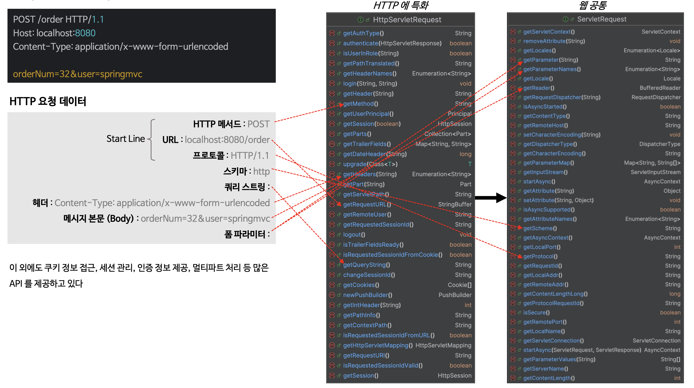
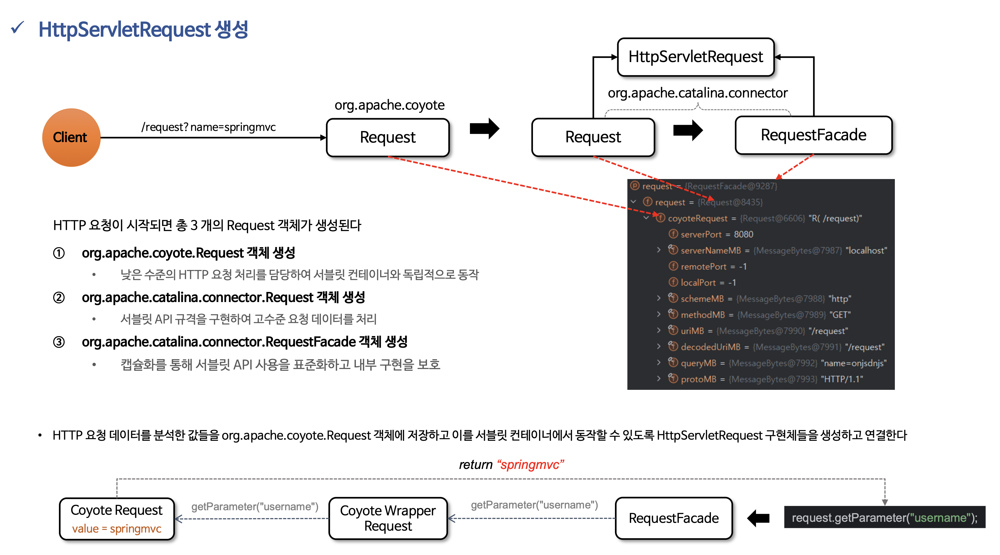
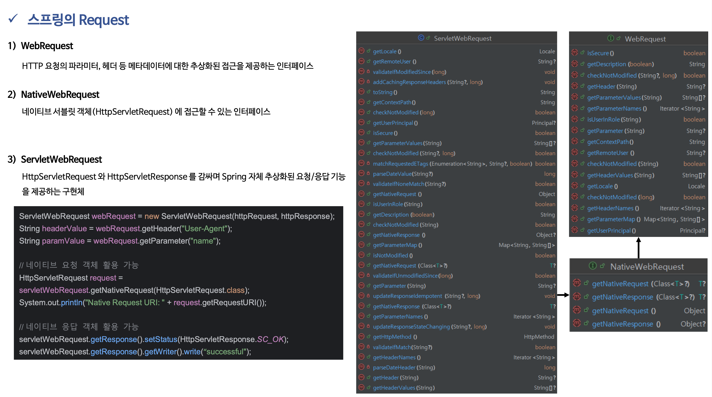

# ☘️ HttpServletRequest

---

## 📖 내용

- HttpServletRequest 는 클라이언트로부터 Http 요청이 들어오면 요청 데이터를 분석하고 분석한 정보들이 저장되어 HttpServletResponse 와 함께 서블릿으로 전달되는 객체이다


<sub>※ 이미지 출처: 인프런</sub>


<sub>※ 이미지 출처: 인프런</sub>


<sub>※ 이미지 출처: 인프런</sub>

0
<sub>※ 이미지 출처: 인프런</sub>


---

## 🔍 중심 로직

```java
package org.springframework.web.context.request;

...

public interface WebRequest extends RequestAttributes {

	@Nullable
	String getHeader(String headerName);

	@Nullable
	String[] getHeaderValues(String headerName);

	Iterator<String> getHeaderNames();

	@Nullable
	String getParameter(String paramName);

	@Nullable
	String[] getParameterValues(String paramName);

	Iterator<String> getParameterNames();

	Map<String, String[]> getParameterMap();

	Locale getLocale();

	String getContextPath();

	@Nullable
	String getRemoteUser();

	@Nullable
	Principal getUserPrincipal();

	boolean isUserInRole(String role);

	boolean isSecure();

	boolean checkNotModified(long lastModifiedTimestamp);

	boolean checkNotModified(String etag);

	boolean checkNotModified(@Nullable String etag, long lastModifiedTimestamp);

	String getDescription(boolean includeClientInfo);

}
```

```java
package org.springframework.web.context.request;

...

public interface NativeWebRequest extends WebRequest {

	Object getNativeRequest();

	@Nullable
	Object getNativeResponse();

	@Nullable
	<T> T getNativeRequest(@Nullable Class<T> requiredType);

	@Nullable
	<T> T getNativeResponse(@Nullable Class<T> requiredType);

}
```

```java
package org.springframework.web.context.request;

...

public class ServletWebRequest extends ServletRequestAttributes implements NativeWebRequest {

    ...
}
```

📌

---

## 💬 코멘트

---
