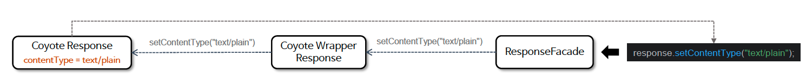
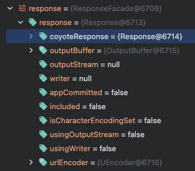

# ☘️ HttpServletResponse

---

## 📖 내용

- HttpServletResponse는 서버가 클라이언트의 요청에 대한 응답을 생성하고 반환할 때 사용되며 HTTP 응답의 상태 코드, 헤더, 본문 데이터를 설정하고 제어하는
- 다양한 메서드를 제공한다.

- HTTP 요청이 시작되면 총 3개의 Response 객체가 생성된다.
  - org.apache.coyote.Response 객체 생성
    - 낮은 수준의 HTTP 응답 처리를 담당하여 서블릿 컨테이너와 독립적으로 동작
  - org.apache.catalina.connector.Response 객체 생성
    - 서블릿 API 규격을 구현하여 고수준 응답 데이터를 처리
  - org.apache.catalina.connector.ResponseFacade 객체 생성
    - 캡슐화를 통해 서블릿 API 사용을 표준화하고 내부 구현을 보호




---

## 🔍 중심 로직

```java
package jakarta.servlet;

...

public interface ServletResponse {

    String getCharacterEncoding();

    String getContentType();

    ServletOutputStream getOutputStream() throws IOException;

    PrintWriter getWriter() throws IOException;

    void setCharacterEncoding(String charset);

    void setContentLength(int len);

    void setContentLengthLong(long length);

    void setContentType(String type);

    void setBufferSize(int size);

    int getBufferSize();

    void flushBuffer() throws IOException;

    void resetBuffer();

    boolean isCommitted();

    void reset();

    void setLocale(Locale loc);

    Locale getLocale();

}
```

```java
package jakarta.servlet.http;

...

public interface HttpServletResponse extends ServletResponse {

    void addCookie(Cookie cookie);

    boolean containsHeader(String name);

    String encodeURL(String url);

    String encodeRedirectURL(String url);

    void sendError(int sc, String msg) throws IOException;

    void sendError(int sc) throws IOException;

    void sendRedirect(String location) throws IOException;

    void setDateHeader(String name, long date);

    void addDateHeader(String name, long date);

    void setHeader(String name, String value);

    void addHeader(String name, String value);

    void setIntHeader(String name, int value);

    void addIntHeader(String name, int value);

    void setStatus(int sc);

    int getStatus();

    String getHeader(String name);

    Collection<String> getHeaders(String name);

    Collection<String> getHeaderNames();

    default void setTrailerFields(Supplier<Map<String,String>> supplier) {
        // NO-OP
    }

    default Supplier<Map<String,String>> getTrailerFields() {
        return null;
    }

    /*
     * Server status codes; see RFC 7231.
     */

    ...
}
```

📌

---

## 💬 코멘트

---
