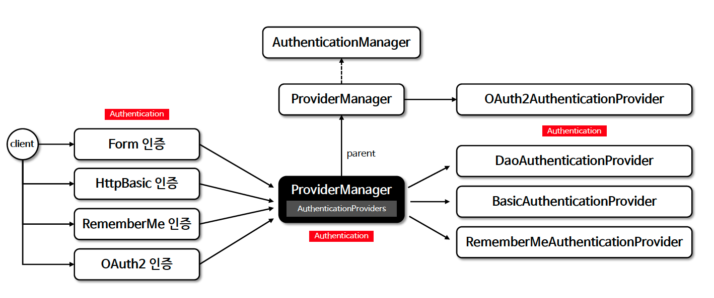

# ☘️ 인증 관리자 - AuthenticationManager - 1 ~ 2

---

## 📖 내용
- `AuthenticationManager`
  - 인증 필터로부터 `Authentication` 객체를 전달 받아 인증을 시도하여 인증에 성공할 경우 사용자 정보, 권한 등을 포함한 `Authentication` 객체를 반환합니다.
  - `AuthenticationManager`는 여러 `AuthenticationProvider`를 관리하며 `AuthenticationProvider` 목록을 순차적으로 순회하며 인증 요청을 처리합니다.
  - `AuthenticationProvider` 목록 중 인증 처리 요건에 맞는 `AuthenticationProvider`를 찾아 인증 처리를 위임합니다.
  - `AuthenticationManagerBuilder`에 의해 객체가 생성되며 주로 사용하는 구현체로 `ProviderManager`가 제공됩니다.

- `AuthenticationManagerBuilder`
  - `AuthenticationManaber` 객체를 생성하며 `UserDetailsService` 및 `AuthenticationProvider`를 추가할 수 있습니다.

- `AuthenticationManager` 흐름도
  - 선택적으로 부모 `AuthenticationManager` 를 구성할 수 있으며 이 부모는 `AuthenticationProvider` 가 인증을 수행할 수 없는 경우에 추가적으로 탐색할 수 있습니다.
  - 일반적으로 `AuthenticationProvider` 로 부터 null 이 아닌 응답을 받을 때 까지 차례대로 시도하며 응답을 받지 못하면 `ProviderNotFoundException`과 함께 인증이 실패합니다.


<sub>※ 이미지 출처: [정수원님의 인프런 강의](https://www.inflearn.com/course/%EC%8A%A4%ED%94%84%EB%A7%81-%EC%8B%9C%ED%81%90%EB%A6%AC%ED%8B%B0-%EC%99%84%EC%A0%84%EC%A0%95%EB%B3%B5/dashboard)</sub>

---

## 🔍 중심 로직

```java
package org.springframework.security.authentication;

...

@FunctionalInterface
public interface AuthenticationManager {
    Authentication authenticate(Authentication authentication) throws AuthenticationException;
}
```

```java
package org.springframework.security.authentication;

...

public class ProviderManager implements AuthenticationManager, MessageSourceAware, InitializingBean {
    private static final Log logger = LogFactory.getLog(ProviderManager.class);
    private AuthenticationEventPublisher eventPublisher;
    private List<AuthenticationProvider> providers;
    protected MessageSourceAccessor messages;
    private AuthenticationManager parent;
    private boolean eraseCredentialsAfterAuthentication;

    public ProviderManager(AuthenticationProvider... providers) {
        this(Arrays.asList(providers), (AuthenticationManager)null);
    }

    public ProviderManager(List<AuthenticationProvider> providers) {
        this(providers, (AuthenticationManager)null);
    }

    public ProviderManager(List<AuthenticationProvider> providers, AuthenticationManager parent) {
        this.eventPublisher = new NullEventPublisher();
        this.providers = Collections.emptyList();
        this.messages = SpringSecurityMessageSource.getAccessor();
        this.eraseCredentialsAfterAuthentication = true;
        Assert.notNull(providers, "providers list cannot be null");
        this.providers = providers;
        this.parent = parent;
        this.checkState();
    }

  ... other methods

    public Authentication authenticate(Authentication authentication) throws AuthenticationException {
        Class<? extends Authentication> toTest = authentication.getClass();
        AuthenticationException lastException = null;
        AuthenticationException parentException = null;
        Authentication result = null;
        Authentication parentResult = null;
        int currentPosition = 0;
        int size = this.providers.size();

        for(AuthenticationProvider provider : this.getProviders()) {
            if (provider.supports(toTest)) {
                if (logger.isTraceEnabled()) {
                    Log var10000 = logger;
                    String var10002 = provider.getClass().getSimpleName();
                    ++currentPosition;
                    var10000.trace(LogMessage.format("Authenticating request with %s (%d/%d)", var10002, currentPosition, size));
                }

                try {
                    result = provider.authenticate(authentication);
                    if (result != null) {
                        this.copyDetails(authentication, result);
                        break;
                    }
                } catch (InternalAuthenticationServiceException | AccountStatusException ex) {
                    this.prepareException(ex, authentication);
                    throw ex;
                } catch (AuthenticationException ex) {
                    lastException = ex;
                }
            }
        }

        if (result == null && this.parent != null) {
            try {
                parentResult = this.parent.authenticate(authentication);
                result = parentResult;
            } catch (ProviderNotFoundException var12) {
            } catch (AuthenticationException ex) {
                parentException = ex;
                lastException = ex;
            }
        }

        if (result != null) {
            if (this.eraseCredentialsAfterAuthentication && result instanceof CredentialsContainer) {
                ((CredentialsContainer)result).eraseCredentials();
            }

            if (parentResult == null) {
                this.eventPublisher.publishAuthenticationSuccess(result);
            }

            return result;
        } else {
            if (lastException == null) {
                lastException = new ProviderNotFoundException(this.messages.getMessage("ProviderManager.providerNotFound", new Object[]{toTest.getName()}, "No AuthenticationProvider found for {0}"));
            }

            if (parentException == null) {
                this.prepareException(lastException, authentication);
            }

            throw lastException;
        }
    }

  ... other methods
}
```

---
