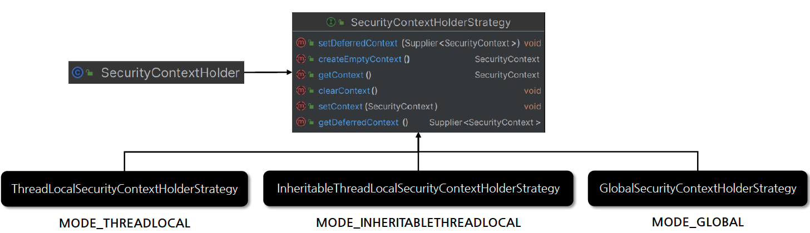

# ☘️ 인증 컨텍스트 - SecurityContext / SecurityContextHolder -1 ~ 2

---

## 📖 내용
- `SecurityContext`
  - Authentication 저장: 현재 인증된 사용자의 Authentication 정보를 저장합니다.
  - ThreadLocal 저장소 사용: `SecurityContextHolder`를 통해 접근되며 ThreadLocal 저장소를 사용해 각 스레드가 자신만의 보안 컨텍스트를 유지합니다.
  - 애플리케이션 전반에 걸친 접근성: 애플리케이션의 어느 곳에서나 접근 가능하며 현재 사용자의 인증 상태나 권한을 확인하는 데 사용됩니다.
- `SecurityContextHolder`
  - SecurityContext 저장: 현재 인증된 사용자의 Authentication 객체를 담고 있는 SecurityContext를 저장합니다.
  - 전략 패턴 사용: 다양한 저장 전략을 지원하기 위해 SecurityContextHolderStrategy 인터페이스를 사용합니다.
  - 기본 전략: MODE_THREADLOCAL
  - 전략 모드 지정: `SecurityContextHolder.setStrategyName(String strategyName)` 메서드를 사용하여 전략 모드를 지정할 수 있습니다.
- `SecurityContextHolder` 저장 모드
  - MODE_THREADLOCAL: 기본 모드로, 각 스레드가 독립적인 보안 컨텍스트를 가집니다. (`ThreadLocalSecurityContextHolderStrategy` 객체 사용)
  - MODE_INHERITABLETHREADLOCAL: 부모 스레드로부터 자식 스레드로 보안 컨텍스트가 상속되며 작업을 스레드 간 분산 실행하는 경우 유용할 수 있습니다. (`InheritableThreadLocalSecurityContextHolderStrategy` 객체 사용)
  - MODE_GLOBAL: 보안 컨텍스트를 전역으로 사용합니다. 이 모드는 멀티스레드 환경에서 사용하기에 적합하지 않습니다. (`GlobalSecurityContextHolderStrategy` 객체 사용)


<sub>※ 이미지 출처: [정수원님의 인프런 강의](https://www.inflearn.com/course/%EC%8A%A4%ED%94%84%EB%A7%81-%EC%8B%9C%ED%81%90%EB%A6%AC%ED%8B%B0-%EC%99%84%EC%A0%84%EC%A0%95%EB%B3%B5/dashboard)</sub>

---

## 🔍 중심 로직

```java
package org.springframework.security.core.context;

...

public interface SecurityContext extends Serializable {
    Authentication getAuthentication();

    void setAuthentication(Authentication authentication);
}
```

```java
package org.springframework.security.core.context;

...

public class SecurityContextHolder {
    public static final String MODE_THREADLOCAL = "MODE_THREADLOCAL";
    public static final String MODE_INHERITABLETHREADLOCAL = "MODE_INHERITABLETHREADLOCAL";
    public static final String MODE_GLOBAL = "MODE_GLOBAL";
    private static final String MODE_PRE_INITIALIZED = "MODE_PRE_INITIALIZED";
    public static final String SYSTEM_PROPERTY = "spring.security.strategy";
    private static String strategyName = System.getProperty("spring.security.strategy");
    private static SecurityContextHolderStrategy strategy;
    private static int initializeCount = 0;

    public SecurityContextHolder() {
    }

    private static void initialize() {
        initializeStrategy();
        ++initializeCount;
    }

    private static void initializeStrategy() {
        if ("MODE_PRE_INITIALIZED".equals(strategyName)) {
            Assert.state(strategy != null, "When using MODE_PRE_INITIALIZED, setContextHolderStrategy must be called with the fully constructed strategy");
        } else {
            // 기본 전략은 MODE_THREADLOCAL
            if (!StringUtils.hasText(strategyName)) {
                strategyName = "MODE_THREADLOCAL";
            }

            // 각 전략에 맞는 SecurityContextHolderStrategy 구현체를 생성
            if (strategyName.equals("MODE_THREADLOCAL")) {
                strategy = new ThreadLocalSecurityContextHolderStrategy();
            } else if (strategyName.equals("MODE_INHERITABLETHREADLOCAL")) {
                strategy = new InheritableThreadLocalSecurityContextHolderStrategy();
            } else if (strategyName.equals("MODE_GLOBAL")) {
                strategy = new GlobalSecurityContextHolderStrategy();
            } else {
                try {
                    Class<?> clazz = Class.forName(strategyName);
                    Constructor<?> customStrategy = clazz.getConstructor();
                    strategy = (SecurityContextHolderStrategy)customStrategy.newInstance();
                } catch (Exception ex) {
                    ReflectionUtils.handleReflectionException(ex);
                }

            }
        }
    }

    ... other methods
}
```

```java
package org.springframework.security.core.context;

...

public interface SecurityContextHolderStrategy {
    void clearContext();

    SecurityContext getContext();

    default Supplier<SecurityContext> getDeferredContext() {
        return this::getContext;
    }

    void setContext(SecurityContext context);

    default void setDeferredContext(Supplier<SecurityContext> deferredContext) {
        this.setContext((SecurityContext)deferredContext.get());
    }

    SecurityContext createEmptyContext();
}
```

```java
package org.springframework.security.core.context;

...

final class GlobalSecurityContextHolderStrategy implements SecurityContextHolderStrategy {
    private static SecurityContext contextHolder;

    ...
    
    // contextHolder가 있을 경우 반환, 없으면 SecurityContextImpl 객체 생성 후 반환
    public SecurityContext getContext() {
        if (contextHolder == null) {
            contextHolder = new SecurityContextImpl();
        }

        return contextHolder;
    }

    ...
}
```

```java
package org.springframework.security.core.context;

...

final class InheritableThreadLocalSecurityContextHolderStrategy implements SecurityContextHolderStrategy {
    // ThreadLocal의 구현체로 InheritableThreadLocal을 사용
    private static final ThreadLocal<Supplier<SecurityContext>> contextHolder = new InheritableThreadLocal();

    ...

    public SecurityContext getContext() {
        return (SecurityContext)this.getDeferredContext().get();
    }

    public Supplier<SecurityContext> getDeferredContext() {
        Supplier<SecurityContext> result = (Supplier)contextHolder.get();
        if (result == null) {
            SecurityContext context = this.createEmptyContext();
            result = () -> context;
            contextHolder.set(result);
        }

        return result;
    }

    public void setDeferredContext(Supplier<SecurityContext> deferredContext) {
        Assert.notNull(deferredContext, "Only non-null Supplier instances are permitted");
        Supplier<SecurityContext> notNullDeferredContext = () -> {
            SecurityContext result = (SecurityContext)deferredContext.get();
            Assert.notNull(result, "A Supplier<SecurityContext> returned null and is not allowed.");
            return result;
        };
        contextHolder.set(notNullDeferredContext);
    }
}
```

```java
package org.springframework.security.core.context;

...

final class ThreadLocalSecurityContextHolderStrategy implements SecurityContextHolderStrategy {
    // ThreadLocal의 구현체로 ThreadLocal을 사용
    private static final ThreadLocal<Supplier<SecurityContext>> contextHolder = new ThreadLocal();

    ...

    public Supplier<SecurityContext> getDeferredContext() {
        Supplier<SecurityContext> result = (Supplier)contextHolder.get();
        if (result == null) {
            SecurityContext context = this.createEmptyContext();
            result = () -> context;
            contextHolder.set(result);
        }

        return result;
    }

    public void setDeferredContext(Supplier<SecurityContext> deferredContext) {
        Assert.notNull(deferredContext, "Only non-null Supplier instances are permitted");
        Supplier<SecurityContext> notNullDeferredContext = () -> {
            SecurityContext result = (SecurityContext)deferredContext.get();
            Assert.notNull(result, "A Supplier<SecurityContext> returned null and is not allowed.");
            return result;
        };
        contextHolder.set(notNullDeferredContext);
    }
}
```

📌  요약
- `GlobalSecurityContextHolderStrategy` ThreadLocal을 사용하지 않고 static 변수를 사용하여 SecurityContext를 저장합니다. 단순하게 contextHolder가 있으면 반환하고 없으면 SecurityContextImpl 객체를 생성하여 반환합니다.
- `InheritableThreadLocalSecurityContextHolderStrategy`와 `ThreadLocalSecurityContextHolderStrategy`는 동작 방식은 동일하지만 내부에서 사용하는 ThreadLocal 구현체가 다릅니다.
  - `InheritableThreadLocalSecurityContextHolderStrategy`: InheritableThreadLocal 사용
  - `ThreadLocalSecurityContextHolderStrategy`: ThreadLocal 사용

---

### 주의
- 단일 애플리케이션이 아니라 여러 애플리케이션의 경우 아래와 같이 SecurityContext를 저장하는 것은 이슈가 있습니다.

```java
SecurityContext context = SecurityContextHolder.createEmptyContext();
context.setAuthentication(authentication);
SecurityContextHolder.setContext(context);
```

- 이 방법은 SecurityContextHolder를 통해 SecurityContext를 정적으로 접근할 때 여러 애플리케이션 컨텍스트가 SecurityContextHolderStrategy를 지정하려고 할 때 경쟁 조건을 만들 수 있습니다.
- 따라서 아래와 같은 방법으로 변경해야 합니다. (단일 애플리케이션은 상관 X)

```java
SecurityContextHolderStrategy strategy = SecurityContextHolder.getContextHolderStrategy();
SecurityContext context = strategy.createEmptyContext();
context.setAuthentication(authentication);
strategy.setContext(context);
```

## 📂 참고할만한 자료

- ThreadLocal 동작 방식
  - [link](https://velog.io/@semi-cloud/%EC%8A%A4%ED%94%84%EB%A7%81-%EA%B3%A0%EA%B8%89%ED%8E%B81-ThreadLocal)