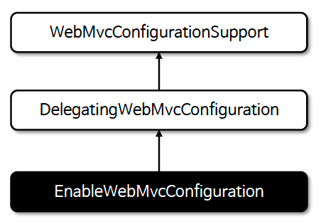
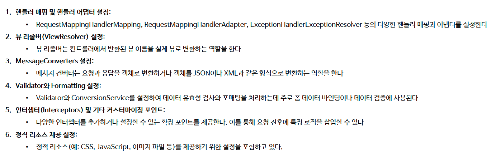

# ☘️ 초기화 클래스들

---

## 📖 내용

- 스프링 부트는 웹 MVC 초기화와 실행을 위한 여러 빈들을 생성하고 초기 값들을 설정하기 위한 여러 클래스들을 정의하고 있다.

- `WebMvcProperties`
  - 스프링 MVC의 여러 속성들을 환경 설정 파일을 통해 설정할 수 있다.

- `DispatcherServletAutoConfiguration`
  - `DispatcherServlet`을 생성하고 초기화하는 클래스이다.
  - `DispatcherServletConfiguration` : `DispatcherServlet` 빈 등록
  - `DispatcherServletRegistrationBean`: `DispatcherServlet` 서블릿 등록
    - ServletRegistrationBean을 상속받아 스프링 부트에서 서블릿과 관련된 설정 (매핑, 부가 설정 등)을 수행한다.

- `DispatcherServlet`
  - 스프링 MVC에서 생성하는 유일한 서블릿으로서 서블릿 컨테이너 및 스프링 빈으로서 스프링 컨테이너에서 관리한다.

- `WebMvcAutoConfiguration`
  - `@EnableWebMvc`를 명시적으로 사용하지 않을 경우 스프링 부트 기반 스프링 MVC 설정을 자동으로 구성한다.
  - `@EnableWebMvc`를 선언하면 `WebMvcConfigurationSupport` 빈이 생성되어 자동 설정은 실행되지 않는다.
  - 메시지 컨버터, 뷰 리졸버, 포맷터, 인터셉터, 리소스 핸들러 등 Web MVC에서 자주 사용하는 빈들이 이 클래스를 통해 자동 구성된다.
  - `WebMvcAutoConfigurationAdapter`
    - `WebMvcConfigurer`를 구현한 추상 클래스이다.
    - 스프링 부트에서 제공하는 여러 기본 MVC 설정을 제공하며 (ViewResolvers, Formatter, ResourceHandler ...) 사용자가 `WebMvcConfigurer` 인터페이스를 직접 구현하여 커스텀할 수 있다.
  - `EnableWebMvcConfiguration`
    - 스프링 MVC의 핵심 설정을 제공하는 클래스로서 `WebMvcConfigurationSupport`를 상속받아 스프링 MVC에서 필요한 다양한 설정을 구현한다.


- `EnableWebMvcConfiguration`
  - 전통적인 스프링 MVC에서 `@EnableWebMvc`를 사용할 때 MVC 구성에 필요한 핵심 빈 등록 (핸들러 매핑, 핸들러 어댑터, 뷰 리졸버 등)을 담당하고 추상 클래스로서 스프링 MVC의 기본 골격이라고 볼 수 있다.
  - `WebMvcConfigurationSupport`를 확장하고 내부적으로 여러 개의 `WebMvcConfigurer` (개발자가 작성한 커스텀 설정 클래스들)를 찾아서 적용 (Delegation)해주는 역할을 한다.
  - `@EnableWebMvc` 또는 스프링 부트가 제공하는 자동 설정과 사용자가 정의한 `WebMvcConfigurer` 들을 연결해 주는 위임 클래스라 볼 수 있다.



<sub>※ 이미지 출처: 인프런</sub>


<sub>※ 이미지 출처: 인프런</sub>


- `WebMvcConfigurer`
  - WebMvcConfigurer 는 Web MVC 관련 설정을 커스터마이징할 수 있는 다양한 메서드를 정의하고 있으며 스프링 부트가 기본적으로 제공하는 자동 구성을 유지하면서 필요한 부분만 맞춤형으로 설정할 수 있다
  - 예를 들어 정적 리소스 매핑(addResourceHandlers), CORS 설정(addCorsMappings), 메시지 컨버터 등록(configureMessageConverters), 인터셉터 추가(addInterceptors) 등
    MVC 전반에 걸친 세부 설정들을 손쉽게 추가하거나 변경할 수 있다


---

## 🔍 중심 로직

```java
package org.springframework.boot.autoconfigure.web.servlet;

...

@ConfigurationProperties(prefix = "spring.mvc")
public class WebMvcProperties {
    ...
}
```
```yaml
spring:
  mvc:
    view:
      prefix: /WEB-INF/views/
      suffix: .jsp
    servlet:
      load-on-startup: 1
```

```java
org.springframework.boot.autoconfigure.web.servlet.DispatcherServletAutoConfiguration
org.springframework.boot.autoconfigure.web.servlet.WebMvcAutoConfiguration
org.springframework.web.servlet.config.annotation.WebMvcConfigurationSupport
org.springframework.web.servlet.config.annotation.WebMvcConfigurer
```

📌

---

## 💬 코멘트

---
