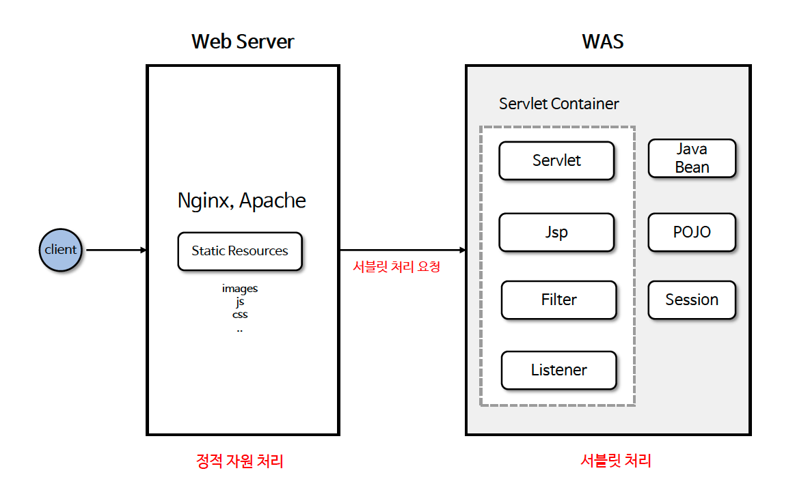
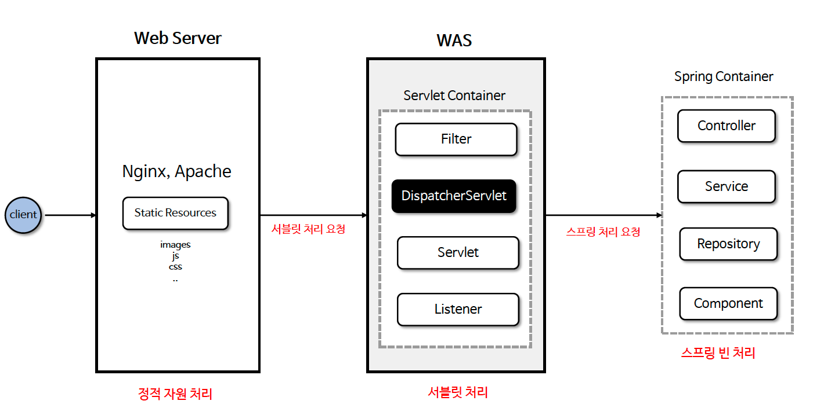
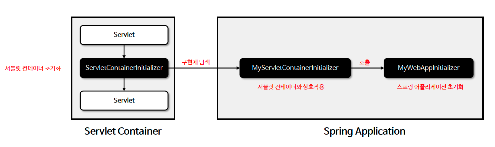

# ☘️ 서블릿 컨테이너 및 스프링 컨테이너 (1) ~ (2)

---

## 📖 내용

### 웹 애플리케이션 서버 구조

- Servlet

<sub>※ 이미지 출처: 인프런</sub>

- Spring Container

<sub>※ 이미지 출처: 인프런</sub>

- Spring Boot

<sub>※ 이미지 출처: 인프런</sub>


### 서블릿 컨테이너 & 스프링 컨테이너 연결
- WAS 가 구동되면 서블릿 컨테이너가 META-INF/services/jakarta.servlet.ServletContainerInitializer 파일을 검색하여 서블릿 3.0 ServletContainerInitializer 인터페이스를 구현한 클래스를 로드한다
- ServletContainerInitializer 구현체는 @HandlesTypes(MyWebAppInitializer.class) 와 같이 설정을 할 수 있으며 MyWebAppInitializer 를 호출하여 스프링 어플리케이션을 초기화한다


<sub>※ 이미지 출처: 인프런</sub>

---

### ServletContainerInitializer
- /META-INF/services/ jakarta.servlet.ServletContainerInitializer 파일에 구현 클래스명을 입력
- 또는 @HandlesTypes(MyWebAppInitializer.class) 어노테이션을 사용하여 초기화할 클래스를 지정

---

### SpringServletContainerInitializer
- 스프링은 SpringServletContainerInitializer 라는 구현체를 제공하며 이는 스프링 애플리케이션에서 서블릿 컨테이너와의 초기 상호작용을 담당한다
- SpringServletContainerInitializer는 @HandlesTypes 어노테이션에 WebApplicationInitializer 타입이 선언되어 있으며 이는 WebApplicationInitializer 인터페이스를 구현한
클래스를 자동으로 탐색하고 이를 호출하여 스프링 어플리케이션을 초기화 한다


<sub>※ 이미지 출처: 인프런</sub>

---

### WebApplicationInitializer
- 스프링 애플리케이션이 구동되면 WebApplicationInitializer 타입의 클래스가 실행되고 여기서 스프링 컨테이너 초기화 및 설정 작업이 이루어진다.


<sub>※ 이미지 출처: 인프런</sub>

---

### Spring Boot 애플리케이션 초기화
- 스프링 부트 애플리케이션이 구동되면 내부적으로 WAS가 실행되고 자동 설정에 의해 스프링 컨테이너 초기화 및 설정 작업이 이루어진다.


<sub>※ 이미지 출처: 인프런</sub>

- 스프링 부트는 스프링 컨테이너 객체 생성 및 초기화 작업을 자동으로 수행하며 여러 다양한 빈들을 자동설정에 의해 생성해 준다.
- 스프링 부트는 웹 애플리케이션 컨텍스트 하나만 생성해서 빈들을 관리한다.
- 스프링 부트는 기본 스플이 프레임워크와는 달리 DispatcherServlet를 빈으로 등록해서 관리하고 있다.

---

## 🔍 중심 로직

```java
package jakarta.servlet;

import java.util.Set;

/**
 * ServletContainerInitializers (SCIs) are registered via an entry in the file
 * META-INF/services/jakarta.servlet.ServletContainerInitializer that must be included in the JAR file that contains the
 * SCI implementation.
 * <p>
 * SCI processing is performed regardless of the setting of metadata-complete. SCI processing can be controlled per JAR
 * file via fragment ordering. If absolute ordering is defined, then only the JARs included in the ordering will be
 * processed for SCIs. To disable SCI processing completely, an empty absolute ordering may be defined.
 * <p>
 * SCIs register an interest in annotations (class, method or field) and/or types via the
 * {@link jakarta.servlet.annotation.HandlesTypes} annotation which is added to the class.
 *
 * @since Servlet 3.0
 */
public interface ServletContainerInitializer {
    void onStartup(Set<Class<?>> c, ServletContext ctx) throws ServletException;
}
```

```java
package org.springframework.web;

...

@HandlesTypes(WebApplicationInitializer.class)
public class SpringServletContainerInitializer implements ServletContainerInitializer {

	/**
	 * Delegate the {@code ServletContext} to any {@link WebApplicationInitializer}
	 * implementations present on the application classpath.
	 * <p>Because this class declares @{@code HandlesTypes(WebApplicationInitializer.class)},
	 * Servlet containers will automatically scan the classpath for implementations of
	 * Spring's {@code WebApplicationInitializer} interface and provide the set of all
	 * such types to the {@code webAppInitializerClasses} parameter of this method.
	 * <p>If no {@code WebApplicationInitializer} implementations are found on the classpath,
	 * this method is effectively a no-op. An INFO-level log message will be issued notifying
	 * the user that the {@code ServletContainerInitializer} has indeed been invoked but that
	 * no {@code WebApplicationInitializer} implementations were found.
	 * <p>Assuming that one or more {@code WebApplicationInitializer} types are detected,
	 * they will be instantiated (and <em>sorted</em> if the @{@link
	 * org.springframework.core.annotation.Order @Order} annotation is present or
	 * the {@link org.springframework.core.Ordered Ordered} interface has been
	 * implemented). Then the {@link WebApplicationInitializer#onStartup(ServletContext)}
	 * method will be invoked on each instance, delegating the {@code ServletContext} such
	 * that each instance may register and configure servlets such as Spring's
	 * {@code DispatcherServlet}, listeners such as Spring's {@code ContextLoaderListener},
	 * or any other Servlet API features such as filters.
	 * @param webAppInitializerClasses all implementations of
	 * {@link WebApplicationInitializer} found on the application classpath
	 * @param servletContext the servlet context to be initialized
	 * @see WebApplicationInitializer#onStartup(ServletContext)
	 * @see AnnotationAwareOrderComparator
	 */
	@Override
	public void onStartup(@Nullable Set<Class<?>> webAppInitializerClasses, ServletContext servletContext)
			throws ServletException {

		List<WebApplicationInitializer> initializers = Collections.emptyList();

		if (webAppInitializerClasses != null) {
			initializers = new ArrayList<>(webAppInitializerClasses.size());
			for (Class<?> waiClass : webAppInitializerClasses) {
				// Be defensive: Some servlet containers provide us with invalid classes,
				// no matter what @HandlesTypes says...
				if (!waiClass.isInterface() && !Modifier.isAbstract(waiClass.getModifiers()) &&
						WebApplicationInitializer.class.isAssignableFrom(waiClass)) {
					try {
						initializers.add((WebApplicationInitializer)
								ReflectionUtils.accessibleConstructor(waiClass).newInstance());
					}
					catch (Throwable ex) {
						throw new ServletException("Failed to instantiate WebApplicationInitializer class", ex);
					}
				}
			}
		}

		if (initializers.isEmpty()) {
			servletContext.log("No Spring WebApplicationInitializer types detected on classpath");
			return;
		}

		servletContext.log(initializers.size() + " Spring WebApplicationInitializers detected on classpath");
		AnnotationAwareOrderComparator.sort(initializers);
		for (WebApplicationInitializer initializer : initializers) {
			initializer.onStartup(servletContext);
		}
	}

}
```

```java
package org.springframework.web;

...

public interface WebApplicationInitializer {

	/**
	 * Configure the given {@link ServletContext} with any servlets, filters, listeners
	 * context-params and attributes necessary for initializing this web application. See
	 * examples {@linkplain WebApplicationInitializer above}.
	 * @param servletContext the {@code ServletContext} to initialize
	 * @throws ServletException if any call against the given {@code ServletContext}
	 * throws a {@code ServletException}
	 */
	void onStartup(ServletContext servletContext) throws ServletException;

}
```

📌

---

## 💬 코멘트

---
