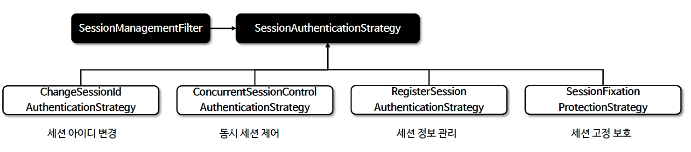
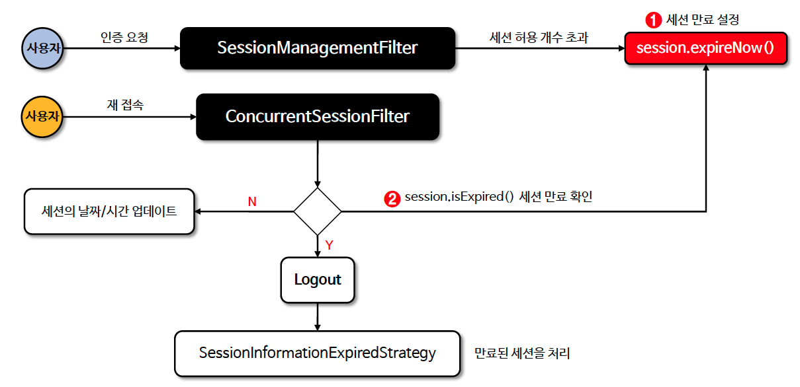

# ☘️ SessionManagementFilter / ConcurrentSessionFilter - 1 ~ 2

---

## 📖 내용
- `SessionManagementFilter`
  - 요청이 시작된 이후 사용자가 인증되었는지 감지하고, 인증된 경우에는 세션 고정 보호 메커니즘을 활성화하거나 동시 다중 로그인을 확인하는 등 세션 관련 활동을 수행하기 위해 설정된
세션 인증 전략 (`SessionAuthenticationStrategy`)을 호출하는 filter 클래스 입니다.
  - Spirng Security 6 이상에서는 `SessionManagementFilter`가 기본적으로 설정되지 않으며 세션관리 API를 통해 설정할 수 있습니다.

- 세션 구성 요소

  <sub>※ 이미지 출처: [정수원님의 인프런 강의](https://www.inflearn.com/course/%EC%8A%A4%ED%94%84%EB%A7%81-%EC%8B%9C%ED%81%90%EB%A6%AC%ED%8B%B0-%EC%99%84%EC%A0%84%EC%A0%95%EB%B3%B5/dashboard)</sub>

- `ConcurrentSessionFilter`
  - 각 요청에 대해 `SessionRegistry`에서 `SessionInformation`을 검색하고 세션이 만료로 표시되었는지 확인하고 만료로 표시될 경우 로그아웃 처리를 수행합니다. (세션 무효화)
  - 각 요청에 대해 `SessionRegistry.refreshLastRequest()`를 호출하여 등록된 세션들이 항상 '마지막 업데이트' 날짜/시간을 가지도록 합니다.

- `ConcurrentSessionFilter` 흐름도

<sub>※ 이미지 출처: [정수원님의 인프런 강의](https://www.inflearn.com/course/%EC%8A%A4%ED%94%84%EB%A7%81-%EC%8B%9C%ED%81%90%EB%A6%AC%ED%8B%B0-%EC%99%84%EC%A0%84%EC%A0%95%EB%B3%B5/dashboard)</sub>

---

## 🔍 중심 로직

```java
package org.springframework.security.web.session;

...

public class SessionManagementFilter extends GenericFilterBean {
    static final String FILTER_APPLIED = "__spring_security_session_mgmt_filter_applied";
    private SecurityContextHolderStrategy securityContextHolderStrategy;
    private final SecurityContextRepository securityContextRepository;
    private SessionAuthenticationStrategy sessionAuthenticationStrategy;
    private AuthenticationTrustResolver trustResolver;
    private InvalidSessionStrategy invalidSessionStrategy;
    private AuthenticationFailureHandler failureHandler;

    public SessionManagementFilter(SecurityContextRepository securityContextRepository) {
        this(securityContextRepository, new SessionFixationProtectionStrategy());
    }

    public SessionManagementFilter(SecurityContextRepository securityContextRepository, SessionAuthenticationStrategy sessionStrategy) {
        this.securityContextHolderStrategy = SecurityContextHolder.getContextHolderStrategy();
        this.trustResolver = new AuthenticationTrustResolverImpl();
        this.invalidSessionStrategy = null;
        this.failureHandler = new SimpleUrlAuthenticationFailureHandler();
        Assert.notNull(securityContextRepository, "SecurityContextRepository cannot be null");
        Assert.notNull(sessionStrategy, "SessionAuthenticationStrategy cannot be null");
        this.securityContextRepository = securityContextRepository;
        this.sessionAuthenticationStrategy = sessionStrategy;
    }

    public void doFilter(ServletRequest request, ServletResponse response, FilterChain chain) throws IOException, ServletException {
        this.doFilter((HttpServletRequest)request, (HttpServletResponse)response, chain);
    }

    private void doFilter(HttpServletRequest request, HttpServletResponse response, FilterChain chain) throws IOException, ServletException {
        if (request.getAttribute("__spring_security_session_mgmt_filter_applied") != null) {
            chain.doFilter(request, response);
        } else {
            request.setAttribute("__spring_security_session_mgmt_filter_applied", Boolean.TRUE);
            if (!this.securityContextRepository.containsContext(request)) {
                Authentication authentication = this.securityContextHolderStrategy.getContext().getAuthentication();
                if (this.trustResolver.isAuthenticated(authentication)) {
                    try {
                        this.sessionAuthenticationStrategy.onAuthentication(authentication, request, response);
                    } catch (SessionAuthenticationException ex) {
                        this.logger.debug("SessionAuthenticationStrategy rejected the authentication object", ex);
                        this.securityContextHolderStrategy.clearContext();
                        this.failureHandler.onAuthenticationFailure(request, response, ex);
                        return;
                    }

                    this.securityContextRepository.saveContext(this.securityContextHolderStrategy.getContext(), request, response);
                } else if (request.getRequestedSessionId() != null && !request.isRequestedSessionIdValid()) {
                    if (this.logger.isDebugEnabled()) {
                        this.logger.debug(LogMessage.format("Request requested invalid session id %s", request.getRequestedSessionId()));
                    }

                    if (this.invalidSessionStrategy != null) {
                        this.invalidSessionStrategy.onInvalidSessionDetected(request, response);
                        return;
                    }
                }
            }

            chain.doFilter(request, response);
        }
    }

    public void setInvalidSessionStrategy(InvalidSessionStrategy invalidSessionStrategy) {
        this.invalidSessionStrategy = invalidSessionStrategy;
    }

    public void setAuthenticationFailureHandler(AuthenticationFailureHandler failureHandler) {
        Assert.notNull(failureHandler, "failureHandler cannot be null");
        this.failureHandler = failureHandler;
    }

    public void setTrustResolver(AuthenticationTrustResolver trustResolver) {
        Assert.notNull(trustResolver, "trustResolver cannot be null");
        this.trustResolver = trustResolver;
    }

    public void setSecurityContextHolderStrategy(SecurityContextHolderStrategy securityContextHolderStrategy) {
        Assert.notNull(securityContextHolderStrategy, "securityContextHolderStrategy cannot be null");
        this.securityContextHolderStrategy = securityContextHolderStrategy;
    }
}
```

```java
package org.springframework.security.web.session;

...

public class ConcurrentSessionFilter extends GenericFilterBean {
    private SecurityContextHolderStrategy securityContextHolderStrategy = SecurityContextHolder.getContextHolderStrategy();
    private final SessionRegistry sessionRegistry;
    private String expiredUrl;
    private RedirectStrategy redirectStrategy;
    private LogoutHandler handlers = new CompositeLogoutHandler(new LogoutHandler[]{new SecurityContextLogoutHandler()});
    private SessionInformationExpiredStrategy sessionInformationExpiredStrategy;

    public ConcurrentSessionFilter(SessionRegistry sessionRegistry) {
        Assert.notNull(sessionRegistry, "SessionRegistry required");
        this.sessionRegistry = sessionRegistry;
        this.sessionInformationExpiredStrategy = new ResponseBodySessionInformationExpiredStrategy();
    }

    /** @deprecated */
    @Deprecated
    public ConcurrentSessionFilter(SessionRegistry sessionRegistry, String expiredUrl) {
        Assert.notNull(sessionRegistry, "SessionRegistry required");
        Assert.isTrue(expiredUrl == null || UrlUtils.isValidRedirectUrl(expiredUrl), () -> expiredUrl + " isn't a valid redirect URL");
        this.expiredUrl = expiredUrl;
        this.sessionRegistry = sessionRegistry;
        this.sessionInformationExpiredStrategy = (event) -> {
            HttpServletRequest request = event.getRequest();
            HttpServletResponse response = event.getResponse();
            SessionInformation info = event.getSessionInformation();
            this.redirectStrategy.sendRedirect(request, response, this.determineExpiredUrl(request, info));
        };
    }

    public ConcurrentSessionFilter(SessionRegistry sessionRegistry, SessionInformationExpiredStrategy sessionInformationExpiredStrategy) {
        Assert.notNull(sessionRegistry, "sessionRegistry required");
        Assert.notNull(sessionInformationExpiredStrategy, "sessionInformationExpiredStrategy cannot be null");
        this.sessionRegistry = sessionRegistry;
        this.sessionInformationExpiredStrategy = sessionInformationExpiredStrategy;
    }

    public void afterPropertiesSet() {
        Assert.notNull(this.sessionRegistry, "SessionRegistry required");
    }

    public void doFilter(ServletRequest request, ServletResponse response, FilterChain chain) throws IOException, ServletException {
        this.doFilter((HttpServletRequest)request, (HttpServletResponse)response, chain);
    }

    private void doFilter(HttpServletRequest request, HttpServletResponse response, FilterChain chain) throws IOException, ServletException {
        HttpSession session = request.getSession(false);
        if (session != null) {
            SessionInformation info = this.sessionRegistry.getSessionInformation(session.getId());
            if (info != null) {
                if (info.isExpired()) {
                    this.logger.debug(LogMessage.of(() -> "Requested session ID " + request.getRequestedSessionId() + " has expired."));
                    this.doLogout(request, response);
                    this.sessionInformationExpiredStrategy.onExpiredSessionDetected(new SessionInformationExpiredEvent(info, request, response, chain));
                    return;
                }

                this.sessionRegistry.refreshLastRequest(info.getSessionId());
            }
        }

        chain.doFilter(request, response);
    }

    /** @deprecated */
    @Deprecated
    protected String determineExpiredUrl(HttpServletRequest request, SessionInformation info) {
        return this.expiredUrl;
    }

    private void doLogout(HttpServletRequest request, HttpServletResponse response) {
        Authentication auth = this.securityContextHolderStrategy.getContext().getAuthentication();
        this.handlers.logout(request, response, auth);
    }

    public void setSecurityContextHolderStrategy(SecurityContextHolderStrategy securityContextHolderStrategy) {
        Assert.notNull(securityContextHolderStrategy, "securityContextHolderStrategy cannot be null");
        this.securityContextHolderStrategy = securityContextHolderStrategy;
    }

    public void setLogoutHandlers(LogoutHandler[] handlers) {
        this.handlers = new CompositeLogoutHandler(handlers);
    }

    public void setLogoutHandlers(List<LogoutHandler> handlers) {
        this.handlers = new CompositeLogoutHandler(handlers);
    }

    /** @deprecated */
    @Deprecated
    public void setRedirectStrategy(RedirectStrategy redirectStrategy) {
        this.redirectStrategy = redirectStrategy;
    }

    private static final class ResponseBodySessionInformationExpiredStrategy implements SessionInformationExpiredStrategy {
        private ResponseBodySessionInformationExpiredStrategy() {
        }

        public void onExpiredSessionDetected(SessionInformationExpiredEvent event) throws IOException {
            HttpServletResponse response = event.getResponse();
            response.getWriter().print("This session has been expired (possibly due to multiple concurrent logins being attempted as the same user).");
            response.flushBuffer();
        }
    }
}
```

```java
package org.springframework.security.web.authentication.session;

...

public interface SessionAuthenticationStrategy {
    void onAuthentication(Authentication authentication, HttpServletRequest request, HttpServletResponse response) throws SessionAuthenticationException;
}
```

```java
// SessionAuthenticationStrategy 구현체
package org.springframework.security.web.authentication.session;

...

public final class ChangeSessionIdAuthenticationStrategy extends AbstractSessionFixationProtectionStrategy {
    public ChangeSessionIdAuthenticationStrategy() {
    }

    HttpSession applySessionFixation(HttpServletRequest request) {
        request.changeSessionId();
        return request.getSession();
    }
}
```

```java
package org.springframework.security.web.authentication.session;

...

public class ConcurrentSessionControlAuthenticationStrategy implements MessageSourceAware, SessionAuthenticationStrategy {
    protected MessageSourceAccessor messages = SpringSecurityMessageSource.getAccessor();
    private final SessionRegistry sessionRegistry;
    private boolean exceptionIfMaximumExceeded = false;
    private int maximumSessions = 1;

    public ConcurrentSessionControlAuthenticationStrategy(SessionRegistry sessionRegistry) {
        Assert.notNull(sessionRegistry, "The sessionRegistry cannot be null");
        this.sessionRegistry = sessionRegistry;
    }

    public void onAuthentication(Authentication authentication, HttpServletRequest request, HttpServletResponse response) {
        int allowedSessions = this.getMaximumSessionsForThisUser(authentication);
        if (allowedSessions != -1) {
            List<SessionInformation> sessions = this.sessionRegistry.getAllSessions(authentication.getPrincipal(), false);
            int sessionCount = sessions.size();
            if (sessionCount >= allowedSessions) {
                if (sessionCount == allowedSessions) {
                    HttpSession session = request.getSession(false);
                    if (session != null) {
                        for(SessionInformation si : sessions) {
                            if (si.getSessionId().equals(session.getId())) {
                                return;
                            }
                        }
                    }
                }

                this.allowableSessionsExceeded(sessions, allowedSessions, this.sessionRegistry);
            }
        }
    }

    protected int getMaximumSessionsForThisUser(Authentication authentication) {
        return this.maximumSessions;
    }

    protected void allowableSessionsExceeded(List<SessionInformation> sessions, int allowableSessions, SessionRegistry registry) throws SessionAuthenticationException {
        if (!this.exceptionIfMaximumExceeded && sessions != null) {
            sessions.sort(Comparator.comparing(SessionInformation::getLastRequest));
            int maximumSessionsExceededBy = sessions.size() - allowableSessions + 1;

            for(SessionInformation session : sessions.subList(0, maximumSessionsExceededBy)) {
                session.expireNow();
            }

        } else {
            throw new SessionAuthenticationException(this.messages.getMessage("ConcurrentSessionControlAuthenticationStrategy.exceededAllowed", new Object[]{allowableSessions}, "Maximum sessions of {0} for this principal exceeded"));
        }
    }

    public void setExceptionIfMaximumExceeded(boolean exceptionIfMaximumExceeded) {
        this.exceptionIfMaximumExceeded = exceptionIfMaximumExceeded;
    }

    public void setMaximumSessions(int maximumSessions) {
        Assert.isTrue(maximumSessions != 0, "MaximumLogins must be either -1 to allow unlimited logins, or a positive integer to specify a maximum");
        this.maximumSessions = maximumSessions;
    }

    public void setMessageSource(MessageSource messageSource) {
        Assert.notNull(messageSource, "messageSource cannot be null");
        this.messages = new MessageSourceAccessor(messageSource);
    }
}
```

```java
package org.springframework.security.web.authentication.session;

...

public class RegisterSessionAuthenticationStrategy implements SessionAuthenticationStrategy {
    private final SessionRegistry sessionRegistry;

    public RegisterSessionAuthenticationStrategy(SessionRegistry sessionRegistry) {
        Assert.notNull(sessionRegistry, "The sessionRegistry cannot be null");
        this.sessionRegistry = sessionRegistry;
    }

    public void onAuthentication(Authentication authentication, HttpServletRequest request, HttpServletResponse response) {
        this.sessionRegistry.registerNewSession(request.getSession().getId(), authentication.getPrincipal());
    }
}
```

```java
package org.springframework.security.web.authentication.session;

...

public class SessionFixationProtectionStrategy extends AbstractSessionFixationProtectionStrategy {
    boolean migrateSessionAttributes = true;

    public SessionFixationProtectionStrategy() {
    }

    protected Map<String, Object> extractAttributes(HttpSession session) {
        return this.createMigratedAttributeMap(session);
    }

    final HttpSession applySessionFixation(HttpServletRequest request) {
        HttpSession session = request.getSession();
        String originalSessionId = session.getId();
        this.logger.debug(LogMessage.of(() -> "Invalidating session with Id '" + originalSessionId + "' " + (this.migrateSessionAttributes ? "and" : "without") + " migrating attributes."));
        Map<String, Object> attributesToMigrate = this.extractAttributes(session);
        int maxInactiveIntervalToMigrate = session.getMaxInactiveInterval();
        session.invalidate();
        session = request.getSession(true);
        this.logger.debug(LogMessage.format("Started new session: %s", session.getId()));
        this.transferAttributes(attributesToMigrate, session);
        if (this.migrateSessionAttributes) {
            session.setMaxInactiveInterval(maxInactiveIntervalToMigrate);
        }

        return session;
    }

    void transferAttributes(Map<String, Object> attributes, HttpSession newSession) {
        if (attributes != null) {
            Objects.requireNonNull(newSession);
            attributes.forEach(newSession::setAttribute);
        }

    }

    private HashMap<String, Object> createMigratedAttributeMap(HttpSession session) {
        HashMap<String, Object> attributesToMigrate = new HashMap();
        Enumeration<String> enumeration = session.getAttributeNames();

        while(enumeration.hasMoreElements()) {
            String key = (String)enumeration.nextElement();
            if (this.migrateSessionAttributes || key.startsWith("SPRING_SECURITY_")) {
                attributesToMigrate.put(key, session.getAttribute(key));
            }
        }

        return attributesToMigrate;
    }

    public void setMigrateSessionAttributes(boolean migrateSessionAttributes) {
        this.migrateSessionAttributes = migrateSessionAttributes;
    }
}
```

---

## 📂 참고할만한 자료
