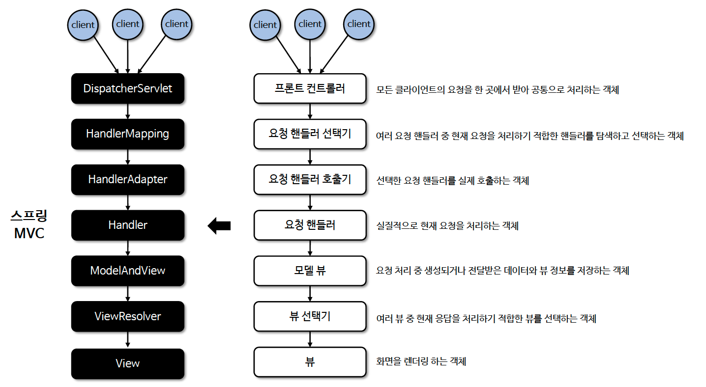
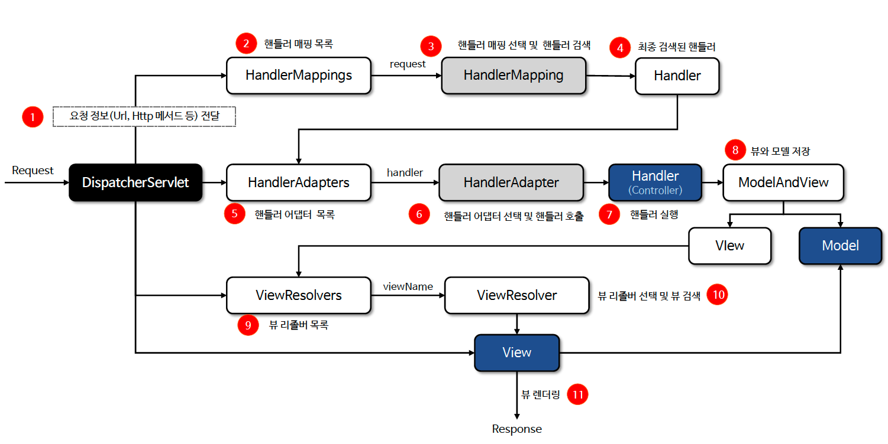

# ☘️ 아키텍처 이해  (1)  ~ (2)

---

## 📖 내용

- 스프링 웹 MVC의 전체 아키텍처 구조를 이해하기 위해서 먼저 큰 흐름을 파악하고 세부적인 기능을 살펴보도록 한다.
- 클라이언트가 요청을 하게 되면, 서버에서 요청을 처리하기 위해서 어떤 기능들이 필요한지 나열해보도록 한다.


### 흐름도


<sub>※ 이미지 출처: 인프런</sub>


<sub>※ 이미지 출처: https://velog.velcdn.com/images/lusate/post/904e3890-efbf-4ed4-bb3e-15205a5d9e54/image.png</sub>


<sub>※ 이미지 출처: 인프런</sub>


### HandlerMapping
- 클라이언트의 요청을 처리할 핸들러를 검색한다
- 핸들러는 요청을 처리할 실제 빈 컨트롤러와 호출 메서드의 정보를 가지고 있다


<sub>※ 이미지 출처: 인프런</sub>

### HandlerAdapter
- 클라이언트의 요청을 처리할 핸들러를 실행한다


<sub>※ 이미지 출처: 인프런</sub>

### ViewResolver
- 뷰 리졸버를 통해 뷰를 선택하고 최종 응답 한다


<sub>※ 이미지 출처: 인프런</sub>

---

## 🔍 중심 로직

```java
// HandlerMapping
org.springframework.web.servlet.mvc.method.annotation.RequestMappingHandlerMapping
org.springframework.web.servlet.handler.AbstractHandlerMethodMapping
org.springframework.web.servlet.handler.AbstractHandlerMethodMapping.MappingRegistry

// HandlerAdapter
org.springframework.web.servlet.mvc.method.annotation.RequestMappingHandlerAdapter

// ViewResolver
org.springframework.web.servlet.view.InternalResourceViewResolver
org.springframework.web.servlet.view.UrlBasedViewResolver
```

📌

---

## 💬 코멘트

---
