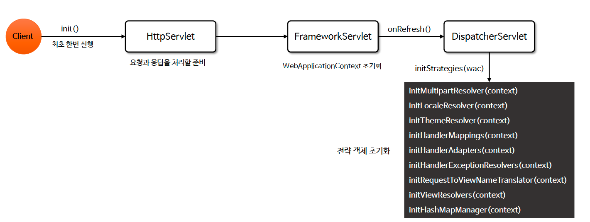

# ☘️ DispatcherServlet 초기화 및 요청 처리

---

## 📖 내용

- DispatcherServlet은 요청이 시작되면 서블릿의 생명주기에 따라 init() 메서드와 service() 메서드가 실행되어 초기화 작업 및 실제 요청을 처리하게 된다.


### DispatcherServlet#init()
- 요청이 시작되면 DispatcherServlet의 init() 메서드가 호출되며 최초 한번 실행된다.
- WebApplicationContext를 생성 및 초기화하며 HandlerMapping, HandlerAdapter, ViewResolver 등의 필수 구성요소를 초기화하고 모든 요청을 처리할 준비를 완료한다.


<sub>※ 이미지 출처: 인프런</sub>

### DispatcherServlet#service()
- 매 요청 마다 실행되는 메서드로 HTTP 요청을 분석하여 적합한 핸들러(Controller)를 찾고 실행하는 역할을 한다
- 실행 결과를 기반으로 뷰(View)를 렌더링하여 클라이언트에게 응답을 반환한다


<sub>※ 이미지 출처: 인프런</sub>

### DispatcherServlet#doDispatch()
- 실제 핸들러로 요청을 디스패치하는 작업을 처리한다
- 모든 HTTP 메서드는 doDispatch() 메서드에 의해 처리가 이루어진다

---

## 🔍 중심 로직

```java
// DispatcherServlet
protected void doDispatch(HttpServletRequest request, HttpServletResponse response) throws Exception {
    
        ...

		try {
            
            ...
            
			try {
                
                ...
                
				// 현재 요청을 처리할 핸들러 검색
				mappedHandler = getHandler(processedRequest);
				if (mappedHandler == null) {
					noHandlerFound(processedRequest, response);
					return;
				}

				// 현재 요청에 대한 핸들러 어댑터를 결정
				HandlerAdapter ha = getHandlerAdapter(mappedHandler.getHandler());

                ...

                // 전 처리 인터셉터 수행
				if (!mappedHandler.applyPreHandle(processedRequest, response)) {
					return;
				}

				// 실제 핸들러 호출 후 ModelAndView 반환
				mv = ha.handle(processedRequest, response, mappedHandler.getHandler());

                ...

                // viewName 확인
				applyDefaultViewName(processedRequest, mv);
                // 후 처리 인터셉터 수행
				mappedHandler.applyPostHandle(processedRequest, response, mv);
			}
			catch (Exception ex) {
				dispatchException = ex;
			}
			catch (Throwable err) {
                ...
			}
            
            // 핸들러가 반환한 ModelAndView를 처리
			processDispatchResult(processedRequest, response, mappedHandler, mv, dispatchException);
		}
		catch (Exception ex) {
			triggerAfterCompletion(processedRequest, response, mappedHandler, ex);
		}
		catch (Throwable err) {
			triggerAfterCompletion(processedRequest, response, mappedHandler,
					new ServletException("Handler processing failed: " + err, err));
		}
		finally {
            ...
		}
	}
    
    // applyDefaultViewName
    private void applyDefaultViewName(HttpServletRequest request, @Nullable ModelAndView mv) throws Exception {
        if (mv != null && !mv.hasView()) {
            String defaultViewName = getDefaultViewName(request);
            if (defaultViewName != null) {
                mv.setViewName(defaultViewName);
            }
        }
    }

    // processDispatchResult
    private void processDispatchResult(HttpServletRequest request, HttpServletResponse response,
                                       @Nullable HandlerExecutionChain mappedHandler, @Nullable ModelAndView mv,
                                       @Nullable Exception exception) throws Exception {
    
        ...
    
        // 뷰 렌더링
        if (mv != null && !mv.wasCleared()) {
            render(mv, request, response);
            if (errorView) {
                WebUtils.clearErrorRequestAttributes(request);
            }
        }
        else {
            ...
        }
    
        ...
    }

protected void render(ModelAndView mv, HttpServletRequest request, HttpServletResponse response) throws Exception {

    ...

    // 뷰 이름 확인
    View view;
    String viewName = mv.getViewName();
    if (viewName != null) {
        // ViewResolver를 사용하여 뷰 이름을 실제 뷰 객체로 변환
        view = resolveViewName(viewName, mv.getModelInternal(), locale, request);
        if (view == null) {
            throw new ServletException("Could not resolve view with name '" + mv.getViewName() +
                    "' in servlet with name '" + getServletName() + "'");
        }
    }
    else {
        // ViewResolver를 사용하지 않고 뷰 객체를 직접 사용
        view = mv.getView();
        if (view == null) {
            throw new ServletException("ModelAndView [" + mv + "] neither contains a view name nor a " +
                    "View object in servlet with name '" + getServletName() + "'");
        }
    }

    ...
    
    try {
        if (mv.getStatus() != null) {
            request.setAttribute(View.RESPONSE_STATUS_ATTRIBUTE, mv.getStatus());
            response.setStatus(mv.getStatus().value());
        }
        
        // 뷰 렌더링
        view.render(mv.getModelInternal(), request, response);
    }
    
    ...
}
```

📌

---

## 💬 코멘트

---
