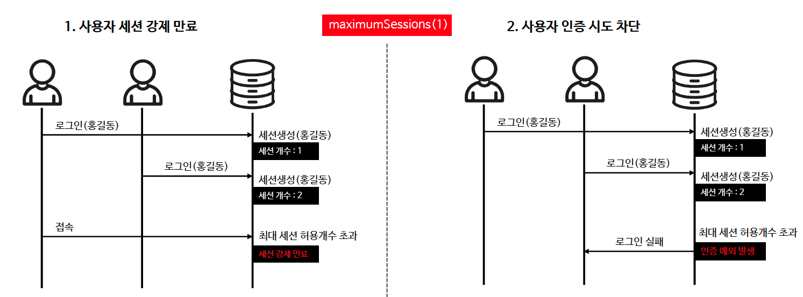

# ☘️ 동시 세션 제어 - sessionManagement().maximumSessions()

---

## 📖 내용
- 동시 세션제어는 사용자가 동시에 여러 세션을 생성하는 것을 관리하는 전략입니다.
- 이 전략은 사용자의 인증 후에 활성화된 세션의 수가 설정된 maximumSessions 값과 비교하여 제어 여부를 결정합니다.

- 동서 세션 제어 유형
  - 사용자 세션 강제 만료: 최대 허용 개수만큼 동시 인증이 가능하고 그 외 이전 사용자의 세션을 만료시킵니다.
  - 사용자 인증 시도 차단: 최대 허용 개수만큼 동시 인증이 가능하고 그 외 사용자의 인증 시도를 차단합니다.


<sub>※ 이미지 출처: [정수원님의 인프런 강의](https://www.inflearn.com/course/%EC%8A%A4%ED%94%84%EB%A7%81-%EC%8B%9C%ED%81%90%EB%A6%AC%ED%8B%B0-%EC%99%84%EC%A0%84%EC%A0%95%EB%B3%B5/dashboard)</sub>

- `HttpSecurity.sessionManagement()` 메서드를 사용하여 활성화 할 수 있으며 `SessionManagementConfigurer`를 통해 설정할 수 있습니다.
---

## 🔍 중심 로직

```java
package org.springframework.security.config.annotation.web.configurers;

...

public final class SessionManagementConfigurer<H extends HttpSecurityBuilder<H>> extends AbstractHttpConfigurer<SessionManagementConfigurer<H>, H> {
    private final SessionAuthenticationStrategy DEFAULT_SESSION_FIXATION_STRATEGY = createDefaultSessionFixationProtectionStrategy();
    private SessionAuthenticationStrategy sessionFixationAuthenticationStrategy;
    private SessionAuthenticationStrategy sessionAuthenticationStrategy;
    private SessionAuthenticationStrategy providedSessionAuthenticationStrategy;
    private InvalidSessionStrategy invalidSessionStrategy;
    private SessionInformationExpiredStrategy expiredSessionStrategy;
    private List<SessionAuthenticationStrategy> sessionAuthenticationStrategies;
    private SessionRegistry sessionRegistry;
    private Integer maximumSessions;
    private String expiredUrl;
    private boolean maxSessionsPreventsLogin;
    private SessionCreationPolicy sessionPolicy;
    private boolean enableSessionUrlRewriting;
    private String invalidSessionUrl;
    private String sessionAuthenticationErrorUrl;
    private AuthenticationFailureHandler sessionAuthenticationFailureHandler;
    private Set<String> propertiesThatRequireImplicitAuthentication;
    private Boolean requireExplicitAuthenticationStrategy;
    private SecurityContextRepository sessionManagementSecurityContextRepository;

    public SessionManagementConfigurer() {
        this.sessionFixationAuthenticationStrategy = this.DEFAULT_SESSION_FIXATION_STRATEGY;
        this.sessionAuthenticationStrategies = new ArrayList();
        this.propertiesThatRequireImplicitAuthentication = new HashSet();
        this.sessionManagementSecurityContextRepository = new HttpSessionSecurityContextRepository();
    }

    public SessionManagementConfigurer<H> invalidSessionUrl(String invalidSessionUrl) {
        this.invalidSessionUrl = invalidSessionUrl;
        this.propertiesThatRequireImplicitAuthentication.add("invalidSessionUrl = " + invalidSessionUrl);
        return this;
    }

    public SessionManagementConfigurer<H> requireExplicitAuthenticationStrategy(boolean requireExplicitAuthenticationStrategy) {
        this.requireExplicitAuthenticationStrategy = requireExplicitAuthenticationStrategy;
        return this;
    }

    public SessionManagementConfigurer<H> invalidSessionStrategy(InvalidSessionStrategy invalidSessionStrategy) {
        Assert.notNull(invalidSessionStrategy, "invalidSessionStrategy");
        this.invalidSessionStrategy = invalidSessionStrategy;
        this.propertiesThatRequireImplicitAuthentication.add("invalidSessionStrategy = " + String.valueOf(invalidSessionStrategy));
        return this;
    }

    public SessionManagementConfigurer<H> sessionAuthenticationErrorUrl(String sessionAuthenticationErrorUrl) {
        this.sessionAuthenticationErrorUrl = sessionAuthenticationErrorUrl;
        this.propertiesThatRequireImplicitAuthentication.add("sessionAuthenticationErrorUrl = " + sessionAuthenticationErrorUrl);
        return this;
    }

    public SessionManagementConfigurer<H> sessionAuthenticationFailureHandler(AuthenticationFailureHandler sessionAuthenticationFailureHandler) {
        this.sessionAuthenticationFailureHandler = sessionAuthenticationFailureHandler;
        this.propertiesThatRequireImplicitAuthentication.add("sessionAuthenticationFailureHandler = " + String.valueOf(sessionAuthenticationFailureHandler));
        return this;
    }

    public SessionManagementConfigurer<H> enableSessionUrlRewriting(boolean enableSessionUrlRewriting) {
        this.enableSessionUrlRewriting = enableSessionUrlRewriting;
        return this;
    }

    public SessionManagementConfigurer<H> sessionCreationPolicy(SessionCreationPolicy sessionCreationPolicy) {
        Assert.notNull(sessionCreationPolicy, "sessionCreationPolicy cannot be null");
        this.sessionPolicy = sessionCreationPolicy;
        this.propertiesThatRequireImplicitAuthentication.add("sessionCreationPolicy = " + String.valueOf(sessionCreationPolicy));
        return this;
    }

    public SessionManagementConfigurer<H> sessionAuthenticationStrategy(SessionAuthenticationStrategy sessionAuthenticationStrategy) {
        this.providedSessionAuthenticationStrategy = sessionAuthenticationStrategy;
        this.propertiesThatRequireImplicitAuthentication.add("sessionAuthenticationStrategy = " + String.valueOf(sessionAuthenticationStrategy));
        return this;
    }

    public SessionManagementConfigurer<H> addSessionAuthenticationStrategy(SessionAuthenticationStrategy sessionAuthenticationStrategy) {
        this.sessionAuthenticationStrategies.add(sessionAuthenticationStrategy);
        return this;
    }

    public SessionManagementConfigurer<H>.SessionFixationConfigurer sessionFixation() {
        return new SessionFixationConfigurer();
    }

    public SessionManagementConfigurer<H> sessionFixation(Customizer<SessionManagementConfigurer<H>.SessionFixationConfigurer> sessionFixationCustomizer) {
        sessionFixationCustomizer.customize(new SessionFixationConfigurer());
        return this;
    }

    public SessionManagementConfigurer<H>.ConcurrencyControlConfigurer maximumSessions(int maximumSessions) {
        this.maximumSessions = maximumSessions;
        this.propertiesThatRequireImplicitAuthentication.add("maximumSessions = " + maximumSessions);
        return new ConcurrencyControlConfigurer();
    }

    public SessionManagementConfigurer<H> sessionConcurrency(Customizer<SessionManagementConfigurer<H>.ConcurrencyControlConfigurer> sessionConcurrencyCustomizer) {
        sessionConcurrencyCustomizer.customize(new ConcurrencyControlConfigurer());
        return this;
    }

    private void setSessionFixationAuthenticationStrategy(SessionAuthenticationStrategy sessionFixationAuthenticationStrategy) {
        this.sessionFixationAuthenticationStrategy = (SessionAuthenticationStrategy)this.postProcess(sessionFixationAuthenticationStrategy);
    }

    public void init(H http) {
        SecurityContextRepository securityContextRepository = (SecurityContextRepository)http.getSharedObject(SecurityContextRepository.class);
        boolean stateless = this.isStateless();
        if (securityContextRepository == null) {
            if (stateless) {
                http.setSharedObject(SecurityContextRepository.class, new RequestAttributeSecurityContextRepository());
                this.sessionManagementSecurityContextRepository = new NullSecurityContextRepository();
            } else {
                HttpSessionSecurityContextRepository httpSecurityRepository = new HttpSessionSecurityContextRepository();
                httpSecurityRepository.setDisableUrlRewriting(!this.enableSessionUrlRewriting);
                httpSecurityRepository.setAllowSessionCreation(this.isAllowSessionCreation());
                AuthenticationTrustResolver trustResolver = (AuthenticationTrustResolver)http.getSharedObject(AuthenticationTrustResolver.class);
                if (trustResolver != null) {
                    httpSecurityRepository.setTrustResolver(trustResolver);
                }

                this.sessionManagementSecurityContextRepository = httpSecurityRepository;
                DelegatingSecurityContextRepository defaultRepository = new DelegatingSecurityContextRepository(new SecurityContextRepository[]{httpSecurityRepository, new RequestAttributeSecurityContextRepository()});
                http.setSharedObject(SecurityContextRepository.class, defaultRepository);
            }
        } else {
            this.sessionManagementSecurityContextRepository = securityContextRepository;
        }

        RequestCache requestCache = (RequestCache)http.getSharedObject(RequestCache.class);
        if (requestCache == null && stateless) {
            http.setSharedObject(RequestCache.class, new NullRequestCache());
        }

        http.setSharedObject(SessionAuthenticationStrategy.class, this.getSessionAuthenticationStrategy(http));
        http.setSharedObject(InvalidSessionStrategy.class, this.getInvalidSessionStrategy());
    }

    public void configure(H http) {
        SessionManagementFilter sessionManagementFilter = this.createSessionManagementFilter(http);
        if (sessionManagementFilter != null) {
            http.addFilter(sessionManagementFilter);
        }

        if (this.isConcurrentSessionControlEnabled()) {
            ConcurrentSessionFilter concurrentSessionFilter = this.createConcurrencyFilter(http);
            concurrentSessionFilter = (ConcurrentSessionFilter)this.postProcess(concurrentSessionFilter);
            http.addFilter(concurrentSessionFilter);
        }

        if (!this.enableSessionUrlRewriting) {
            http.addFilter(new DisableEncodeUrlFilter());
        }

        if (this.sessionPolicy == SessionCreationPolicy.ALWAYS) {
            http.addFilter(new ForceEagerSessionCreationFilter());
        }

    }

    private boolean shouldRequireExplicitAuthenticationStrategy() {
        boolean defaultRequireExplicitAuthenticationStrategy = this.propertiesThatRequireImplicitAuthentication.isEmpty();
        if (this.requireExplicitAuthenticationStrategy == null) {
            return defaultRequireExplicitAuthenticationStrategy;
        } else if (this.requireExplicitAuthenticationStrategy && !defaultRequireExplicitAuthenticationStrategy) {
            Boolean var10002 = this.requireExplicitAuthenticationStrategy;
            throw new IllegalStateException("Invalid configuration that explicitly sets requireExplicitAuthenticationStrategy to " + var10002 + " but implicitly requires it due to the following properties being set: " + String.valueOf(this.propertiesThatRequireImplicitAuthentication));
        } else {
            return this.requireExplicitAuthenticationStrategy;
        }
    }

    private SessionManagementFilter createSessionManagementFilter(H http) {
        if (this.shouldRequireExplicitAuthenticationStrategy()) {
            return null;
        } else {
            SecurityContextRepository securityContextRepository = this.sessionManagementSecurityContextRepository;
            SessionManagementFilter sessionManagementFilter = new SessionManagementFilter(securityContextRepository, this.getSessionAuthenticationStrategy(http));
            if (this.sessionAuthenticationErrorUrl != null) {
                sessionManagementFilter.setAuthenticationFailureHandler(new SimpleUrlAuthenticationFailureHandler(this.sessionAuthenticationErrorUrl));
            }

            InvalidSessionStrategy strategy = this.getInvalidSessionStrategy();
            if (strategy != null) {
                sessionManagementFilter.setInvalidSessionStrategy(strategy);
            }

            AuthenticationFailureHandler failureHandler = this.getSessionAuthenticationFailureHandler();
            if (failureHandler != null) {
                sessionManagementFilter.setAuthenticationFailureHandler(failureHandler);
            }

            AuthenticationTrustResolver trustResolver = (AuthenticationTrustResolver)http.getSharedObject(AuthenticationTrustResolver.class);
            if (trustResolver != null) {
                sessionManagementFilter.setTrustResolver(trustResolver);
            }

            sessionManagementFilter.setSecurityContextHolderStrategy(this.getSecurityContextHolderStrategy());
            return (SessionManagementFilter)this.postProcess(sessionManagementFilter);
        }
    }

    private ConcurrentSessionFilter createConcurrencyFilter(H http) {
        SessionInformationExpiredStrategy expireStrategy = this.getExpiredSessionStrategy();
        SessionRegistry sessionRegistry = this.getSessionRegistry(http);
        ConcurrentSessionFilter concurrentSessionFilter = expireStrategy != null ? new ConcurrentSessionFilter(sessionRegistry, expireStrategy) : new ConcurrentSessionFilter(sessionRegistry);
        LogoutConfigurer<H> logoutConfigurer = (LogoutConfigurer)http.getConfigurer(LogoutConfigurer.class);
        if (logoutConfigurer != null) {
            List<LogoutHandler> logoutHandlers = logoutConfigurer.getLogoutHandlers();
            if (!CollectionUtils.isEmpty(logoutHandlers)) {
                concurrentSessionFilter.setLogoutHandlers(logoutHandlers);
            }
        }

        concurrentSessionFilter.setSecurityContextHolderStrategy(this.getSecurityContextHolderStrategy());
        return concurrentSessionFilter;
    }

    InvalidSessionStrategy getInvalidSessionStrategy() {
        if (this.invalidSessionStrategy != null) {
            return this.invalidSessionStrategy;
        } else if (this.invalidSessionUrl == null) {
            return null;
        } else {
            this.invalidSessionStrategy = new SimpleRedirectInvalidSessionStrategy(this.invalidSessionUrl);
            return this.invalidSessionStrategy;
        }
    }

    SessionInformationExpiredStrategy getExpiredSessionStrategy() {
        if (this.expiredSessionStrategy != null) {
            return this.expiredSessionStrategy;
        } else if (this.expiredUrl == null) {
            return null;
        } else {
            this.expiredSessionStrategy = new SimpleRedirectSessionInformationExpiredStrategy(this.expiredUrl);
            return this.expiredSessionStrategy;
        }
    }

    AuthenticationFailureHandler getSessionAuthenticationFailureHandler() {
        if (this.sessionAuthenticationFailureHandler != null) {
            return this.sessionAuthenticationFailureHandler;
        } else if (this.sessionAuthenticationErrorUrl == null) {
            return null;
        } else {
            this.sessionAuthenticationFailureHandler = new SimpleUrlAuthenticationFailureHandler(this.sessionAuthenticationErrorUrl);
            return this.sessionAuthenticationFailureHandler;
        }
    }

    SessionCreationPolicy getSessionCreationPolicy() {
        if (this.sessionPolicy != null) {
            return this.sessionPolicy;
        } else {
            SessionCreationPolicy sessionPolicy = (SessionCreationPolicy)((HttpSecurityBuilder)this.getBuilder()).getSharedObject(SessionCreationPolicy.class);
            return sessionPolicy != null ? sessionPolicy : SessionCreationPolicy.IF_REQUIRED;
        }
    }

    private boolean isAllowSessionCreation() {
        SessionCreationPolicy sessionPolicy = this.getSessionCreationPolicy();
        return SessionCreationPolicy.ALWAYS == sessionPolicy || SessionCreationPolicy.IF_REQUIRED == sessionPolicy;
    }

    private boolean isStateless() {
        SessionCreationPolicy sessionPolicy = this.getSessionCreationPolicy();
        return SessionCreationPolicy.STATELESS == sessionPolicy;
    }

    private SessionAuthenticationStrategy getSessionAuthenticationStrategy(H http) {
        if (this.sessionAuthenticationStrategy != null) {
            return this.sessionAuthenticationStrategy;
        } else {
            List<SessionAuthenticationStrategy> delegateStrategies = this.sessionAuthenticationStrategies;
            SessionAuthenticationStrategy defaultSessionAuthenticationStrategy;
            if (this.providedSessionAuthenticationStrategy == null) {
                defaultSessionAuthenticationStrategy = (SessionAuthenticationStrategy)this.postProcess(this.sessionFixationAuthenticationStrategy);
            } else {
                defaultSessionAuthenticationStrategy = this.providedSessionAuthenticationStrategy;
            }

            if (this.isConcurrentSessionControlEnabled()) {
                SessionRegistry sessionRegistry = this.getSessionRegistry(http);
                ConcurrentSessionControlAuthenticationStrategy concurrentSessionControlStrategy = new ConcurrentSessionControlAuthenticationStrategy(sessionRegistry);
                concurrentSessionControlStrategy.setMaximumSessions(this.maximumSessions);
                concurrentSessionControlStrategy.setExceptionIfMaximumExceeded(this.maxSessionsPreventsLogin);
                concurrentSessionControlStrategy = (ConcurrentSessionControlAuthenticationStrategy)this.postProcess(concurrentSessionControlStrategy);
                RegisterSessionAuthenticationStrategy registerSessionStrategy = new RegisterSessionAuthenticationStrategy(sessionRegistry);
                registerSessionStrategy = (RegisterSessionAuthenticationStrategy)this.postProcess(registerSessionStrategy);
                delegateStrategies.addAll(Arrays.asList(concurrentSessionControlStrategy, defaultSessionAuthenticationStrategy, registerSessionStrategy));
            } else {
                delegateStrategies.add(defaultSessionAuthenticationStrategy);
            }

            this.sessionAuthenticationStrategy = (SessionAuthenticationStrategy)this.postProcess(new CompositeSessionAuthenticationStrategy(delegateStrategies));
            return this.sessionAuthenticationStrategy;
        }
    }

    private SessionRegistry getSessionRegistry(H http) {
        if (this.sessionRegistry == null) {
            this.sessionRegistry = (SessionRegistry)this.getBeanOrNull(SessionRegistry.class);
        }

        if (this.sessionRegistry == null) {
            SessionRegistryImpl sessionRegistry = new SessionRegistryImpl();
            this.registerDelegateApplicationListener(http, sessionRegistry);
            this.sessionRegistry = sessionRegistry;
        }

        return this.sessionRegistry;
    }

    private void registerDelegateApplicationListener(H http, ApplicationListener<?> delegate) {
        DelegatingApplicationListener delegating = (DelegatingApplicationListener)this.getBeanOrNull(DelegatingApplicationListener.class);
        if (delegating != null) {
            SmartApplicationListener smartListener = new GenericApplicationListenerAdapter(delegate);
            delegating.addListener(smartListener);
        }
    }

    private boolean isConcurrentSessionControlEnabled() {
        return this.maximumSessions != null;
    }

    private static SessionAuthenticationStrategy createDefaultSessionFixationProtectionStrategy() {
        return new ChangeSessionIdAuthenticationStrategy();
    }

    private <T> T getBeanOrNull(Class<T> type) {
        ApplicationContext context = (ApplicationContext)((HttpSecurityBuilder)this.getBuilder()).getSharedObject(ApplicationContext.class);
        return (T)(context == null ? null : context.getBeanProvider(type).getIfUnique());
    }

    public final class SessionFixationConfigurer {
        public SessionFixationConfigurer() {
        }

        public SessionManagementConfigurer<H> newSession() {
            SessionFixationProtectionStrategy sessionFixationProtectionStrategy = new SessionFixationProtectionStrategy();
            sessionFixationProtectionStrategy.setMigrateSessionAttributes(false);
            SessionManagementConfigurer.this.setSessionFixationAuthenticationStrategy(sessionFixationProtectionStrategy);
            return SessionManagementConfigurer.this;
        }

        public SessionManagementConfigurer<H> migrateSession() {
            SessionManagementConfigurer.this.setSessionFixationAuthenticationStrategy(new SessionFixationProtectionStrategy());
            return SessionManagementConfigurer.this;
        }

        public SessionManagementConfigurer<H> changeSessionId() {
            SessionManagementConfigurer.this.setSessionFixationAuthenticationStrategy(new ChangeSessionIdAuthenticationStrategy());
            return SessionManagementConfigurer.this;
        }

        public SessionManagementConfigurer<H> none() {
            SessionManagementConfigurer.this.setSessionFixationAuthenticationStrategy(new NullAuthenticatedSessionStrategy());
            return SessionManagementConfigurer.this;
        }
    }

    public final class ConcurrencyControlConfigurer {
        private ConcurrencyControlConfigurer() {
        }

        public SessionManagementConfigurer<H>.ConcurrencyControlConfigurer maximumSessions(int maximumSessions) {
            SessionManagementConfigurer.this.maximumSessions = maximumSessions;
            return this;
        }

        public SessionManagementConfigurer<H>.ConcurrencyControlConfigurer expiredUrl(String expiredUrl) {
            SessionManagementConfigurer.this.expiredUrl = expiredUrl;
            return this;
        }

        public SessionManagementConfigurer<H>.ConcurrencyControlConfigurer expiredSessionStrategy(SessionInformationExpiredStrategy expiredSessionStrategy) {
            SessionManagementConfigurer.this.expiredSessionStrategy = expiredSessionStrategy;
            return this;
        }

        public SessionManagementConfigurer<H>.ConcurrencyControlConfigurer maxSessionsPreventsLogin(boolean maxSessionsPreventsLogin) {
            SessionManagementConfigurer.this.maxSessionsPreventsLogin = maxSessionsPreventsLogin;
            return this;
        }

        public SessionManagementConfigurer<H>.ConcurrencyControlConfigurer sessionRegistry(SessionRegistry sessionRegistry) {
            SessionManagementConfigurer.this.sessionRegistry = sessionRegistry;
            return this;
        }
    }
}
```

```java
@Configuration
@EnableWebSecurity
public class SecurityConfig {

    @Bean
    public SecurityFilterChain securityFilterChain(HttpSecurity http) throws Exception {
        return http
                .sessionManagement(sessionManagement ->
                        sessionManagement
                                .sessionCreationPolicy()
                                .sessionFixation()
                                .sessionConcurrency()
                                .sessionAuthenticationFailureHandler()
                                .sessionAuthenticationErrorUrl()
                                .requireExplicitAuthenticationStrategy()
                                .sessionAuthenticationStrategy()
                                .addSessionAuthenticationStrategy()
                                .enableSessionUrlRewriting()
                                .invalidSessionUrl()
                                .invalidSessionStrategy()
                                .maximumSessions()
                                .sessionRegistry()
                                .maxSessionsPreventsLogin()
                                .expiredSessionStrategy()
                                .expiredUrl()
                )
                .build();
    }
}
```

📌  요약
- `sessionCreationPolicy()`: 세션 생성 정책을 설정합니다.
- `sessionFixation()`: 세션 고정 공격 방지 전략을 설정합니다.
- `sessionConcurrency()`: 동시 세션 제어를 설정합니다.
- `sessionAuthenticationFailureHandler()`: 세션 인증 실패 핸들러를 설정합니다.
- `sessionAuthenticationErrorUrl()`: 세션 인증 오류 시 리다이렉트할 URL을 설정합니다.
- `requireExplicitAuthenticationStrategy()`: 명시적인 인증 전략을 요구하는지 설정합니다.
- `sessionAuthenticationStrategy()`: 세션 인증 전략을 설정합니다.
- `addSessionAuthenticationStrategy()`: 추가 세션 인증 전략을 설정합니다.
- `enableSessionUrlRewriting()`: 세션 URL 재작성 기능을 활성화합니다.
- `invalidSessionUrl()`: 세션이 유효하지 않을 때 리다이렉트할 URL을 설정합니다.
- `invalidSessionStrategy()`: 세션이 유효하지 않을 때 사용할 전략을 설정합니다.
- `maximumSessions()`: 최대 동시 세션 수를 설정합니다.
- `sessionRegistry()`: 세션 레지스트리를 설정합니다.
- `maxSessionsPreventsLogin()`: 최대 세션 수 초과 시 로그인 차단 여부를 설정합니다.
  - true: 최대 세션 수에 도달했을 때 신규 사용자의 로그인 차단
  - false: 최대 세션 수에 도달했을 때 기존 사용자의 로그인 만료
- `expiredSessionStrategy()`: 만료된 세션에 대한 전략을 설정합니다.
- `expiredUrl()`: 세션 만료 후 리다이렉트 URL을 설정합니다.

|maxSessionPreventsLogin()|invalidSessionUrl()|expiredUrl()|결과|
|---|---|---|---|
|false|X|X|This session has been expired|
|false|O|X|This session has been expired|
|false|O|O|invalidSessionUrl()에 설정된 URL로 리다이렉션|
|false|X|O|expiredUrl()에 설정된 URL로 리다이렉션|
|true|O,X|O,X|인증이 차단|

---

## 📂 참고할만한 자료
