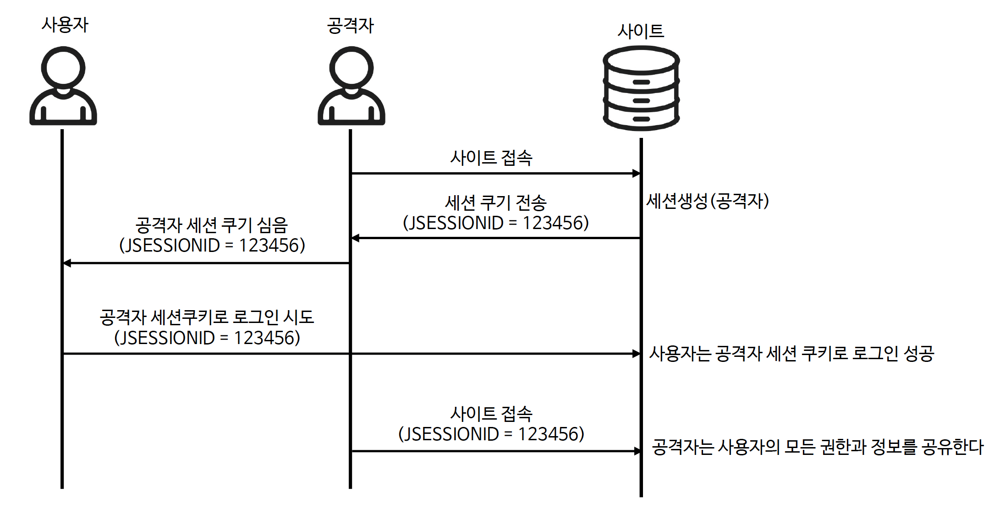

# ☘️ 세션 고정 보호 - sessionManagement().sessionFixation()

---

## 📖 내용
- 세션 고정 보호 전략
  - 세션 고정 공격은 악의적인 공격자가 사이트에 접근하여 세션을 생성한 다음 다른 사용자가 같은 세션으로 로그인하도록 유도하는 위험을 말합니다.
  - Spring Security는 사용자가 로그인할 때 새로운 세션을 사용하거나 세션ID를 변경함으로써 이러한 공격에 자동으로 대응합니다.


<sub>※ 이미지 출처: [정수원님의 인프런 강의](https://www.inflearn.com/course/%EC%8A%A4%ED%94%84%EB%A7%81-%EC%8B%9C%ED%81%90%EB%A6%AC%ED%8B%B0-%EC%99%84%EC%A0%84%EC%A0%95%EB%B3%B5/dashboard)</sub>

- 세션 고정 보호 전략 종류
  - `changeSessionId()`: 기존 세션을 유지하면서 세션 ID만 변경하여 인증 과정에서 세션 고정 공격을 방지하는 방식입니다. (defualt)
  - `newSession()`: 새로운 세션을 생성하고 기존 세션 데이터를 복사하지 않는 방식입니다. (SPRING_SECURITY_로 시작하는 속성은 복사합니다.)
  - `migrateSession()`: 새로운 세션을 생성하고 모든 기존 세션 속성을 새 세션으로 복사합니다.
  - `none()`: 기존 세션을 그대로 사용하빈다.

---

## 🔍 중심 로직

```java
@Configuration
@EnableWebSecurity
public class SecurityConfig {

    @Bean
    public SecurityFilterChain securityFilterChain(HttpSecurity http) throws Exception {
        return http
                .sessionManagement(sessionManagement ->
                        sessionManagement.sessionFixation()
                )
                .build();
    }
}
```

---

## 📂 참고할만한 자료
