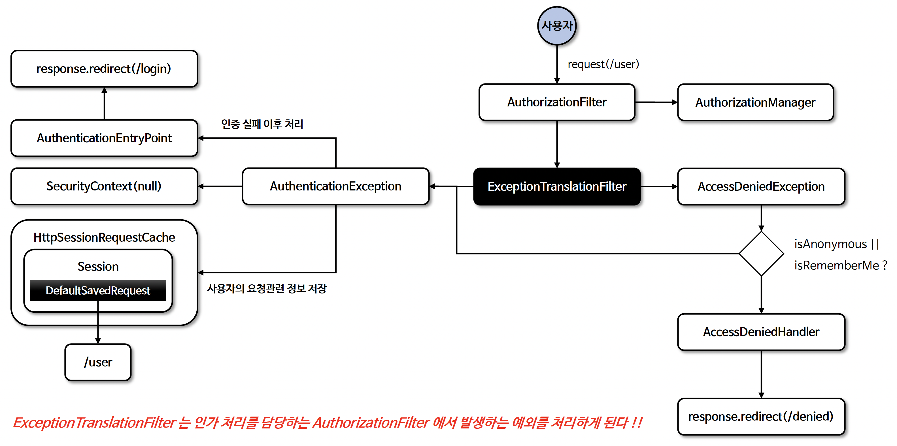
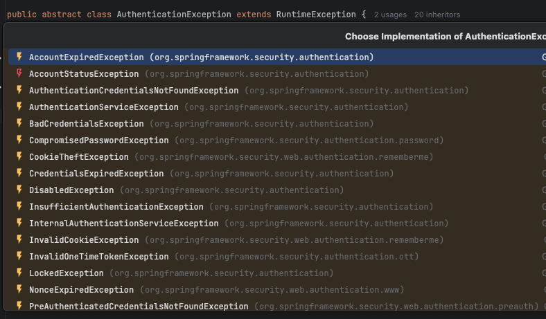

# ☘️ 예외 필터 - ExceptionTranslationFilter

---

## 📖 내용
- `ExceptionTranslationFilter`는 `AuthorizationFilter`에서 발생하는 예외를 처리하는 Filter입니다.
- `ExceptionTranslationFilter`에서 `chain.doFilter()` 메소드를 try-catch문을 사용하여 감싸고 발생한 예외의 타입(인증/인가)에 따라 예외를 처리합니다.


<sub>※ 이미지 출처: [정수원님의 인프런 강의](https://www.inflearn.com/course/%EC%8A%A4%ED%94%84%EB%A7%81-%EC%8B%9C%ED%81%90%EB%A6%AC%ED%8B%B0-%EC%99%84%EC%A0%84%EC%A0%95%EB%B3%B5/dashboard)</sub>

---

## 🔍 중심 로직

```java
package org.springframework.security.web.access;

...

public class ExceptionTranslationFilter extends GenericFilterBean implements MessageSourceAware {
    private SecurityContextHolderStrategy securityContextHolderStrategy;
    private AccessDeniedHandler accessDeniedHandler;
    private AuthenticationEntryPoint authenticationEntryPoint;
    private AuthenticationTrustResolver authenticationTrustResolver;
    private ThrowableAnalyzer throwableAnalyzer;
    private final RequestCache requestCache;
    protected MessageSourceAccessor messages;

    public ExceptionTranslationFilter(AuthenticationEntryPoint authenticationEntryPoint) {
        this(authenticationEntryPoint, new HttpSessionRequestCache());
    }

    public ExceptionTranslationFilter(AuthenticationEntryPoint authenticationEntryPoint, RequestCache requestCache) {
        this.securityContextHolderStrategy = SecurityContextHolder.getContextHolderStrategy();
        this.accessDeniedHandler = new AccessDeniedHandlerImpl();
        this.authenticationTrustResolver = new AuthenticationTrustResolverImpl();
        this.throwableAnalyzer = new DefaultThrowableAnalyzer();
        this.messages = SpringSecurityMessageSource.getAccessor();
        Assert.notNull(authenticationEntryPoint, "authenticationEntryPoint cannot be null");
        Assert.notNull(requestCache, "requestCache cannot be null");
        this.authenticationEntryPoint = authenticationEntryPoint;
        this.requestCache = requestCache;
    }

    public void afterPropertiesSet() {
        Assert.notNull(this.authenticationEntryPoint, "authenticationEntryPoint must be specified");
    }

    public void doFilter(ServletRequest request, ServletResponse response, FilterChain chain) throws IOException, ServletException {
        this.doFilter((HttpServletRequest)request, (HttpServletResponse)response, chain);
    }

    private void doFilter(HttpServletRequest request, HttpServletResponse response, FilterChain chain) throws IOException, ServletException {
        try {
            chain.doFilter(request, response);
        } catch (IOException ex) {
            throw ex;
        } catch (Exception var8) {
            Throwable[] causeChain = this.throwableAnalyzer.determineCauseChain(var8);
            RuntimeException securityException = (AuthenticationException)this.throwableAnalyzer.getFirstThrowableOfType(AuthenticationException.class, causeChain);
            if (securityException == null) {
                securityException = (AccessDeniedException)this.throwableAnalyzer.getFirstThrowableOfType(AccessDeniedException.class, causeChain);
            }

            if (securityException == null) {
                this.rethrow(var8);
            }

            if (response.isCommitted()) {
                throw new ServletException("Unable to handle the Spring Security Exception because the response is already committed.", var8);
            }

            *** 확인
            this.handleSpringSecurityException(request, response, chain, securityException);
        }

    }

    private void rethrow(Exception ex) throws ServletException {
        if (ex instanceof ServletException) {
            throw (ServletException)ex;
        } else if (ex instanceof RuntimeException) {
            throw (RuntimeException)ex;
        } else {
            throw new RuntimeException(ex);
        }
    }

    public AuthenticationEntryPoint getAuthenticationEntryPoint() {
        return this.authenticationEntryPoint;
    }

    protected AuthenticationTrustResolver getAuthenticationTrustResolver() {
        return this.authenticationTrustResolver;
    }

    *** 확인
    private void handleSpringSecurityException(HttpServletRequest request, HttpServletResponse response, FilterChain chain, RuntimeException exception) throws IOException, ServletException {
        if (exception instanceof AuthenticationException) {
            this.handleAuthenticationException(request, response, chain, (AuthenticationException)exception);
        } else if (exception instanceof AccessDeniedException) {
            this.handleAccessDeniedException(request, response, chain, (AccessDeniedException)exception);
        }

    }

    *** 확인
    private void handleAuthenticationException(HttpServletRequest request, HttpServletResponse response, FilterChain chain, AuthenticationException exception) throws ServletException, IOException {
        this.logger.trace("Sending to authentication entry point since authentication failed", exception);
        this.sendStartAuthentication(request, response, chain, exception);
    }

    *** 확인
    private void handleAccessDeniedException(HttpServletRequest request, HttpServletResponse response, FilterChain chain, AccessDeniedException exception) throws ServletException, IOException {
        Authentication authentication = this.securityContextHolderStrategy.getContext().getAuthentication();
        boolean isAnonymous = this.authenticationTrustResolver.isAnonymous(authentication);
        if (!isAnonymous && !this.authenticationTrustResolver.isRememberMe(authentication)) {
            if (this.logger.isTraceEnabled()) {
                this.logger.trace(LogMessage.format("Sending %s to access denied handler since access is denied", authentication), exception);
            }

            this.accessDeniedHandler.handle(request, response, exception);
        } else {
            if (this.logger.isTraceEnabled()) {
                this.logger.trace(LogMessage.format("Sending %s to authentication entry point since access is denied", authentication), exception);
            }

            this.sendStartAuthentication(request, response, chain, new InsufficientAuthenticationException(this.messages.getMessage("ExceptionTranslationFilter.insufficientAuthentication", "Full authentication is required to access this resource")));
        }

    }

    *** 확인
    protected void sendStartAuthentication(HttpServletRequest request, HttpServletResponse response, FilterChain chain, AuthenticationException reason) throws ServletException, IOException {
        SecurityContext context = this.securityContextHolderStrategy.createEmptyContext();
        this.securityContextHolderStrategy.setContext(context);
        this.requestCache.saveRequest(request, response);
        this.authenticationEntryPoint.commence(request, response, reason);
    }

    *** 확인
    public void setAccessDeniedHandler(AccessDeniedHandler accessDeniedHandler) {
        Assert.notNull(accessDeniedHandler, "AccessDeniedHandler required");
        this.accessDeniedHandler = accessDeniedHandler;
    }

    public void setAuthenticationTrustResolver(AuthenticationTrustResolver authenticationTrustResolver) {
        Assert.notNull(authenticationTrustResolver, "authenticationTrustResolver must not be null");
        this.authenticationTrustResolver = authenticationTrustResolver;
    }

    public void setThrowableAnalyzer(ThrowableAnalyzer throwableAnalyzer) {
        Assert.notNull(throwableAnalyzer, "throwableAnalyzer must not be null");
        this.throwableAnalyzer = throwableAnalyzer;
    }

    public void setMessageSource(MessageSource messageSource) {
        Assert.notNull(messageSource, "messageSource cannot be null");
        this.messages = new MessageSourceAccessor(messageSource);
    }

    public void setSecurityContextHolderStrategy(SecurityContextHolderStrategy securityContextHolderStrategy) {
        Assert.notNull(securityContextHolderStrategy, "securityContextHolderStrategy cannot be null");
        this.securityContextHolderStrategy = securityContextHolderStrategy;
    }

    private static final class DefaultThrowableAnalyzer extends ThrowableAnalyzer {
        private DefaultThrowableAnalyzer() {
        }

        protected void initExtractorMap() {
            super.initExtractorMap();
            this.registerExtractor(ServletException.class, (throwable) -> {
                ThrowableAnalyzer.verifyThrowableHierarchy(throwable, ServletException.class);
                return ((ServletException)throwable).getRootCause();
            });
        }
    }
}
```

```java
package org.springframework.security.core;

public abstract class AuthenticationException extends RuntimeException {
    private static final long serialVersionUID = 2018827803361503060L;

    public AuthenticationException(String msg, Throwable cause) {
        super(msg, cause);
    }

    public AuthenticationException(String msg) {
        super(msg);
    }
}
```

- `AuthenticationException` 구현 클래스 20개 제공


```java
package org.springframework.security.access;

public class AccessDeniedException extends RuntimeException {
    private static final long serialVersionUID = 6395817500121599533L;

    public AccessDeniedException(String msg) {
        super(msg);
    }

    public AccessDeniedException(String msg, Throwable cause) {
        super(msg, cause);
    }
}
```

- `AccessDeniedException` 구현 클래스 6개 제공


📌 `ExceptionTranslationFilter` 흐름
- `ExceptionTranslationFilter`는 `chain.doFilter()` 메소드를 try-catch문으로 감싸고 `AuthorizationFilter`에서 발생한 예외 타입에 따라 예외를 처리합니다.
- 예외가 발생하면 `handleAuthenticationException()` 메소드를 호출하여 예외 타입에 따라 처리를 위임합니다.
- `handleAuthenticationException()`에서 예외 타입이 `AuthenticationException`이면 `handleAuthenticationException()` 메소드를 호출하여 예외를 처리합니다.
  - `sendStartAuthentication()` 메소드를 호출하여 `SecurityContext`, `RequestCache`를 초기화하고 `AuthenticationEntryPoint`를 통해 인증 예외 처리를 위임합니다.
- `handleAuthenticationException()`에서 예외 타입이 `AccessDeniedException`이면 `handleAccessDeniedException()` 메소드를 호출하여 예외를 처리합니다.
  - 사용자가 익명 사용자인 경우 `sendStartAuthentication()` 메소드를 호출하여 인증 예외를 처리합니다.
  - 그 외의 경우 `AccessDeniedHandler`를 통해 인가 예외 처리를 위임합니다.

---

## 📂 참고할만한 자료
