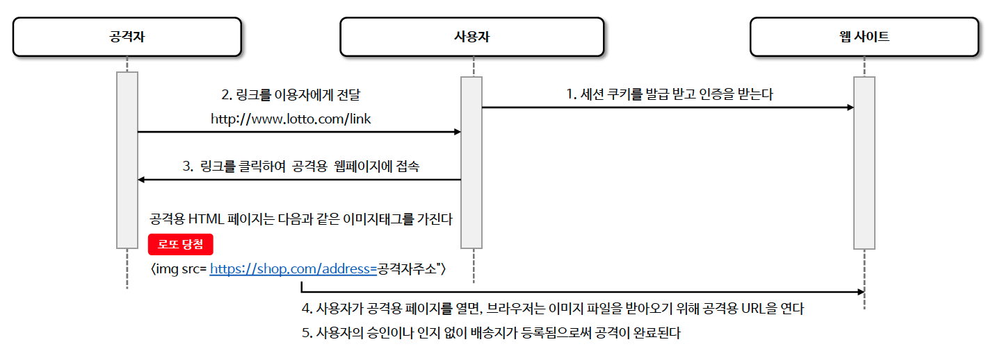

# ☘️ CSRF (Cross Site Request Forgery)

---

## 📖 내용
- `CSRF(Cross Site Request Forgery)`
  - 웹 애플리케이션의 보안 취약점으로 공격자가 사용자로 하여금 이미 인증된 다른 사이트에 대해 원치 않는 작업을 수행하게 만드는 기법을 말합니다.
  - 이 공격은 사용자의 브라우저가 자동으로 보낼 수 있는 인증 정보, 예를 들어 쿠키나 기본 인증 세션을 이용하여 사용자가 의도하지 않은 요청을 서버로 전송하게 만듭니다.
  - 이는 사용자가 로그인한 상태에서 악의적인 웹사이트를 방문하거나 이메일 등을 통해 악의적인 링크를 클릭할 때 발생할 수 있습니다.

- `CSRF` 흐름


<sub>※ 이미지 출처: [정수원님의 인프런 강의](https://www.inflearn.com/course/%EC%8A%A4%ED%94%84%EB%A7%81-%EC%8B%9C%ED%81%90%EB%A6%AC%ED%8B%B0-%EC%99%84%EC%A0%84%EC%A0%95%EB%B3%B5/dashboard)</sub>

- `HttpSecurity.csrf()` 메소드를 사용하여 활성화 할 수 있으며 `CsrfConfigurer` 객체가 초기화 작업을 수행합니다.

---

## 🔍 중심 로직

```java
package org.springframework.security.config.annotation.web.configurers;

...

public final class CsrfConfigurer<H extends HttpSecurityBuilder<H>> extends AbstractHttpConfigurer<CsrfConfigurer<H>, H> {
    private CsrfTokenRepository csrfTokenRepository = new HttpSessionCsrfTokenRepository();
    private RequestMatcher requireCsrfProtectionMatcher;
    private List<RequestMatcher> ignoredCsrfProtectionMatchers;
    private SessionAuthenticationStrategy sessionAuthenticationStrategy;
    private CsrfTokenRequestHandler requestHandler;
    private final ApplicationContext context;

    public CsrfConfigurer(ApplicationContext context) {
        this.requireCsrfProtectionMatcher = CsrfFilter.DEFAULT_CSRF_MATCHER;
        this.ignoredCsrfProtectionMatchers = new ArrayList();
        this.context = context;
    }

    public CsrfConfigurer<H> csrfTokenRepository(CsrfTokenRepository csrfTokenRepository) {
        Assert.notNull(csrfTokenRepository, "csrfTokenRepository cannot be null");
        this.csrfTokenRepository = csrfTokenRepository;
        return this;
    }

    public CsrfConfigurer<H> requireCsrfProtectionMatcher(RequestMatcher requireCsrfProtectionMatcher) {
        Assert.notNull(requireCsrfProtectionMatcher, "requireCsrfProtectionMatcher cannot be null");
        this.requireCsrfProtectionMatcher = requireCsrfProtectionMatcher;
        return this;
    }

    public CsrfConfigurer<H> csrfTokenRequestHandler(CsrfTokenRequestHandler requestHandler) {
        this.requestHandler = requestHandler;
        return this;
    }

    public CsrfConfigurer<H> ignoringRequestMatchers(RequestMatcher... requestMatchers) {
        return ((IgnoreCsrfProtectionRegistry)(new IgnoreCsrfProtectionRegistry(this.context)).requestMatchers(requestMatchers)).and();
    }

    public CsrfConfigurer<H> ignoringRequestMatchers(String... patterns) {
        return ((IgnoreCsrfProtectionRegistry)(new IgnoreCsrfProtectionRegistry(this.context)).requestMatchers(patterns)).and();
    }

    public CsrfConfigurer<H> sessionAuthenticationStrategy(SessionAuthenticationStrategy sessionAuthenticationStrategy) {
        Assert.notNull(sessionAuthenticationStrategy, "sessionAuthenticationStrategy cannot be null");
        this.sessionAuthenticationStrategy = sessionAuthenticationStrategy;
        return this;
    }

    public void configure(H http) {
        CsrfFilter filter = new CsrfFilter(this.csrfTokenRepository);
        RequestMatcher requireCsrfProtectionMatcher = this.getRequireCsrfProtectionMatcher();
        if (requireCsrfProtectionMatcher != null) {
            filter.setRequireCsrfProtectionMatcher(requireCsrfProtectionMatcher);
        }

        AccessDeniedHandler accessDeniedHandler = this.createAccessDeniedHandler(http);
        ObservationRegistry registry = this.getObservationRegistry();
        if (!registry.isNoop()) {
            ObservationMarkingAccessDeniedHandler observable = new ObservationMarkingAccessDeniedHandler(registry);
            accessDeniedHandler = new CompositeAccessDeniedHandler(new AccessDeniedHandler[]{observable, accessDeniedHandler});
        }

        if (accessDeniedHandler != null) {
            filter.setAccessDeniedHandler(accessDeniedHandler);
        }

        LogoutConfigurer<H> logoutConfigurer = (LogoutConfigurer)http.getConfigurer(LogoutConfigurer.class);
        if (logoutConfigurer != null) {
            logoutConfigurer.addLogoutHandler(new CsrfLogoutHandler(this.csrfTokenRepository));
        }

        SessionManagementConfigurer<H> sessionConfigurer = (SessionManagementConfigurer)http.getConfigurer(SessionManagementConfigurer.class);
        if (sessionConfigurer != null) {
            sessionConfigurer.addSessionAuthenticationStrategy(this.getSessionAuthenticationStrategy());
        }

        if (this.requestHandler != null) {
            filter.setRequestHandler(this.requestHandler);
        }

        filter = (CsrfFilter)this.postProcess(filter);
        http.addFilter(filter);
    }
    
    ...
}
```

```java
package org.springframework.security.web.csrf;

...

public final class CsrfFilter extends OncePerRequestFilter {
    public static final RequestMatcher DEFAULT_CSRF_MATCHER = new DefaultRequiresCsrfMatcher();
    private static final String SHOULD_NOT_FILTER = "SHOULD_NOT_FILTER" + CsrfFilter.class.getName();
    private final Log logger = LogFactory.getLog(this.getClass());
    private final CsrfTokenRepository tokenRepository;
    private RequestMatcher requireCsrfProtectionMatcher;
    private AccessDeniedHandler accessDeniedHandler;
    private CsrfTokenRequestHandler requestHandler;

    public CsrfFilter(CsrfTokenRepository tokenRepository) {
        this.requireCsrfProtectionMatcher = DEFAULT_CSRF_MATCHER;
        this.accessDeniedHandler = new AccessDeniedHandlerImpl();
        this.requestHandler = new XorCsrfTokenRequestAttributeHandler();
        Assert.notNull(tokenRepository, "tokenRepository cannot be null");
        this.tokenRepository = tokenRepository;
    }

    protected boolean shouldNotFilter(HttpServletRequest request) throws ServletException {
        return Boolean.TRUE.equals(request.getAttribute(SHOULD_NOT_FILTER));
    }

    protected void doFilterInternal(HttpServletRequest request, HttpServletResponse response, FilterChain filterChain) throws ServletException, IOException {
        DeferredCsrfToken deferredCsrfToken = this.tokenRepository.loadDeferredToken(request, response);
        request.setAttribute(DeferredCsrfToken.class.getName(), deferredCsrfToken);
        CsrfTokenRequestHandler var10000 = this.requestHandler;
        Objects.requireNonNull(deferredCsrfToken);
        var10000.handle(request, response, deferredCsrfToken::get);
        if (!this.requireCsrfProtectionMatcher.matches(request)) {
            if (this.logger.isTraceEnabled()) {
                this.logger.trace("Did not protect against CSRF since request did not match " + String.valueOf(this.requireCsrfProtectionMatcher));
            }

            filterChain.doFilter(request, response);
        } else {
            CsrfToken csrfToken = deferredCsrfToken.get();
            String actualToken = this.requestHandler.resolveCsrfTokenValue(request, csrfToken);
            if (!equalsConstantTime(csrfToken.getToken(), actualToken)) {
                boolean missingToken = deferredCsrfToken.isGenerated();
                this.logger.debug(LogMessage.of(() -> "Invalid CSRF token found for " + UrlUtils.buildFullRequestUrl(request)));
                AccessDeniedException exception = (AccessDeniedException)(!missingToken ? new InvalidCsrfTokenException(csrfToken, actualToken) : new MissingCsrfTokenException(actualToken));
                this.accessDeniedHandler.handle(request, response, exception);
            } else {
                filterChain.doFilter(request, response);
            }
        }
    }

    public static void skipRequest(HttpServletRequest request) {
        request.setAttribute(SHOULD_NOT_FILTER, Boolean.TRUE);
    }

    public void setRequireCsrfProtectionMatcher(RequestMatcher requireCsrfProtectionMatcher) {
        Assert.notNull(requireCsrfProtectionMatcher, "requireCsrfProtectionMatcher cannot be null");
        this.requireCsrfProtectionMatcher = requireCsrfProtectionMatcher;
    }

    public void setAccessDeniedHandler(AccessDeniedHandler accessDeniedHandler) {
        Assert.notNull(accessDeniedHandler, "accessDeniedHandler cannot be null");
        this.accessDeniedHandler = accessDeniedHandler;
    }

    public void setRequestHandler(CsrfTokenRequestHandler requestHandler) {
        Assert.notNull(requestHandler, "requestHandler cannot be null");
        this.requestHandler = requestHandler;
    }

    private static boolean equalsConstantTime(String expected, String actual) {
        if (expected == actual) {
            return true;
        } else if (expected != null && actual != null) {
            byte[] expectedBytes = Utf8.encode(expected);
            byte[] actualBytes = Utf8.encode(actual);
            return MessageDigest.isEqual(expectedBytes, actualBytes);
        } else {
            return false;
        }
    }

    private static final class DefaultRequiresCsrfMatcher implements RequestMatcher {
        private final HashSet<String> allowedMethods = new HashSet(Arrays.asList("GET", "HEAD", "TRACE", "OPTIONS"));

        private DefaultRequiresCsrfMatcher() {
        }

        public boolean matches(HttpServletRequest request) {
            return !this.allowedMethods.contains(request.getMethod());
        }

        public String toString() {
            return "CsrfNotRequired " + String.valueOf(this.allowedMethods);
        }
    }
}
```

📌


---

## 📂 참고할만한 자료

