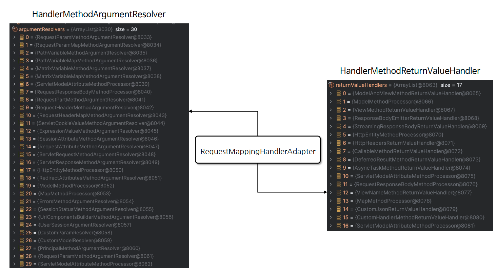

# ☘️ HandlerAdapter 이해

---

## 📖 내용

- HandlerAdapter 는 스프링 MVC에서 핸들러(Handler)를 호출하는 역할을 하는 인터페이스이다
- HandlerAdapter 는 다양한 타입의 핸들러들이 일관된 방식으로 호출 될 수 있도록 해 주며 핸들러가 다양한 타입으로 정의되더라도 그에 맞는 호출 방식을 제공해 준다
- 요청이 들어왔을 때 어떤 핸들러가 해당 요청을 처리할지 결정하는 것이 HandlerMapping 이라면 HandlerAdapter 는 결정된 핸들러를 호출하여 실행하는 역할을 한다

---

### 핵심 클래스들

- `HttpRequestHandlerAdapter`
  - HttpRequestHandler 인터페이스를 구현하여 요청을 처리할 수 있도록 해 준다
- `RequestMappingHandlerAdapter`
  - @RequestMapping 어노테이션으로 매핑된 메서드를 처리하는 클래스로서 대부분 이 클래스가 사용된다
- `SimpleControllerHandlerAdapter`
  - 일반적인 Controller 인터페이스를 구현하여 요청을 처리할 수 있도록 해 준다

---

### HandlerAdapter 설계 의도
- HandlerAdapter 는 HandlerMapping 이 어떤 타입의 핸들러를 결정하더라도 타입과 상관없이 공통된 방식으로 핸들러를 호출할 수 있어야 한다
- HandlerAdapter 는 HandlerMapping 으로 부터 전달받은 핸들러의 타입 정보를 분석해서 해당 핸들러를 지원하는지 여부를 판단하고 true 이면 핸들러를 호출한다


<sub>※ 이미지 출처: 인프런</sub>

---

### RequestMappingHandlerAdapter
- RequestMappingHandlerAdapter 는 @RequestMapping 어노테이션이 적용된 컨트롤러 메서드를 처리하는 데 사용되는 어댑터이다
- 이 어댑터는 HandlerMethod 를 호출하고 메서드의 인자와 반환 값을 처리하는 역할을 하며 필요할 경우 사용자 정의 Argument Resolver 및 ReturnValueHandler 를 구현하여 설정
  할 수 있다

---

### Handler Methods
- @RequestMapping 이 선언된 핸들러 메서드는 메서드에 전달되는 인자와 반환 값을 다양한 타입과 방식으로 유연하게 설정할 수 있다
- 메서드 호출과 반환을 자유롭게 구현하기 위해서는 호출에 필요한 인자 정보와 반환에 필요한 타입 정보를 알 수 있어야 한다. 이것을 스프링에서는 Method Arguments
  & Return Values 로 나누어 API 를 제공하고 있다


<sub>※ 이미지 출처: 인프런</sub>


<sub>※ 이미지 출처: 인프런</sub>

---

## 🔍 중심 로직

```java
org.springframework.web.servlet.mvcHttpRequestHandlerAdapter
org.springframework.web.servlet.mvc.method.annotation.RequestMappingHandlerAdapter
org.springframework.web.servlet.mvc.SimpleControllerHandlerAdapter
```

```java
package org.springframework.web.method.support;

...

public interface HandlerMethodArgumentResolver {

	boolean supportsParameter(MethodParameter parameter);

	@Nullable
	Object resolveArgument(MethodParameter parameter, @Nullable ModelAndViewContainer mavContainer,
			NativeWebRequest webRequest, @Nullable WebDataBinderFactory binderFactory) throws Exception;
}
```

```java
package org.springframework.web.method.support;

...

public interface HandlerMethodReturnValueHandler {

	boolean supportsReturnType(MethodParameter returnType);

	void handleReturnValue(@Nullable Object returnValue, MethodParameter returnType,
			ModelAndViewContainer mavContainer, NativeWebRequest webRequest) throws Exception;
}
```

📌

---

## 💬 코멘트

---
