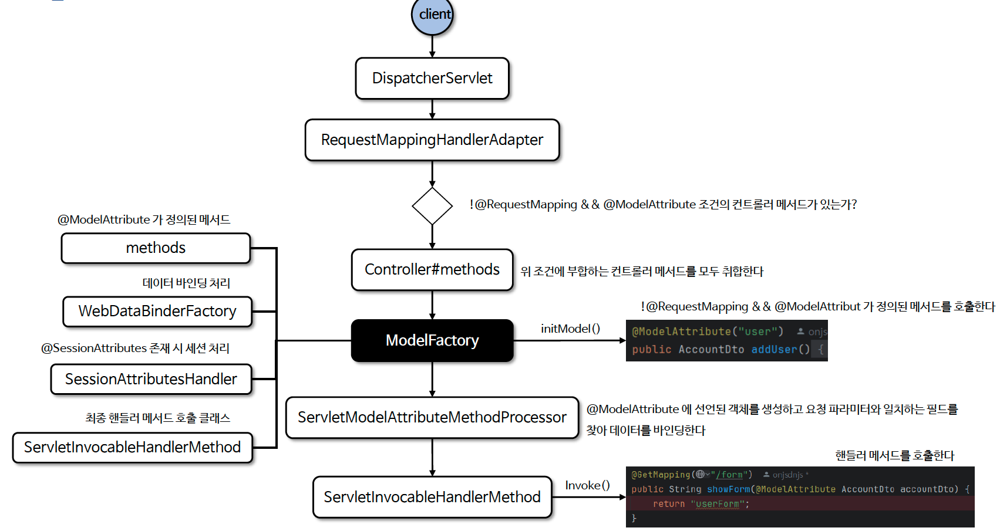

# ☘️ @ModelAttribute (1) ~ (3)

---

## 📖 내용

- @ModelAttribute는 스프링 MVC에서 주로 폼 데이터나 요청 파라미터를 모델 객체에 바인딩할 때 사용하는 어노테이션이다
- 이 어노테이션은 요청 파라미터를 특정 객체의 각 필드(요청 파라미터명과 일치)에 바인딩하고 이후 자동으로 모델에 추가하여 뷰에서 사용할 수 있게 한다
- 일반적으로 기본형 타입(int, long, String ..)의 바인딩은 @RequestParam 이 처리하고 객체 타입은 @ModelAttribute 가 처리한다고 보면 된다

---

### @ModelAttribute 기본
- `@ModelAttribute("user") User user`
- @ModelAttribute는 파라미터가 객체일 경우 생략 가능하며 동일하게 데이터를 바인딩 해 준다

---

### 데이터 바인딩 없이 모델에 접근
- `@ModelAttribute(binding=false) User user`
- 데이터 바인딩 없이 모델에 접근하고자 할 경우 @ModelAttribute(binding=false)로 설정하여 데이터 바인딩 없이 객체에 접근할 수 있다

---

### 생성자 바인딩 : @BindParam
- @ModelAttribute 는 요청 파라미터와 일치하는 생성자를 통해 객체를 생성할 수도 있으며 생성자 바인딩을 사용할 때는 @BindParam을 이용해 요청 파라미터의 이름을 매핑할 있다
```java
@PostMapping("/account")
public String processAccount(@ModelAttribute Account account) {
    System.out.println("First Name: " + account.getFirstName());
    return "accountResult";
}

public class Account {
    private final String firstName;
    public Account(@BindParam("first-name") String firstName) {
        this.firstName = firstName;
    }
}
```

---

### 경로 변수 or 요청 파라미터 객체 바인딩
- Converter<String, T>가 등록되어 있고 @ModelAttribute 속성 이름이 경로 변수와 일치하는 경우 Converter 를 사용하여 모델 객체를 가져올 수 있다
```java
@PutMapping("/accounts/{account}")
public String save(@ModelAttribute("account") Account account) {
    System.out.println("Account ID: " + account.getId());
    System.out.println("Account Name: " + account.getName());
    return "accountSaved"; // 결과 페이지로 이동
}

@Component
public class StringToAccountConverter implements Converter<String, Account> {
    @Override
    public Account convert(String id) {
        return new Account(id, "Default Name");
    }
}

public class Account {
    private String id;
    private String name;
    
    // getters, setters
}
```

---

### 메서드에 @ModelAttribute 선언
- 컨트롤러에서 모델에 데이터를 추가하는 역할을 한다. 이 경우 메서드가 리턴한 객체가 자동으로 모델에 추가된다
- 주로 뷰에서 공통적으로 사용되는 데이터를 미리 모델에 추가할 때 사용된다. 예를 들어 드롭다운 리스트에 넣을 데이터나 공통적으로 사용되는 객체 등을 미리 준비하는 경우 유용하다

---

### 흐름도

<sub>※ 이미지 출처: 인프런</sub>

---

## 🔍 중심 로직

```java
package org.springframework.web.servlet.mvc.method.annotation;

...

public class ServletModelAttributeMethodProcessor extends ModelAttributeMethodProcessor {

	public ServletModelAttributeMethodProcessor(boolean annotationNotRequired) {
		super(annotationNotRequired);
	}

	@Override
	@Nullable
	protected final Object createAttribute(String attributeName, MethodParameter parameter,
			WebDataBinderFactory binderFactory, NativeWebRequest request) throws Exception {

		String value = getRequestValueForAttribute(attributeName, request);
		if (value != null) {
			Object attribute = createAttributeFromRequestValue(
					value, attributeName, parameter, binderFactory, request);
			if (attribute != null) {
				return attribute;
			}
		}

		return super.createAttribute(attributeName, parameter, binderFactory, request);
	}

	@Nullable
	protected String getRequestValueForAttribute(String attributeName, NativeWebRequest request) {
		Map<String, String> variables = getUriTemplateVariables(request);
		String variableValue = variables.get(attributeName);
		if (StringUtils.hasText(variableValue)) {
			return variableValue;
		}
		String parameterValue = request.getParameter(attributeName);
		if (StringUtils.hasText(parameterValue)) {
			return parameterValue;
		}
		return null;
	}

	protected final Map<String, String> getUriTemplateVariables(NativeWebRequest request) {
		@SuppressWarnings("unchecked")
		Map<String, String> variables = (Map<String, String>) request.getAttribute(
				HandlerMapping.URI_TEMPLATE_VARIABLES_ATTRIBUTE, RequestAttributes.SCOPE_REQUEST);
		return (variables != null ? variables : Collections.emptyMap());
	}

	@Nullable
	protected Object createAttributeFromRequestValue(String sourceValue, String attributeName,
			MethodParameter parameter, WebDataBinderFactory binderFactory, NativeWebRequest request)
			throws Exception {

		DataBinder binder = binderFactory.createBinder(request, null, attributeName);
		ConversionService conversionService = binder.getConversionService();
		if (conversionService != null) {
			TypeDescriptor source = TypeDescriptor.valueOf(String.class);
			TypeDescriptor target = new TypeDescriptor(parameter);
			if (conversionService.canConvert(source, target)) {
				return binder.convertIfNecessary(sourceValue, parameter.getParameterType(), parameter);
			}
		}
		return null;
	}

	@Override
	protected void constructAttribute(WebDataBinder binder, NativeWebRequest request) {
		ServletRequest servletRequest = request.getNativeRequest(ServletRequest.class);
		Assert.state(servletRequest != null, "No ServletRequest");
		ServletRequestDataBinder servletBinder = (ServletRequestDataBinder) binder;
		servletBinder.construct(servletRequest);
	}

	@Override
	protected void bindRequestParameters(WebDataBinder binder, NativeWebRequest request) {
		ServletRequest servletRequest = request.getNativeRequest(ServletRequest.class);
		Assert.state(servletRequest != null, "No ServletRequest");
		ServletRequestDataBinder servletBinder = (ServletRequestDataBinder) binder;
		servletBinder.bind(servletRequest);
	}

}
```

📌

---

## 💬 코멘트

---
