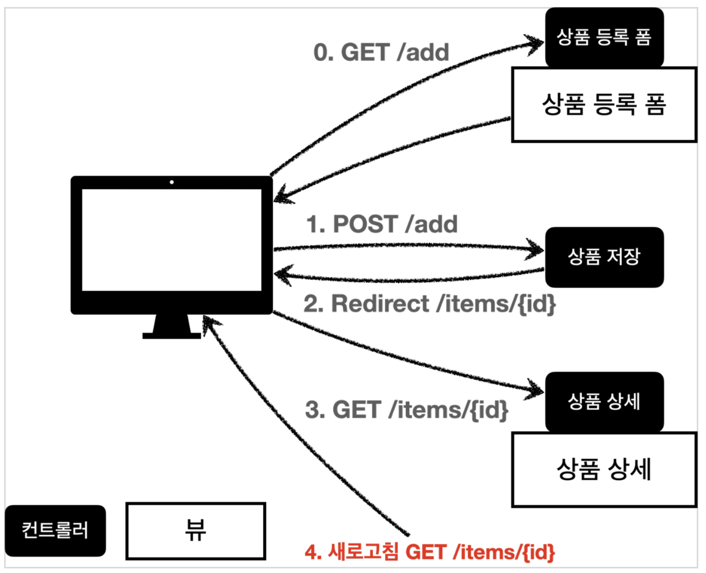

# ☘️ RedirectAttributes & FlashAttributes (1) ~ (2)

---

## 📖 내용

- 웹 애플리케이션에서 페이지 이동 중 데이터 전달이 필요한 경우가 발생한다. 예를 들어, 사용자가 폼을 제출한 후, 성공 메시지나 에러 메시지를 다음 화면에서 표시하고자 할 때, 리다이렉트를
- 사용하여 다른 URL로 이동시키면서 데이터를 전달해야 하는 상황이 자주 발생할 수 있다.

---

### 문제점
- URL에 데이터 포함
  - 리다이렉트 요청에서 데이터를 전달하는 가장 기본적인 방법은 쿼리 파라미터를 URL에 추가하는 것이다. 하지만 이 방식은 보안적으로 불안정하며 사용자가 URL에서 민감한 정보를 볼 수 있다는 단점이 있다.
- 세션 사용
  - 세션을 이용하여 데이터를 전달할 수도 있지만 세션은 다음 요청 이후에도 남아 있는 데이터를 수동으로 제거해야 하며 메모리를 많이 사용할 수 있다.
- 일회성 데이터 필요
  - 많은 경우 리다이렉트 한 번만 사용할 데이터를 전달하는 것이 필요하다. 하지만 기본 세션이나 URL 쿼리 파라미터는 이 요구를 충족하지 못한다.

---

### RedirectAttributes와 FlashAttributes의 등장
- RedirectAttributes는 리다이렉트 요청 시 데이터를 안전하고 효율적으로 전달할 수 있도록 돕는 인터페이스로서 리다이렉트 요청 간에 필요한 데이터를 URL에 포함할 수 있으며 FlashAttributes를 사용해서
- URL에 표시되지 않도록 임시 데이터를 세션을 통해 전달할 수도 있다.

---

### Post-Redirect-Get 패턴
- RedirectAttributes와 FlashAttributes는 주로 Post-Redirect-Get (PRG) 패턴에서 유용하게 사용되는데 사용자가 폼을 제출한 후 같은 URL에서 폼을 다시 불러오는 대신 다른 페이지로 리다이렉트 시키는 패턴을 말한다.
- 이 패턴을 통해 중복 제출 방지 및 리다이렉트 된 페이지에서 FlashAttributes를 통해 성공 또는 에러 메시지를 전달하여 사용자에게 정보를 표시할 수 있다.



<sub>※ 이미지 출처: https://non-stop.tistory.com/551</sub>


<sub>※ 이미지 출처: https://blog.kakaocdn.net/dn/bhy5wI/btrLu1MhZbq/kkXCX13c6utnIEP44sTiKk/img.png</sub>

---

### Flash Attributes
- Spring MVC는 Flash Attributes를 지원하기 위해 두 가지 주요 추상화인 FlashMap과 FlashMapManager를 제공하며 FlashMap은 플래시 속성을 저장하는 데 사용되고 FlashMapManager는 FlashMap 객체를 저장, 조회 및 관리하는 역할을 한다.

---

### FlashMap
- FlashMap은 리다이렉트 후 다음 요청에서만 사용할 수 있는 임시적인 속성을 저장하는 Map 형태의 객체로서 리다이렉트가 일어나면 이 FlashMap이 세션에 저장되고 다음 요청에서 자동으로 제거된다.
- 현재 요청에서 이후 요청으로 데이터를 전달하는 출력 FlashMap과 이전 요청에서 전달된 데이터를 담고 있는 입력 FlashMap으로 구분하며 FlashMap 객체는 RequestContextUtils 의 정적 메서드를 통해 Spring MVC 어디서든 접근 가능하다.

---

### FlashMapManager
- FlashMapManager는 FlashMap 객체를 생성하고 관리하는 역할을 하며 FlashMap을 세션에 저장하고 다음 요청에서 이를 가져가거나 제거하는 작업을 수행한다.

---

## 🔍 중심 로직

```java
package org.springframework.web.servlet.mvc.support;

// imports

public interface RedirectAttributes extends Model {

	@Override
	RedirectAttributes addAttribute(String attributeName, @Nullable Object attributeValue);

	@Override
	RedirectAttributes addAttribute(Object attributeValue);

	@Override
	RedirectAttributes addAllAttributes(Collection<?> attributeValues);

	@Override
	RedirectAttributes mergeAttributes(Map<String, ?> attributes);

	RedirectAttributes addFlashAttribute(String attributeName, @Nullable Object attributeValue);

	RedirectAttributes addFlashAttribute(Object attributeValue);

	Map<String, ?> getFlashAttributes();
}
```

```java
package org.springframework.web.servlet.mvc.support;

// imports

@SuppressWarnings("serial")
public class RedirectAttributesModelMap extends ModelMap implements RedirectAttributes {

	@Nullable
	private final DataBinder dataBinder;

	private final ModelMap flashAttributes = new ModelMap();
    
	public RedirectAttributesModelMap() {
		this(null);
	}

	public RedirectAttributesModelMap(@Nullable DataBinder dataBinder) {
		this.dataBinder = dataBinder;
	}

	@Override
	public Map<String, ?> getFlashAttributes() {
		return this.flashAttributes;
	}

	@Override
	public RedirectAttributesModelMap addAttribute(String attributeName, @Nullable Object attributeValue) {
		super.addAttribute(attributeName, formatValue(attributeValue));
		return this;
	}

	@Nullable
	private String formatValue(@Nullable Object value) {
		if (value == null) {
			return null;
		}
		return (this.dataBinder != null ? this.dataBinder.convertIfNecessary(value, String.class) : value.toString());
	}

	@Override
	public RedirectAttributesModelMap addAttribute(Object attributeValue) {
		super.addAttribute(attributeValue);
		return this;
	}

	@Override
	public RedirectAttributesModelMap addAllAttributes(@Nullable Collection<?> attributeValues) {
		super.addAllAttributes(attributeValues);
		return this;
	}

	@Override
	public RedirectAttributesModelMap addAllAttributes(@Nullable Map<String, ?> attributes) {
		if (attributes != null) {
			attributes.forEach(this::addAttribute);
		}
		return this;
	}

	@Override
	public RedirectAttributesModelMap mergeAttributes(@Nullable Map<String, ?> attributes) {
		if (attributes != null) {
			attributes.forEach((key, attribute) -> {
				if (!containsKey(key)) {
					addAttribute(key, attribute);
				}
			});
		}
		return this;
	}

	@Override
	public Map<String, Object> asMap() {
		return this;
	}

	@Override
	public Object put(String key, @Nullable Object value) {
		return super.put(key, formatValue(value));
	}

	@Override
	public void putAll(@Nullable Map<? extends String, ? extends Object> map) {
		if (map != null) {
			map.forEach((key, value) -> put(key, formatValue(value)));
		}
	}

	@Override
	public RedirectAttributes addFlashAttribute(String attributeName, @Nullable Object attributeValue) {
		this.flashAttributes.addAttribute(attributeName, attributeValue);
		return this;
	}

	@Override
	public RedirectAttributes addFlashAttribute(Object attributeValue) {
		this.flashAttributes.addAttribute(attributeValue);
		return this;
	}

}
```

```java
package org.springframework.web.servlet;

// imports

@SuppressWarnings("serial")
public final class FlashMap extends HashMap<String, Object> implements Comparable<FlashMap> {

	@Nullable
	private String targetRequestPath;

	private final MultiValueMap<String, String> targetRequestParams = new LinkedMultiValueMap<>(3);

	private long expirationTime = -1;

	public void setTargetRequestPath(@Nullable String path) {
		this.targetRequestPath = path;
	}

	@Nullable
	public String getTargetRequestPath() {
		return this.targetRequestPath;
	}

	public FlashMap addTargetRequestParams(@Nullable MultiValueMap<String, String> params) {
		if (params != null) {
			params.forEach((key, values) -> {
				for (String value : values) {
					addTargetRequestParam(key, value);
				}
			});
		}
		return this;
	}

	public FlashMap addTargetRequestParam(String name, String value) {
		if (StringUtils.hasText(name) && StringUtils.hasText(value)) {
			this.targetRequestParams.add(name, value);
		}
		return this;
	}

	public MultiValueMap<String, String> getTargetRequestParams() {
		return this.targetRequestParams;
	}

	public void startExpirationPeriod(int timeToLive) {
		this.expirationTime = System.currentTimeMillis() + timeToLive * 1000;
	}

	public void setExpirationTime(long expirationTime) {
		this.expirationTime = expirationTime;
	}

	public long getExpirationTime() {
		return this.expirationTime;
	}
    
	public boolean isExpired() {
		return (this.expirationTime != -1 && System.currentTimeMillis() > this.expirationTime);
	}

	@Override
	public int compareTo(FlashMap other) {
		int thisUrlPath = (this.targetRequestPath != null ? 1 : 0);
		int otherUrlPath = (other.targetRequestPath != null ? 1 : 0);
		if (thisUrlPath != otherUrlPath) {
			return otherUrlPath - thisUrlPath;
		}
		else {
			return other.targetRequestParams.size() - this.targetRequestParams.size();
		}
	}

	@Override
	public boolean equals(@Nullable Object other) {
		return (this == other || (other instanceof FlashMap that &&
				super.equals(other) &&
				ObjectUtils.nullSafeEquals(this.targetRequestPath, that.targetRequestPath) &&
				this.targetRequestParams.equals(that.targetRequestParams)));
	}

	@Override
	public int hashCode() {
		int result = super.hashCode();
		result = 31 * result + ObjectUtils.nullSafeHashCode(this.targetRequestPath);
		result = 31 * result + this.targetRequestParams.hashCode();
		return result;
	}

	@Override
	public String toString() {
		return "FlashMap [attributes=" + super.toString() + ", targetRequestPath=" +
				this.targetRequestPath + ", targetRequestParams=" + this.targetRequestParams + "]";
	}

}
```

```java
package org.springframework.web.servlet;

// imports

public interface FlashMapManager {

	@Nullable
	FlashMap retrieveAndUpdate(HttpServletRequest request, HttpServletResponse response);

	void saveOutputFlashMap(FlashMap flashMap, HttpServletRequest request, HttpServletResponse response);

}
```

📌

---

## 💬 코멘트

---
