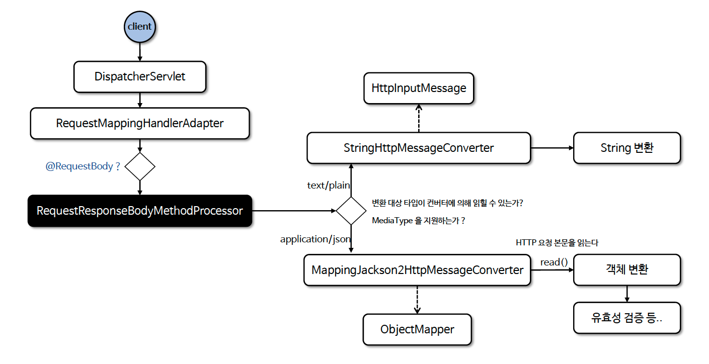

# ☘️ @RequestBody

---

## 📖 내용

- @RequestBody 는 HTTP 요청 본문(HTTP Body)을 자동으로 객체로 매핑하는 데 사용되며 내부적으로 HttpMessageConverter 객체가 작동되어 본문을 처리한다
- HttpEntity 및 RequestEntity 도 요청 본문을 처리해 주지만 지정된 객체로 자동 매핑을 해 주지는 않는다
- @Valid 애너테이션과 함께 사용하면 요청 본문의 유효성을 쉽게 검증할 수 있다


- @RequestBody 는 반드시 요청 본문이 있어야 하며 요청 본문이 없을 경우 HttpMessageNotReadableException 이 발생한다
  - required = false 로 설정하면 요청 본문이 없을 때 null 을 허용한다


- 흐름도

<sub>※ 이미지 출처: 인프런</sub>

---

### @RequestBody vs HttpEntity
- @RequestBody 는 요청의 Content-Type 헤더를 기반으로 적절한 HttpMessageConverter 를 선택하기 때문에 Content-Type 헤더가 올바르게 설정되어야 한다
- @RequestBody 는 생략하면 안된다. 생략할 경우 기본형은 @RequestParam, 객체 타입은 @ModelAttribute 가 작동하게 되지만 정확한 결과를 보장할 수 없다

---

## 🔍 중심 로직

```java
package org.springframework.web.bind.annotation;

// imports

@Target(ElementType.PARAMETER)
@Retention(RetentionPolicy.RUNTIME)
@Documented
public @interface RequestBody {

	boolean required() default true;

}
```

```java
package org.springframework.web.servlet.mvc.method.annotation;

// imports

public class RequestResponseBodyMethodProcessor extends AbstractMessageConverterMethodProcessor {

	public RequestResponseBodyMethodProcessor(List<HttpMessageConverter<?>> converters) {
		super(converters);
	}

	public RequestResponseBodyMethodProcessor(List<HttpMessageConverter<?>> converters,
			@Nullable ContentNegotiationManager manager) {

		super(converters, manager);
	}

	public RequestResponseBodyMethodProcessor(List<HttpMessageConverter<?>> converters,
			@Nullable List<Object> requestResponseBodyAdvice) {

		super(converters, null, requestResponseBodyAdvice);
	}

	public RequestResponseBodyMethodProcessor(List<HttpMessageConverter<?>> converters,
			@Nullable ContentNegotiationManager manager, @Nullable List<Object> requestResponseBodyAdvice) {

		super(converters, manager, requestResponseBodyAdvice);
	}

	public RequestResponseBodyMethodProcessor(List<HttpMessageConverter<?>> converters,
			@Nullable ContentNegotiationManager manager, List<Object> requestResponseBodyAdvice,
			List<ErrorResponse.Interceptor> interceptors) {

		super(converters, manager, requestResponseBodyAdvice, interceptors);
	}


	@Override
	public boolean supportsParameter(MethodParameter parameter) {
		return parameter.hasParameterAnnotation(RequestBody.class);
	}

	@Override
	public boolean supportsReturnType(MethodParameter returnType) {
		return (AnnotatedElementUtils.hasAnnotation(returnType.getContainingClass(), ResponseBody.class) ||
				returnType.hasMethodAnnotation(ResponseBody.class));
	}

	@Override
	@Nullable
	public Object resolveArgument(MethodParameter parameter, @Nullable ModelAndViewContainer mavContainer,
			NativeWebRequest webRequest, @Nullable WebDataBinderFactory binderFactory) throws Exception {

		parameter = parameter.nestedIfOptional();
		Object arg = readWithMessageConverters(webRequest, parameter, parameter.getNestedGenericParameterType());

		if (binderFactory != null) {
			String name = Conventions.getVariableNameForParameter(parameter);
			ResolvableType type = ResolvableType.forMethodParameter(parameter);
			WebDataBinder binder = binderFactory.createBinder(webRequest, arg, name, type);
			if (arg != null) {
				validateIfApplicable(binder, parameter);
				if (binder.getBindingResult().hasErrors() && isBindExceptionRequired(binder, parameter)) {
					throw new MethodArgumentNotValidException(parameter, binder.getBindingResult());
				}
			}
			if (mavContainer != null) {
				mavContainer.addAttribute(BindingResult.MODEL_KEY_PREFIX + name, binder.getBindingResult());
			}
		}

		return adaptArgumentIfNecessary(arg, parameter);
	}

	@Override
	@Nullable
	protected Object readWithMessageConverters(NativeWebRequest webRequest, MethodParameter parameter,
			Type paramType) throws IOException, HttpMediaTypeNotSupportedException, HttpMessageNotReadableException {

		ServletServerHttpRequest inputMessage = createInputMessage(webRequest);
		Object arg = readWithMessageConverters(inputMessage, parameter, paramType);
		if (arg == null && checkRequired(parameter)) {
			throw new HttpMessageNotReadableException("Required request body is missing: " +
					parameter.getExecutable().toGenericString(), inputMessage);
		}
		return arg;
	}

	protected boolean checkRequired(MethodParameter parameter) {
		RequestBody requestBody = parameter.getParameterAnnotation(RequestBody.class);
		return (requestBody != null && requestBody.required() && !parameter.isOptional());
	}

	@Override
	public void handleReturnValue(@Nullable Object returnValue, MethodParameter returnType,
			ModelAndViewContainer mavContainer, NativeWebRequest webRequest)
			throws IOException, HttpMediaTypeNotAcceptableException, HttpMessageNotWritableException {

		mavContainer.setRequestHandled(true);
		ServletServerHttpRequest inputMessage = createInputMessage(webRequest);
		ServletServerHttpResponse outputMessage = createOutputMessage(webRequest);

		if (returnValue instanceof ProblemDetail detail) {
			outputMessage.setStatusCode(HttpStatusCode.valueOf(detail.getStatus()));
			if (detail.getInstance() == null) {
				URI path = URI.create(inputMessage.getServletRequest().getRequestURI());
				detail.setInstance(path);
			}
			invokeErrorResponseInterceptors(detail, null);
		}

		// Try even with null return value. ResponseBodyAdvice could get involved.
		writeWithMessageConverters(returnValue, returnType, inputMessage, outputMessage);
	}

}
```

📌

---

## 💬 코멘트

---
