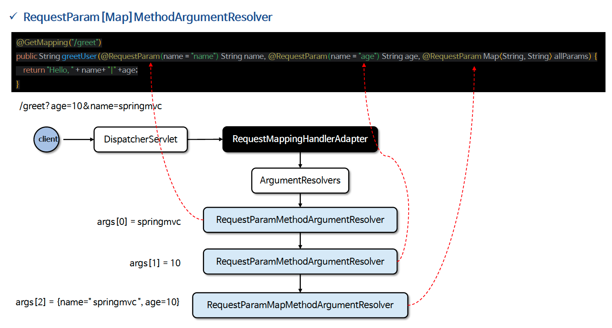

# ☘️ @RequestParam (1) ~ (2)

---

## 📖 내용

- @RequestParam 어노테이션은 HTTP 요청의 파라미터를 메서드의 매개변수에 바인딩 되도록 해 준다
- @RequestParam 은 URL 쿼리 파라미터, 폼 데이터, 그리고 멀티파트 요청을 매핑하며 HTTP 본문 요청은 처리하지 않는다 (HttpMessageConvertter 가 처리)
- 주로 int, long 과 같은 기본형, 기본형 래퍼 클래스, String 형 매개변수를 바인딩할 때 사용하며 대부분의 객체 타입은 처리하지 않는다 (@ModelAttribute 가 처리)
- 내부적으로 RequestParamMethodArgumentResolver 구현체가 사용되며 request.getParameterValues() 와 같은 API 를 사용하여 바인딩을 해결하고 있다

---

### required
- required 속성은 해당 파라미터가 필수인지 여부를 설정한다.
- 기본값은 true 이며, 필수 파라미터가 없을 경우 MissingServletRequestParameterException 예외가 발생한다

- 요청 및 결과
  - /required-true?param=test → 필수 파라미터 값: test
  - /required-true → 400 Bad Request (필수 파라미터가 없어서 발생)
  - /required-false?param=test → 받은 파라미터 값: test
  - /required-false → 파라미터가 없습니다.

---

### defaultValue
- defaultValue 속성은 해당 파라미터의 기본값을 설정한다

- 요청 및 결과
  - /default-value?param=test → 받은 값: test
  - /default-value → 받은 값: 기본값
  - /default-value?param= → 받은 값: 기본값

- 설명
  - defaultValue 가 설정되면 required 는 자동으로 false로 동작한다
  - 파라미터 값이 비어있는 경우(?param=)에도 기본값이 적용된다

---

### name 속성을 생략하거나 @RequestParam 을 선언하지 않은 경우
- 요청 및 결과
  - /noName?param=test → 받은 값: test
  - /noRequestparam?param=test → 받은 값: test
- 설명
  - 요청 파라미터 이름과 메서드 매개변수 이름이 동일하면 @RequestParam을 생략해도 동작한다
  - 명시적으로 선언하는 것이 유지보수 및 가독성이 좋다. 가급적 적는 것을 권장한다

---

### RequestParam[Map]MethodArgumentResolver

<sub>※ 이미지 출처: 인프런</sub>

---

## 🔍 중심 로직

```java
package org.springframework.web.bind.annotation;

...

@Target(ElementType.PARAMETER)
@Retention(RetentionPolicy.RUNTIME)
@Documented
public @interface RequestParam {

	@AliasFor("name")
	String value() default "";

	@AliasFor("value")
	String name() default "";

	boolean required() default true;

	String defaultValue() default ValueConstants.DEFAULT_NONE;

}
```

```java
package org.springframework.web.method.annotation;

...

public class RequestParamMethodArgumentResolver extends AbstractNamedValueMethodArgumentResolver
		implements UriComponentsContributor {

	private static final TypeDescriptor STRING_TYPE_DESCRIPTOR = TypeDescriptor.valueOf(String.class);

	private final boolean useDefaultResolution;

	public RequestParamMethodArgumentResolver(boolean useDefaultResolution) {
		this.useDefaultResolution = useDefaultResolution;
	}

	public RequestParamMethodArgumentResolver(@Nullable ConfigurableBeanFactory beanFactory,
			boolean useDefaultResolution) {

		super(beanFactory);
		this.useDefaultResolution = useDefaultResolution;
	}

	@Override
	public boolean supportsParameter(MethodParameter parameter) {
		if (parameter.hasParameterAnnotation(RequestParam.class)) {
			if (Map.class.isAssignableFrom(parameter.nestedIfOptional().getNestedParameterType())) {
				RequestParam requestParam = parameter.getParameterAnnotation(RequestParam.class);
				return (requestParam != null && StringUtils.hasText(requestParam.name()));
			}
			else {
				return true;
			}
		}
		else {
			if (parameter.hasParameterAnnotation(RequestPart.class)) {
				return false;
			}
			parameter = parameter.nestedIfOptional();
			if (MultipartResolutionDelegate.isMultipartArgument(parameter)) {
				return true;
			}
			else if (this.useDefaultResolution) {
				return BeanUtils.isSimpleProperty(parameter.getNestedParameterType());
			}
			else {
				return false;
			}
		}
	}

	@Override
	protected NamedValueInfo createNamedValueInfo(MethodParameter parameter) {
		RequestParam ann = parameter.getParameterAnnotation(RequestParam.class);
		return (ann != null ? new RequestParamNamedValueInfo(ann) : new RequestParamNamedValueInfo());
	}

	@Override
	@Nullable
	protected Object resolveName(String name, MethodParameter parameter, NativeWebRequest request) throws Exception {
		HttpServletRequest servletRequest = request.getNativeRequest(HttpServletRequest.class);

		if (servletRequest != null) {
			Object mpArg = MultipartResolutionDelegate.resolveMultipartArgument(name, parameter, servletRequest);
			if (mpArg != MultipartResolutionDelegate.UNRESOLVABLE) {
				return mpArg;
			}
		}

		Object arg = null;
		MultipartRequest multipartRequest = request.getNativeRequest(MultipartRequest.class);
		if (multipartRequest != null) {
			List<MultipartFile> files = multipartRequest.getFiles(name);
			if (!files.isEmpty()) {
				arg = (files.size() == 1 ? files.get(0) : files);
			}
		}
		if (arg == null) {
			String[] paramValues = request.getParameterValues(name);
			if (paramValues == null) {
				paramValues = request.getParameterValues(name + "[]");
			}
			if (paramValues != null) {
				arg = (paramValues.length == 1 ? paramValues[0] : paramValues);
			}
		}
		return arg;
	}

	@Override
	protected void handleMissingValue(String name, MethodParameter parameter, NativeWebRequest request)
			throws Exception {

		handleMissingValueInternal(name, parameter, request, false);
	}

	@Override
	protected void handleMissingValueAfterConversion(
			String name, MethodParameter parameter, NativeWebRequest request) throws Exception {

		handleMissingValueInternal(name, parameter, request, true);
	}

	protected void handleMissingValueInternal(
			String name, MethodParameter parameter, NativeWebRequest request, boolean missingAfterConversion)
			throws Exception {

		HttpServletRequest servletRequest = request.getNativeRequest(HttpServletRequest.class);
		if (MultipartResolutionDelegate.isMultipartArgument(parameter)) {
			if (servletRequest == null || !MultipartResolutionDelegate.isMultipartRequest(servletRequest)) {
				throw new MultipartException("Current request is not a multipart request");
			}
			else {
				throw new MissingServletRequestPartException(name);
			}
		}
		else {
			throw new MissingServletRequestParameterException(name, parameter, missingAfterConversion);
		}
	}

	@Override
	public void contributeMethodArgument(MethodParameter parameter, @Nullable Object value,
			UriComponentsBuilder builder, Map<String, Object> uriVariables, ConversionService conversionService) {

		Class<?> paramType = parameter.getNestedParameterType();
		if (Map.class.isAssignableFrom(paramType) || MultipartFile.class == paramType || Part.class == paramType) {
			return;
		}

		RequestParam requestParam = parameter.getParameterAnnotation(RequestParam.class);
		String name = (requestParam != null && StringUtils.hasLength(requestParam.name()) ?
				requestParam.name() : parameter.getParameterName());
		Assert.state(name != null, "Unresolvable parameter name");

		parameter = parameter.nestedIfOptional();
		if (value instanceof Optional<?> optional) {
			value = optional.orElse(null);
		}

		if (value == null) {
			if (requestParam != null &&
					(!requestParam.required() || !requestParam.defaultValue().equals(ValueConstants.DEFAULT_NONE))) {
				return;
			}
			builder.queryParam(name);
		}
		else if (value instanceof Collection<?> elements) {
			for (Object element : elements) {
				element = formatUriValue(conversionService, TypeDescriptor.nested(parameter, 1), element);
				builder.queryParam(name, element);
			}
		}
		else {
			builder.queryParam(name, formatUriValue(conversionService, new TypeDescriptor(parameter), value));
		}
	}

	@Nullable
	protected String formatUriValue(
			@Nullable ConversionService cs, @Nullable TypeDescriptor sourceType, @Nullable Object value) {

		if (value == null) {
			return null;
		}
		else if (value instanceof String string) {
			return string;
		}
		else if (cs != null) {
			return (String) cs.convert(value, sourceType, STRING_TYPE_DESCRIPTOR);
		}
		else {
			return value.toString();
		}
	}


	private static class RequestParamNamedValueInfo extends NamedValueInfo {

		public RequestParamNamedValueInfo() {
			super("", false, ValueConstants.DEFAULT_NONE);
		}

		public RequestParamNamedValueInfo(RequestParam annotation) {
			super(annotation.name(), annotation.required(), annotation.defaultValue());
		}
	}

}
```

📌

---

## 💬 코멘트

---
