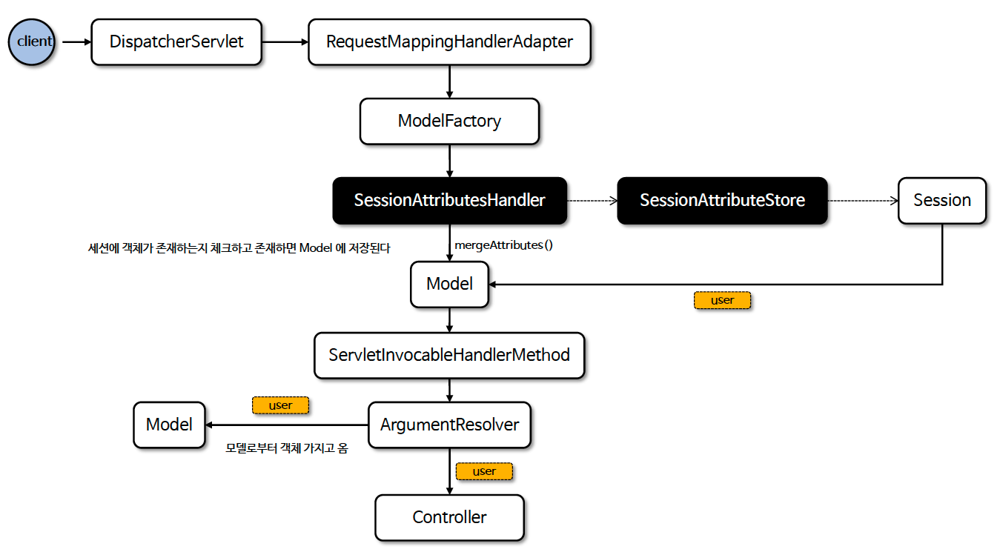
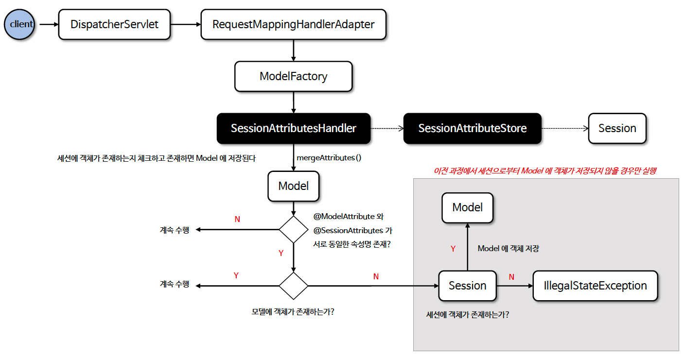

# ☘️ @SessionAttributes (1) ~ (2)

---

## 📖 내용

- @SessionAttributes 는 세션(Session)에 속성 값을 저장하고 그 값을 다른 요청에서도 사용할 수 있도록 하기 위해 사용되는 어노테이션이다
- @SessionAttributes 는 컨트롤러 클래스 레벨에 선언되며 특정 모델 속성 이름을 지정하면 세션에 자동으로 저장된다
- @SessionAttributes 는 모델에 저장된 객체를 세션에 저장하는 역할과 세션에 저장된 객체를 모델에 저장하는 역할을 한다

---

### @SessionAttributes 기본 – 세션 초기화
- 세션 초기화는 서버에서 특정 세션에 저장된 데이터를 삭제하고 세션 상태를 초기화하는 과정을 말한다

---

### SessionStatus
- Spring 에서는 SessionStatus 사용하여 세션 데이터를 제거할 수 있으며 세션 초기화 후에는 보통 다른 페이지로 리다이렉트하여 새로운 세션이 시작될 준비를 한다
- 세션 초기화 범위는 컨트롤러에서 @SessionAttributes로 선언된 세션 속성들에 한정된다
- SessionStatus.setComplete()는 해당 컨트롤러에서 관리하는 특정 세션 속성들만을 초기화(삭제)하고, 다른 곳에서 저장된 세션 데이터나 전체 세션 자체를 삭제하지는 않는다
- 세션 전체 무효화를 원한다면 HttpSession.invalidate()를 사용할 수 있다

---

### 흐름도





---

## 🔍 중심 로직

```java
package org.springframework.web.bind.support;

public interface SessionStatus {

	void setComplete();

	boolean isComplete();

}
```

📌

---

## 💬 코멘트

---
