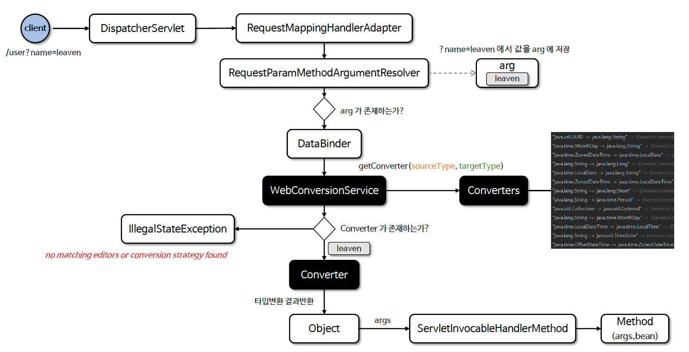

# ☘️ Converter 스프링 적용

---

## 📖 내용

- 앞에서 수동으로 변환했던 작업을 스프링에 의한 자동 변환 방식으로 적용되도록 WebMvcConfigurer 를 사용해 Converter 를 등록한다
- FormatterRegistry 는 웹에서 전반적으로 사용되는 WebConversionService 구현체가 전달된다
- 사용자가 명시적으로 Converter 를 등록하면 소스와 타겟 타입이 동일하게 지정된 스프링의 기본 Converter 보다 우선적으로 적용된다

```java
@Configuration
public class WebConfig implements WebMvcConfigurer {
    @Override
    public void addFormatters(FormatterRegistry registry) {
        registry.addConverter(new StringToUrlConverter());
        registry.addConverter(new UrlToStringConverter());
        registry.addConverter(new StringToUserConditionalConverter());
        registry.addConverterFactory(new StringToEnumConverterFactory());
    }
}
```

---

### 흐름도

<sub>출처: 인프런</sub>

---

## 🔍 중심 로직

```java
package org.springframework.boot.autoconfigure.web.format;

// imports

public class WebConversionService extends DefaultFormattingConversionService {

	private static final boolean JSR_354_PRESENT = ClassUtils.isPresent("javax.money.MonetaryAmount",
			WebConversionService.class.getClassLoader());

	public WebConversionService(DateTimeFormatters dateTimeFormatters) {
		super(false);
		if (dateTimeFormatters.isCustomized()) {
			addFormatters(dateTimeFormatters);
		}
		else {
			addDefaultFormatters(this);
		}
	}

	private void addFormatters(DateTimeFormatters dateTimeFormatters) {
		addFormatterForFieldAnnotation(new NumberFormatAnnotationFormatterFactory());
		if (JSR_354_PRESENT) {
			addFormatter(new CurrencyUnitFormatter());
			addFormatter(new MonetaryAmountFormatter());
			addFormatterForFieldAnnotation(new Jsr354NumberFormatAnnotationFormatterFactory());
		}
		registerJsr310(dateTimeFormatters);
		registerJavaDate(dateTimeFormatters);
	}

	private void registerJsr310(DateTimeFormatters dateTimeFormatters) {
		DateTimeFormatterRegistrar dateTime = new DateTimeFormatterRegistrar();
		configure(dateTimeFormatters::getDateFormatter, dateTime::setDateFormatter);
		configure(dateTimeFormatters::getTimeFormatter, dateTime::setTimeFormatter);
		configure(dateTimeFormatters::getDateTimeFormatter, dateTime::setDateTimeFormatter);
		dateTime.registerFormatters(this);
	}

	private void configure(Supplier<DateTimeFormatter> supplier, Consumer<DateTimeFormatter> consumer) {
		DateTimeFormatter formatter = supplier.get();
		if (formatter != null) {
			consumer.accept(formatter);
		}
	}

	private void registerJavaDate(DateTimeFormatters dateTimeFormatters) {
		DateFormatterRegistrar dateFormatterRegistrar = new DateFormatterRegistrar();
		String datePattern = dateTimeFormatters.getDatePattern();
		if (datePattern != null) {
			DateFormatter dateFormatter = new DateFormatter(datePattern);
			dateFormatterRegistrar.setFormatter(dateFormatter);
		}
		dateFormatterRegistrar.registerFormatters(this);
	}

}
```

📌

---

## 💬 코멘트

---
