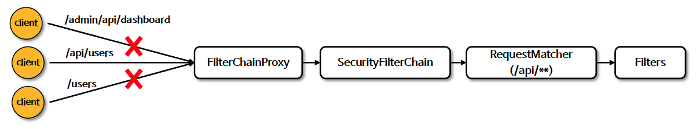

# ☘️ 요청 기반 권한 부여 - HttpSecurity.securityMatcher()

---

## 📖 내용
- `securityMatcher()` 메소드는 특정 패턴에 해당하는 요청에만 보안 규칙을 적용하도록 설정할 수 있으며 중복해서 정의할 경우 마지막에 설정한 것으로 대체합니다.
- `securityMatcher()` 동작 흐름


<sub>※ 이미지 출처: [정수원님의 인프런 강의](https://www.inflearn.com/course/%EC%8A%A4%ED%94%84%EB%A7%81-%EC%8B%9C%ED%81%90%EB%A6%AC%ED%8B%B0-%EC%99%84%EC%A0%84%EC%A0%95%EB%B3%B5/dashboard)</sub>

- `RequestMatcherConfigurer`을 사용하여 다중 패턴을 설정할 수 있습니다.
  - 1.`http.securityMatchers((matchers) -> matchers.requestMatchers("/api/**", "/oauth/**"))`;
  - 2.`http.securityMatchers((matchers) -> matchers.requestMatchers("/api/**").requestMatchers("/oauth/**"))`;
  - 3.`http.securityMatchers((matchers) -> matchers.requestMatchers("/api/**").securityMatchers((matchers) -> matchers.requestMatchers("/oauth/**"))`;

---

## 🔍 중심 로직

```java
public class RequestMatcherConfigurer extends AbstractRequestMatcherRegistry<RequestMatcherConfigurer> {
    protected List<RequestMatcher> matchers = new ArrayList();

    RequestMatcherConfigurer(ApplicationContext context) {
        this.setApplicationContext(context);
    }

    protected RequestMatcherConfigurer chainRequestMatchers(List<RequestMatcher> requestMatchers) {
        this.setMatchers(requestMatchers);
        return this;
    }

    private void setMatchers(List<? extends RequestMatcher> requestMatchers) {
        this.matchers.addAll(requestMatchers);
        HttpSecurity.this.securityMatcher((RequestMatcher)(new OrRequestMatcher(this.matchers)));
    }

    /** @deprecated */
    @Deprecated(
        since = "6.1",
        forRemoval = true
    )
    public HttpSecurity and() {
        return HttpSecurity.this;
    }
}
```

```java
@Configuration
@EnableWebSecurity
public class SecurityConfig {
    @Bean
    public SecurityFilterChain securityFilterChain(HttpSecurity http) throws Exception {
        return http
                .securityMatcher("/api/**")
                .authorizeHttpRequests(authorize -> authorize
                        .anyRequest().authenticated())
                .build();
    }
}
```

📌
- `HttpSecurity`를 `/api/**` 패턴에만 적용하도록 설정합니다.
- Spring MVC가 클래스 경로에 있으면 `MvcRequestMatcher` 가 사용되고, 그렇지 않으면 `AntPathRequestMatcher` 가 사용됩니다.
- 하나의 프로젝트에서 사용자별로 각각 다른 보안을 설정하고 싶은 경우 `securityMatcher()`를 사용하여 보안 규칙을 설정할 수 있습니다.

---

## 📂 참고할만한 자료

