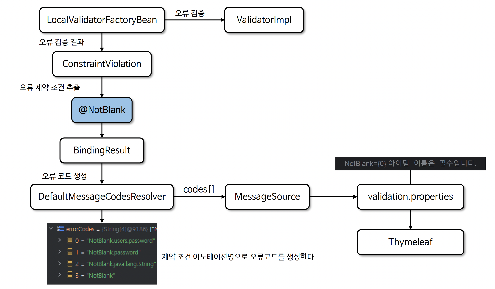

# ☘️ Bean Validation MessageSource 연동

---

## 📖 내용

- Bean Validation 에서 검증 메시지는 메시지를 하드 코딩하지 않고 MessageSource 를 통해 다양한 언어로 메시지를 관리할 수 있다


<sub>※ 이미지 출처: 인프런</sub>

---
## 🔍 중심 로직

```properties
# validation.properties
NotNull={0} 값이 비어 있음
Min={0}, 최소 {1}
Max={0}, 최대 {1}
```

```java
package org.springframework.validation;

// imports

public interface MessageCodesResolver {

	String[] resolveMessageCodes(String errorCode, String objectName);

	String[] resolveMessageCodes(String errorCode, String objectName, String field, @Nullable Class<?> fieldType);

}
```

📌

---

## 💬 코멘트

---
