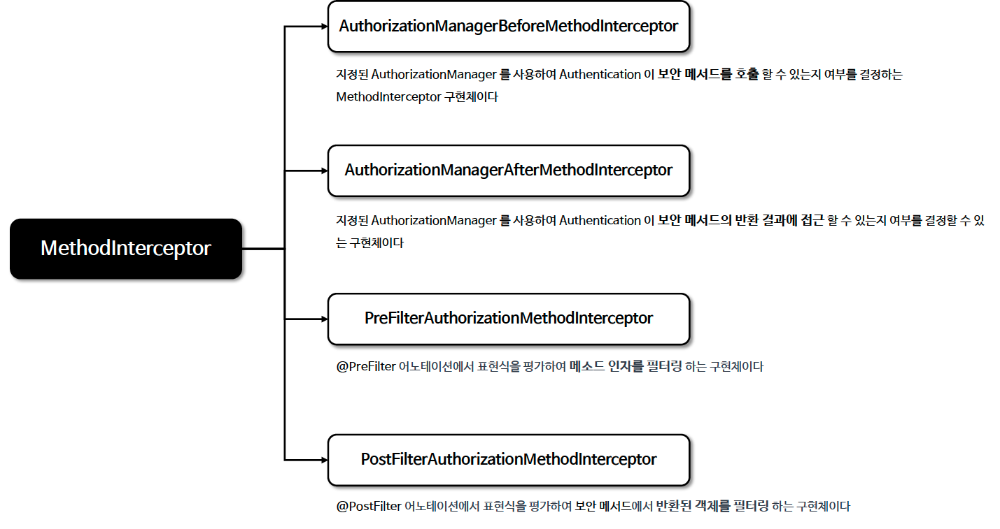

# ☘️ 메서드 기반 인가 관리자 - PreAuthorizeAuthorizationManager 외 클래스 구조 이해 - 1 ~ 2

---

## 📖 내용
- Spring Security는 인가 관리자 클래스로 `PreAuthorizeAuthorizationManager`, `PostAuthorizeAuthorizationManager`, `Jsr250AuthorizationManager`, `SecuredAuthorizationManager`를 제공합니다.
- 메서드 기반 권한 부여는 내부적으로 AOP 방식에 의해 초기화 설정이 이루어지며 메서드의 호출을 `MethodInterceptor`가 가로채어 인가를 수행합니다.

- 인터셉터 구조


<sub>※ 이미지 출처: [정수원님의 인프런 강의](https://www.inflearn.com/course/%EC%8A%A4%ED%94%84%EB%A7%81-%EC%8B%9C%ED%81%90%EB%A6%AC%ED%8B%B0-%EC%99%84%EC%A0%84%EC%A0%95%EB%B3%B5/dashboard)</sub>

---

## 🔍 중심 로직

```java
package org.springframework.security.access.expression.method;

...

public interface MethodSecurityExpressionHandler extends SecurityExpressionHandler<MethodInvocation> {
    Object filter(Object filterTarget, Expression filterExpression, EvaluationContext ctx);

    void setReturnObject(Object returnObject, EvaluationContext ctx);
}
```

```java
package org.springframework.security.access.expression.method;

...

class MethodSecurityEvaluationContext extends MethodBasedEvaluationContext {
    MethodSecurityEvaluationContext(Authentication user, MethodInvocation mi) {
        this((Authentication)user, mi, new DefaultSecurityParameterNameDiscoverer());
    }

    MethodSecurityEvaluationContext(Authentication user, MethodInvocation mi, ParameterNameDiscoverer parameterNameDiscoverer) {
        super(mi.getThis(), getSpecificMethod(mi), mi.getArguments(), parameterNameDiscoverer);
    }

    MethodSecurityEvaluationContext(MethodSecurityExpressionOperations root, MethodInvocation mi, ParameterNameDiscoverer parameterNameDiscoverer) {
        super(root, getSpecificMethod(mi), mi.getArguments(), parameterNameDiscoverer);
    }

    private static Method getSpecificMethod(MethodInvocation mi) {
        return AopUtils.getMostSpecificMethod(mi.getMethod(), AopProxyUtils.ultimateTargetClass(mi.getThis()));
    }
}
```

```java
package org.springframework.security.access.expression.method;

...

class MethodSecurityExpressionRoot extends SecurityExpressionRoot implements MethodSecurityExpressionOperations {
    private Object filterObject;
    private Object returnObject;
    private Object target;

    MethodSecurityExpressionRoot(Authentication a) {
        super(a);
    }

    MethodSecurityExpressionRoot(Supplier<Authentication> authentication) {
        super(authentication);
    }

    public void setFilterObject(Object filterObject) {
        this.filterObject = filterObject;
    }

    public Object getFilterObject() {
        return this.filterObject;
    }

    public void setReturnObject(Object returnObject) {
        this.returnObject = returnObject;
    }

    public Object getReturnObject() {
        return this.returnObject;
    }

    void setThis(Object target) {
        this.target = target;
    }

    public Object getThis() {
        return this.target;
    }
}
```

```java
package org.springframework.security.authorization.method.PreAuthorizeAuthorizationManager;
package org.springframework.security.authorization.method.PostAuthorizeAuthorizationManager;
package org.springframework.security.authorization.method.Jsr250AuthorizationManager;
package org.springframework.security.authorization.method.SecuredAuthorizationManager;
```

```java
package org.springframework.security.authorization.method;

...

public final class AuthorizationManagerBeforeMethodInterceptor implements AuthorizationAdvisor {
    private Supplier<SecurityContextHolderStrategy> securityContextHolderStrategy = SecurityContextHolder::getContextHolderStrategy;
    private final Log logger = LogFactory.getLog(this.getClass());
    private final Pointcut pointcut;
    private final AuthorizationManager<MethodInvocation> authorizationManager;
    private final MethodAuthorizationDeniedHandler defaultHandler = new ThrowingMethodAuthorizationDeniedHandler();
    private int order;
    private AuthorizationEventPublisher eventPublisher;

    public AuthorizationManagerBeforeMethodInterceptor(Pointcut pointcut, AuthorizationManager<MethodInvocation> authorizationManager) {
        this.order = AuthorizationInterceptorsOrder.FIRST.getOrder();
        this.eventPublisher = new NoOpAuthorizationEventPublisher();
        Assert.notNull(pointcut, "pointcut cannot be null");
        Assert.notNull(authorizationManager, "authorizationManager cannot be null");
        this.pointcut = pointcut;
        this.authorizationManager = authorizationManager;
    }

    public static AuthorizationManagerBeforeMethodInterceptor preAuthorize() {
        return preAuthorize(new PreAuthorizeAuthorizationManager());
    }

    public static AuthorizationManagerBeforeMethodInterceptor preAuthorize(PreAuthorizeAuthorizationManager authorizationManager) {
        AuthorizationManagerBeforeMethodInterceptor interceptor = new AuthorizationManagerBeforeMethodInterceptor(AuthorizationMethodPointcuts.forAnnotations(new Class[]{PreAuthorize.class}), authorizationManager);
        interceptor.setOrder(AuthorizationInterceptorsOrder.PRE_AUTHORIZE.getOrder());
        return interceptor;
    }

    public static AuthorizationManagerBeforeMethodInterceptor preAuthorize(AuthorizationManager<MethodInvocation> authorizationManager) {
        AuthorizationManagerBeforeMethodInterceptor interceptor = new AuthorizationManagerBeforeMethodInterceptor(AuthorizationMethodPointcuts.forAnnotations(new Class[]{PreAuthorize.class}), authorizationManager);
        interceptor.setOrder(AuthorizationInterceptorsOrder.PRE_AUTHORIZE.getOrder());
        return interceptor;
    }

    public static AuthorizationManagerBeforeMethodInterceptor secured() {
        return secured(new SecuredAuthorizationManager());
    }

    public static AuthorizationManagerBeforeMethodInterceptor secured(SecuredAuthorizationManager authorizationManager) {
        AuthorizationManagerBeforeMethodInterceptor interceptor = new AuthorizationManagerBeforeMethodInterceptor(AuthorizationMethodPointcuts.forAnnotations(new Class[]{Secured.class}), authorizationManager);
        interceptor.setOrder(AuthorizationInterceptorsOrder.SECURED.getOrder());
        return interceptor;
    }

    public static AuthorizationManagerBeforeMethodInterceptor secured(AuthorizationManager<MethodInvocation> authorizationManager) {
        AuthorizationManagerBeforeMethodInterceptor interceptor = new AuthorizationManagerBeforeMethodInterceptor(AuthorizationMethodPointcuts.forAnnotations(new Class[]{Secured.class}), authorizationManager);
        interceptor.setOrder(AuthorizationInterceptorsOrder.SECURED.getOrder());
        return interceptor;
    }

    public static AuthorizationManagerBeforeMethodInterceptor jsr250() {
        return jsr250(new Jsr250AuthorizationManager());
    }

    public static AuthorizationManagerBeforeMethodInterceptor jsr250(Jsr250AuthorizationManager authorizationManager) {
        AuthorizationManagerBeforeMethodInterceptor interceptor = new AuthorizationManagerBeforeMethodInterceptor(AuthorizationMethodPointcuts.forAnnotations(new Class[]{RolesAllowed.class, DenyAll.class, PermitAll.class}), authorizationManager);
        interceptor.setOrder(AuthorizationInterceptorsOrder.JSR250.getOrder());
        return interceptor;
    }

    public static AuthorizationManagerBeforeMethodInterceptor jsr250(AuthorizationManager<MethodInvocation> authorizationManager) {
        AuthorizationManagerBeforeMethodInterceptor interceptor = new AuthorizationManagerBeforeMethodInterceptor(AuthorizationMethodPointcuts.forAnnotations(new Class[]{RolesAllowed.class, DenyAll.class, PermitAll.class}), authorizationManager);
        interceptor.setOrder(AuthorizationInterceptorsOrder.JSR250.getOrder());
        return interceptor;
    }
    
    ... other methods
}
```

### 메서드 기반 인가 처리 애노테이션별 interceptor & manager 매핑
```java
@PreAuthorize() : AuthorizationManagerBeforeMethodInterceptor -> PreAuthorizeAuthorizationManager
@PostAuthorize() : AuthorizationManagerAfterMethodInterceptor -> PostAuthorizeAuthorizationManager
@PreFilter() : PreFilterAuthorizationMethodInterceptor
@PostFilter() : PostFilterAuthorizationMethodInterceptor
@Secured() : AuthorizationManagerBeforeMethodInterceptor -> SecuredAuthorizationManager
@PermitAll() : AuthorizationManagerBeforeMethodInterceptor -> Jsr250AuthorizationManager
```

📌

---

## 📂 참고할만한 자료

